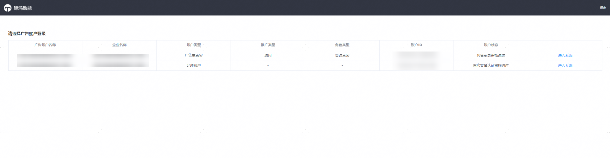
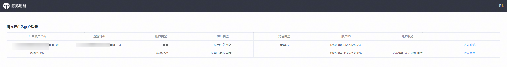

# 华为账号绑定多账户类型，选择单个账户类型登录

如您的华为账号已绑定应用市场应用推广&鲸鸿动能广告不同的账户类型，在登录后，选择您想操作的账户类型，点击“进入系统”按钮，登录即可。以下场景需要选择账户类型登录，比如：

1. 您的华为账号分别绑定了应用市场应用推广和鲸鸿动能广告的直客账户和子客账户
2. 您的华为账号分别绑定了应用市场应用推广和鲸鸿动能广告的服务商账户
3. 您的华为账号关联的广告账号曾开通过直客团队账号或鲸鸿动能广告的经理账户权限，可选择登录直客/直客管理者账户。如您的华为账号同时绑定了应用市场应用推广的直客或直客管理者账户、和鲸鸿动能的直客账户，投放端整合升级后，历史两个平台的直客账户投放数据将整合在一个直客账户里。登录进入直客账户内通过“投放网络”区分。

## 整合升级后，账户类型对应如下：

| Before | After |
| --- | --- |
| 直客账户 | 直客账户 |
| 直客管理者账户 | 直客账户+直客管理者账户（经理账户平台） |
| 直客协作者账户 | 直客协作者账户 |
| 客户投放伙伴主账户 | 一级服务商 |
| 客户投放伙伴子账户 | 子客服务商 |
| 投放操作账户 | 子客 |
