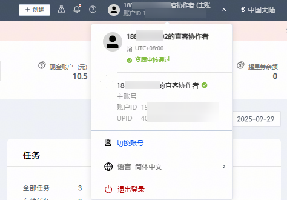
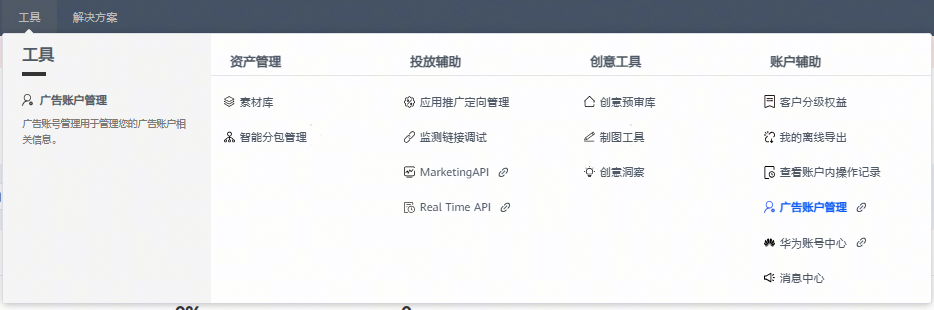
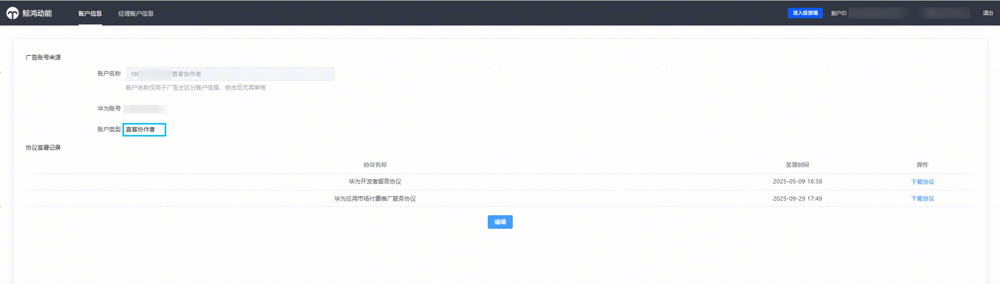
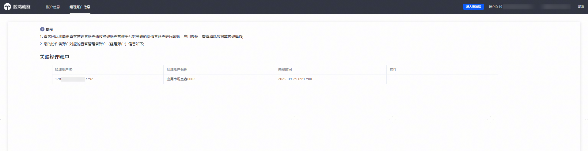

# 直客协作者账户

登录直客协作者账户后，账户名称为直客管理者设置的昵称。投放管理平台的功能变化点和普通直客账户一致，详见本文档的[【变化点梳理】](/docs/monetize/promotion/mix-summary-0000002499177773)章节。

- 登录后账户右上角可以查看协作者账户的名称，账户ID，客户ID（UPID）。

- 工具—&gt;广告账户管理，可以查看本账户的账户类型和归属直客管理者信息。

