# 进入认证中心完成开户

进入认证中心后，您需补充与所选推广范围相关的开户信息。具体如下：

## 同时勾选展示广告网络、应用市场应用推广

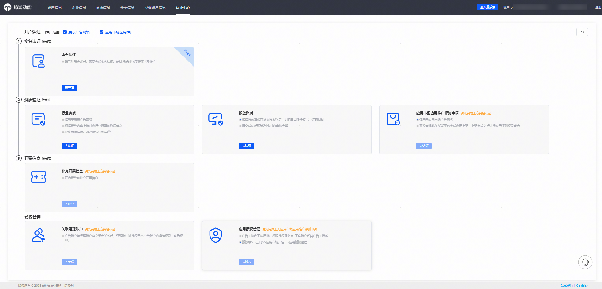

### 实名认证

点击【去认证】跳转华为开发者联盟进行实名认证。

1. 选择企业类型后，可通过对公银行打款认证或者企业资料人工审核认证完成实名认证。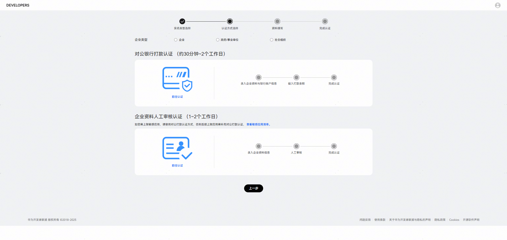
2. 对公银行打款认证，操作步骤参考文档：[对公银行打款认证](https://developer.huawei.com/consumer/cn/doc/start/atpopb-0000001062836624)。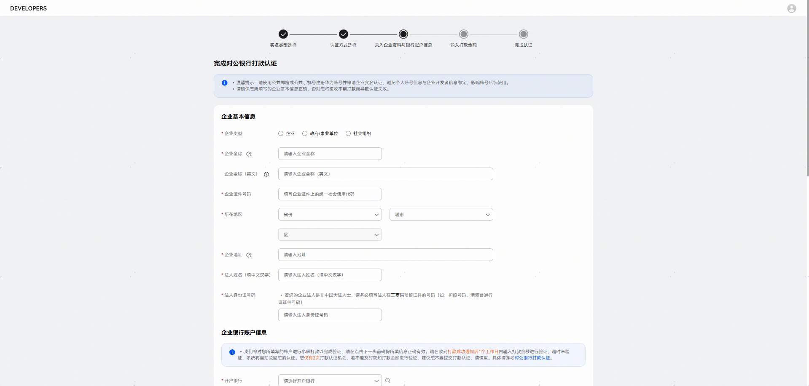
3. 企业资料人工审核认证，操作步骤参考文档：[企业资料人工审核认证](https://developer.huawei.com/consumer/cn/doc/start/mracoei-0000001062678404)。
   1. 上传手持身份证

      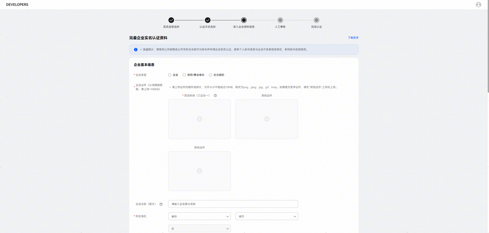

      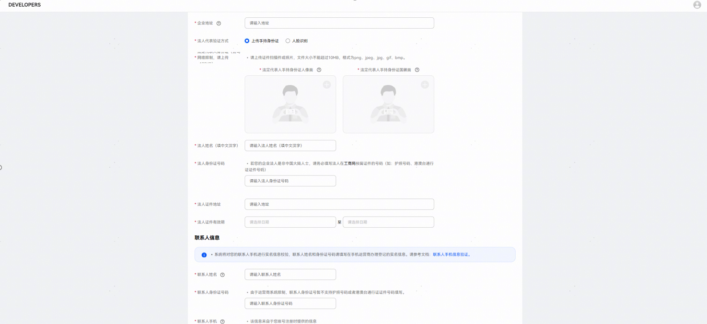

      
   2. 人脸识别

      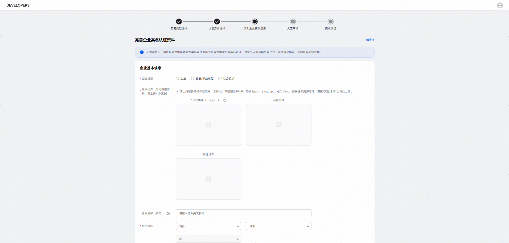

      

### 行业资质

根据鲸鸿动能广告的要求，补充上传行业资质。官网指导文档：[鲸鸿动能广告-行业资质审核](https://developer.huawei.com/consumer/cn/doc/promotion/ads_shenhe100-0000001062567184)。

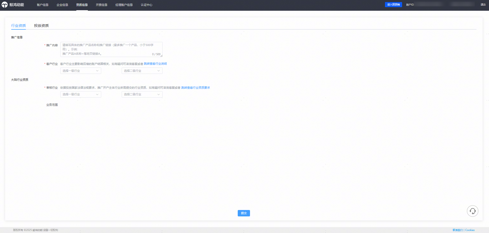

### 投放资质

如您在鲸鸿动能广告的投放涉及明星肖像授权、合作协议或者其他补充审核要求的认证信息，请在投放前补充上传相关资质。

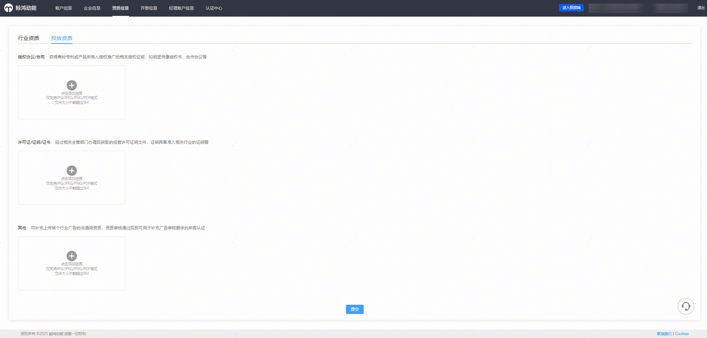

### 应用市场应用推广评测申请

点击【去认证】，跳转应用市场应用推广-我的推广权限申请页面，为已上架未申请推广权限应用，发起推广权限申请。

官网指导文档：[申请推广评测](https://developer.huawei.com/consumer/cn/doc/promotion/bp-start-guest-apply-evaluation-0000001346654709)

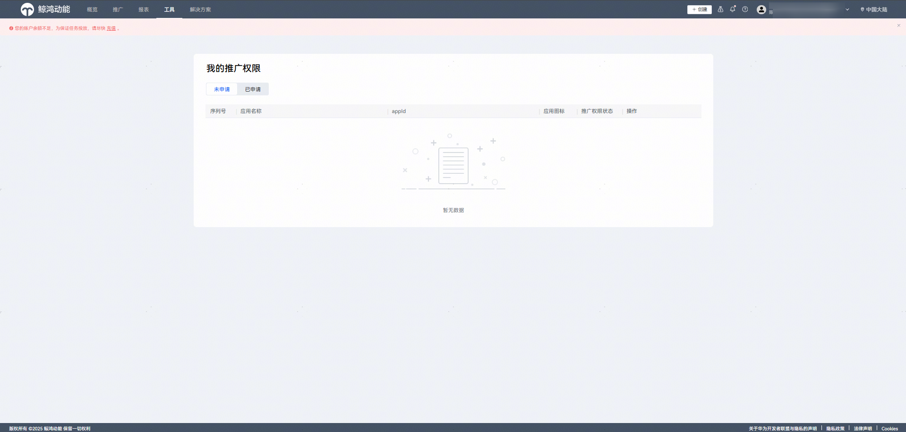

### 补充开票信息

点击【去补充】，跳转开发者联盟开通付费服务，并补充发票信息。官网指导文档：[付费服务](https://developer.huawei.com/consumer/cn/doc/start/payment-service-0000001052865979)

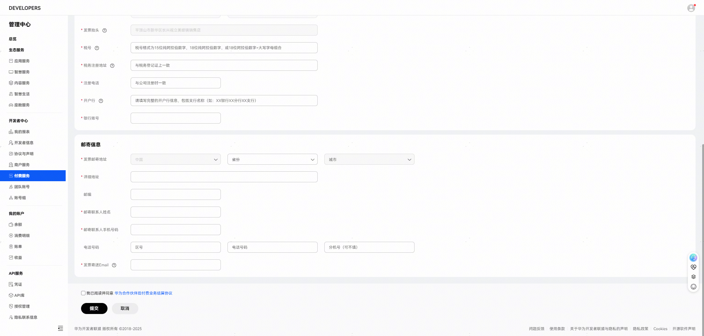

### 关联经理账户

对应应用市场应用推广直客团队账户能力。平台整合升级后，经理账户能力由应用市场应用推广和鲸鸿动能广告分别管理，如您需要为应用市场应用推广和展示广告网络都开通直客团队账户权限（经理账户），需分别联系对应的平台运营开通。应用市场应用推广直客团队账户能力申请开通后，入口：工具——账户辅助——应用推广直客团队账户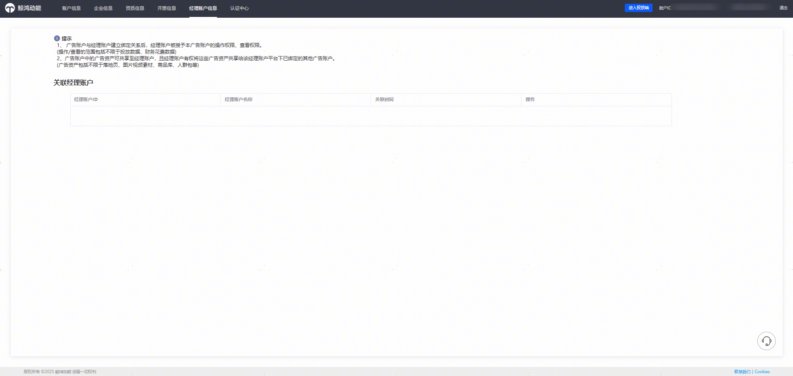

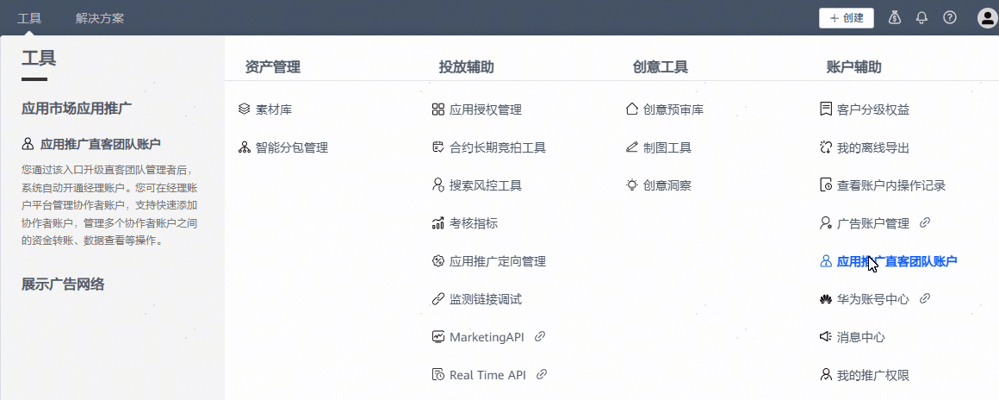

### 应用授权管理

您可以把名下已申请推广评测的应用授权服务商代理投放，官网文档指引：[授权客户投放伙伴管理账户](https://developer.huawei.com/consumer/cn/doc/promotion/bp-start-guest-authorize-0000001346774281)。

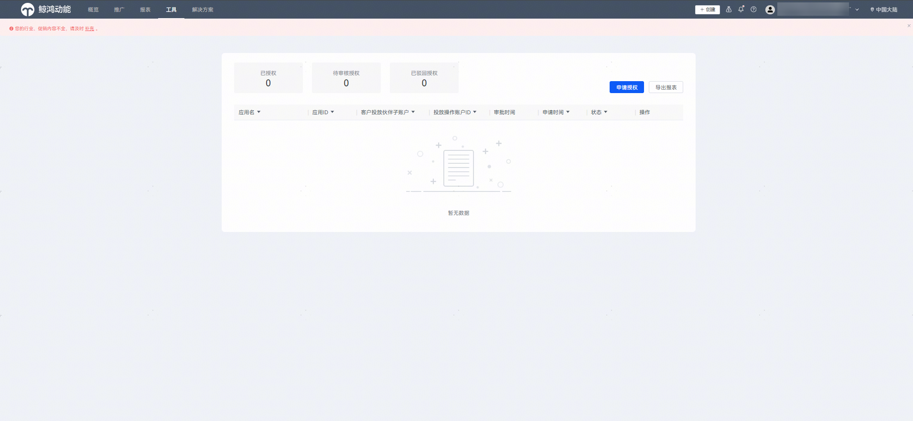

## 只勾选应用市场应用推广

您需要完成实名认证、应用市场应用推广评测申请、补充开票信息后开启投放。

可根据投放需要，申请开通直客团队账户，或通过应用授权管理把应用授权给服务商代理投放。

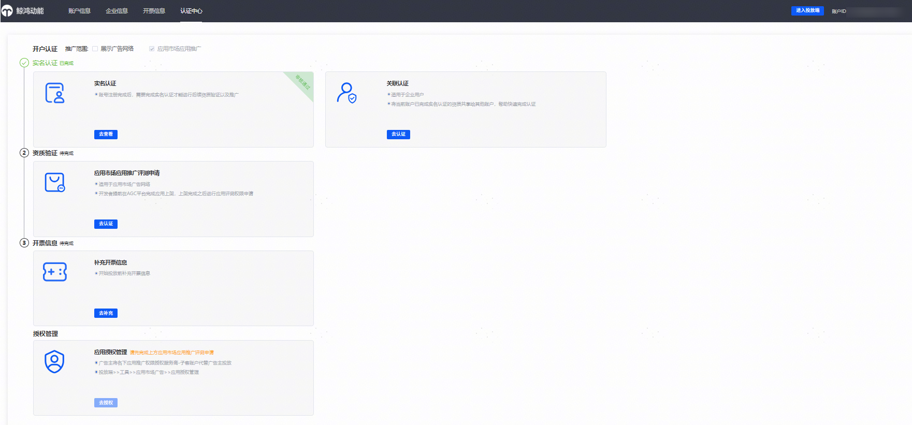

## 补充推广范围——展示广告网络

如您目前只开通了应用市场应用推广的推广范围，并想拓展鲸鸿动能展示广告网络的推广。可在认证中心，推广范围——勾选展示广告网络。

### 补充推广范围，勾选增加两份协议

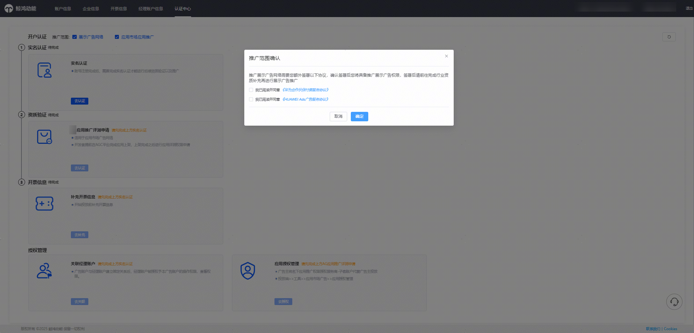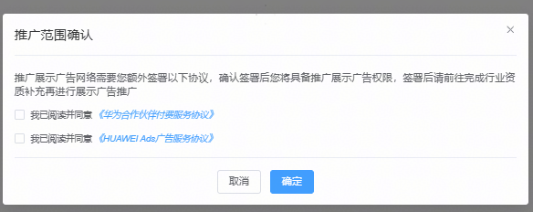

### 重新进入认证中心，按照认证中心要求补充鲸鸿动能广告投放的行业资质和投放资质

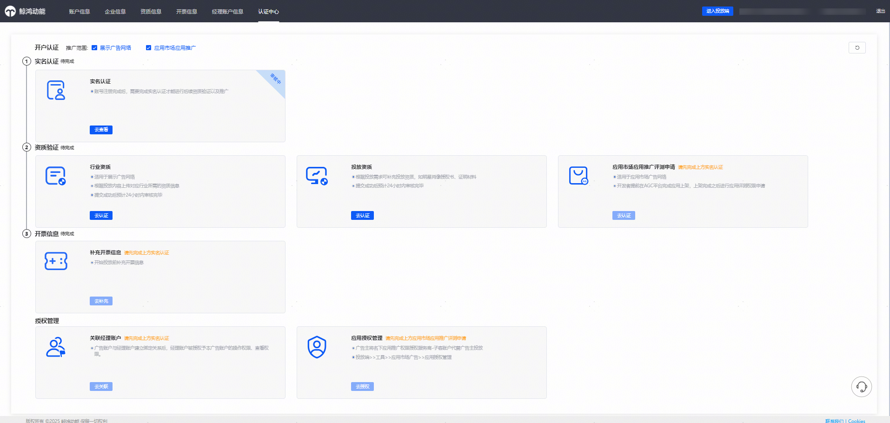
