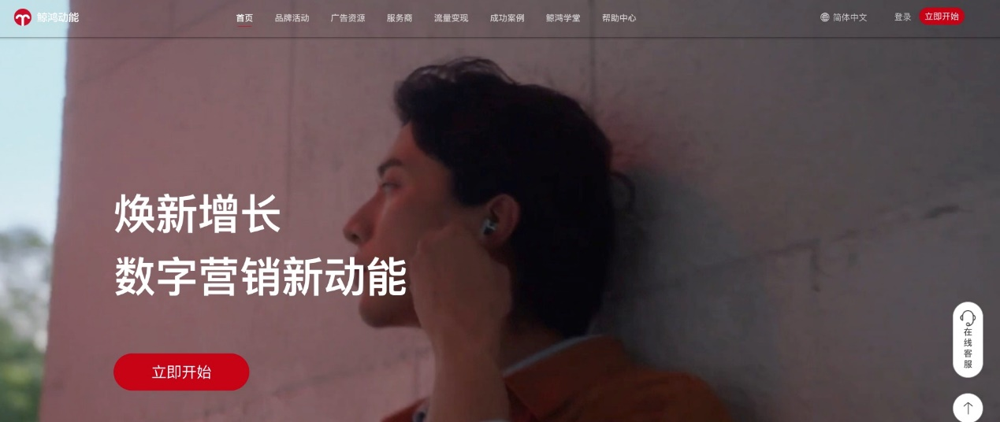

# 平台整合升级高频FAQ

## 登录推广账户的华为账号不变

账户整合升级到鲸鸿动能广告平台后，您可以直接使用原有应用市场的应用推广账号和密码登录鲸鸿动能平台，无需重新注册。如您的账户已迁移成功，通过原应用市场应用推广入口登录时，系统将自动跳转至鲸鸿动能广告平台，无需重复输入登录信息。点击【登录】即可。

## API调用

账户整合升级后，您在应用市场应用推广的API权限不变、API接口可调用范围不变。后续应用市场应用推广和鲸鸿动能广告的API接口仍维护两套接口。如您想调用账户内应用市场应用推广的投放数据、投放任务等信息，请参考应用市场应用推广的Marketing API接口文档。

## 开票处理

账户投放后的开票处理仍由在开发者联盟开具，发票开具流程不变。
