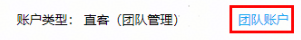
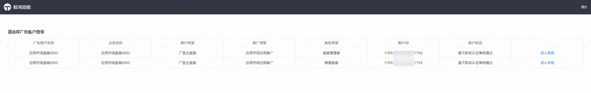

# 登录直客团队账户

如您的直客推广账户已申请开通直客团队账户，原登录应用推广账号类型为直客（团队管理）的功能通过两个入口拆分，整合升级后登录页面如下：

- 角色类型—直客管理者，点击【进入系统】跳转登录经理账户平台，承载原直客管理者账户的团队账户管理功能，如：新增邀请直客协作者账户、给直客协作者账户转账等。
- 角色类型—普通直客，点击【进入系统】跳转登录投放管理平台，用直客管理者账号进行任务创编、投放数据查看等。直客协作者账户登录只有普通直客账户类型。

