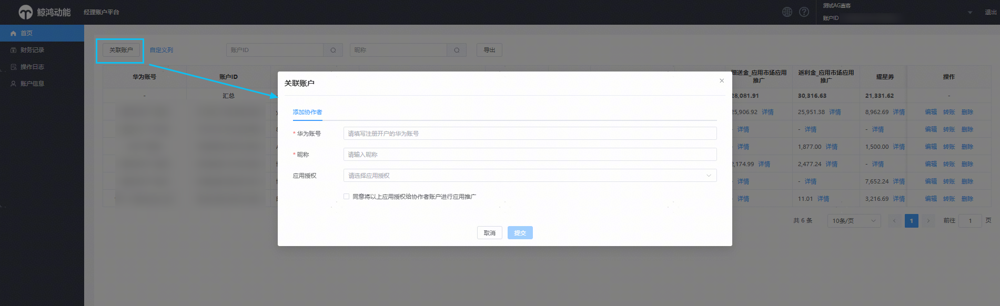
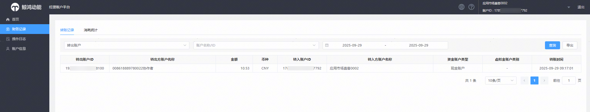
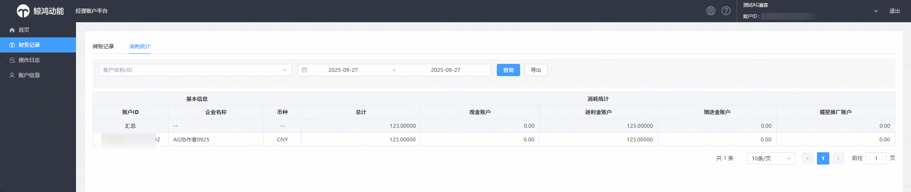
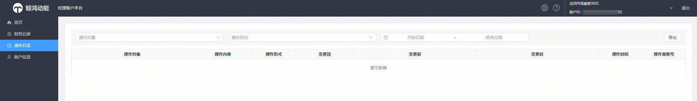
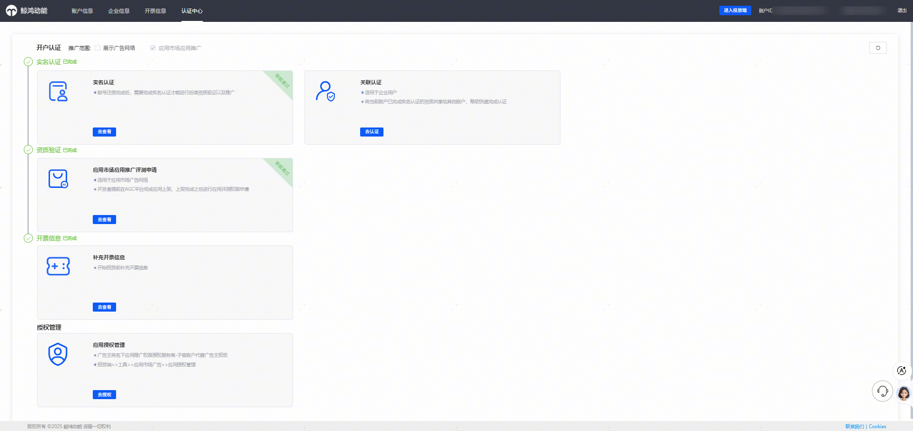

# 直客管理者账户

## 团队管理功能

团队管理功能由经理账户平台承载，登录后首页——关联账户，填写华为账号、账户昵称、授权应用等信息可以将直客管理者账户的应用授权给直客协作者账户。

## 登录经理账户首页功能介绍

首页功能：直客管理者账户登录经理账户平台首页，支持：

- 查看名下直客协作者账户信息（授权华为账号、账户昵称、账户ID等）
- 查看直客协作者账户余额明细
- 编辑——直客协作者账户的授权，包括授权华为账号、授权应用等
- 转账——给协作者账户转账，支持按照现金、赠送金、返利金、耀星券等资金类型转账

   

  1. 转账界面“余额”是对应资金类型的总金额（不包含合约）；
  2. 转账界面“可释放冻结金额”是竞价过程中动态预留的金额，支持解冻释放。
- 删除——删除直客协作者账户

| 功能 | 截图 |
| --- | --- |
| 首页 |  |
| 编辑 |  |
| 转账 |  |
| 删除 |  |
| 协作者账户资金明细（总余额，现金，赠送金，返利金，耀星券等） |  |

## 财务记录

支持查看直客管理者账户和直客协作者账户的转账记录、消耗统计。

### 转账记录

支持查看转入账户、转出账户、转账金额、转账资金类型、转账时间。

### 消耗统计

直客协作者账户的分天消耗明细，不包含直客管理者账户消耗。

## 操作日志

支持查看直客协作者账户的新增修改删除等记录、直客协作者账户应用/华为账号的授权记录、以及操作直客协作者账户资金相关记录。

## 账户信息

点击账户信息跳转到认证中心，可查看直客管理者账户的开户认证资质。

