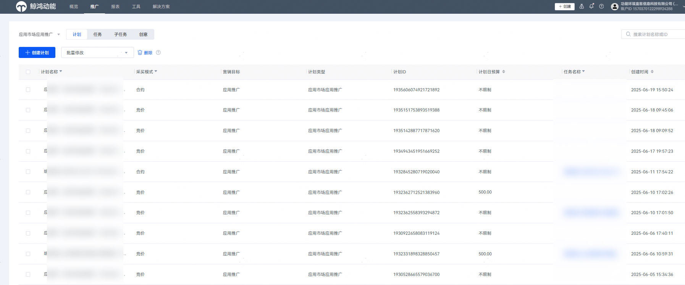

# 投放端——推广

支持查看现有账户已创建的计划、任务、子任务、创意等维度推广数据。

- 计划维度：投放端整合升级后新增的维度，一个计划只能绑定一个任务。存量任务在整合升级后，由系统自动生成计划维度信息（计划ID、计划名称=存量任务名称、计划日预算=任务日预算），任务日预算改为计划日预算，前置到计划层支持批量修改。后续您新建任务时，需新建/选择已有计划后再创建任务。
- 任务、子任务、创意等Tab数据，对齐原应用市场应用推广投放端的任务列表、子任务列表、创意列表。

