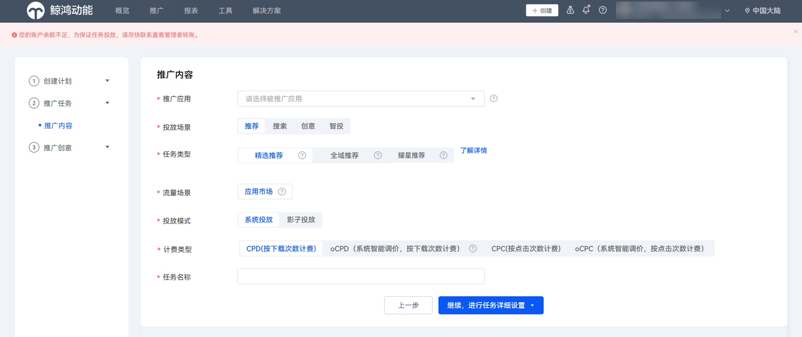
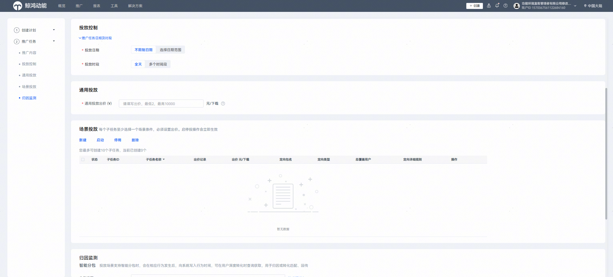
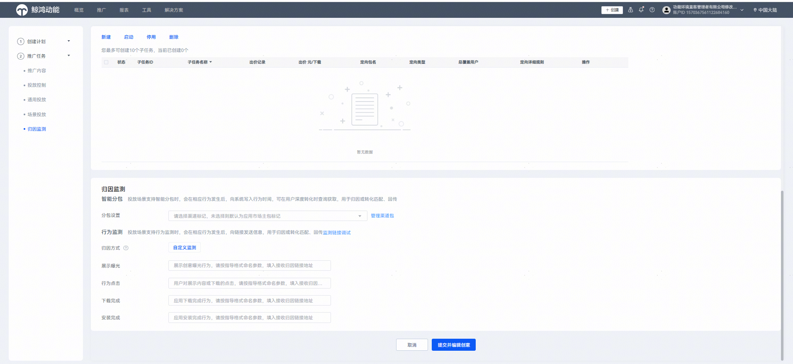
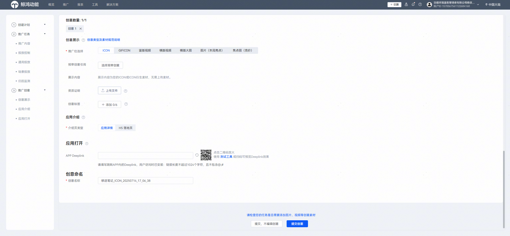

# 任务创建流程

投放端整合升级后，适配新增计划层，任务层级变化见下表。应用推广任务创建共有四个层级：计划——任务——子任务——创意，任务日预算前置到计划层，成为计划日预算。

 

解决方案仍为任务日预算。其他能力对齐应用市场应用推广现有功能，无变化。

|  |  |
| --- | --- |
| <strong>Before</strong> | <strong>After</strong> |
| / | 计划层（适配新增） |
| 任务层 | 任务层 |
| 子任务层 | 子任务层 |
| 创意层 | 创意层 |

## 创建计划

创建计划入口有3个，您可以从概览页或者推广——计划入口创建计划。

| 概览页——右上角——创建计划 | 概览页——总览——创建 | 推广——计划——创建计划 |
| --- | --- | --- |
|  |  |  |

营销目标、计划类型、投放网络无需填写，您根据推广目标填写采买模式、设置计划日预算和计划名称，点击“继续，创建任务”。

## 创建任务

选择您想推广的应用，选择投放场景、任务类型、流量场景、投放模式、计费类型，并填写任务名称，点击“继续，进行任务详细设置”。

您可参考[应用推广-投放与任务管理](https://developer.huawei.com/consumer/cn/doc/promotion/bp-delivery-task-0000001284751146)查看详细的任务创建指导。

## 创建子任务

- 投放控制：填写任务日期、设置投放时段、否词等。
- 通用投放：填写通投出价（根据任务类型可选是否开启）。
- 场景投放：新建子任务设置名称、子任务出价、定向等。
- 归因监测：填写智能分包信息、监测链接等，填写完点击“提交并编辑创意”。

## 创建创意

根据您创建的任务类型，编辑上传创意展示类型。如您选择“提交，不编辑创意”，您的任务将以ICON形式投出。如您正常上传创意并选择“提交创意”，您后续可通过创意列表查看创意投放情况。

