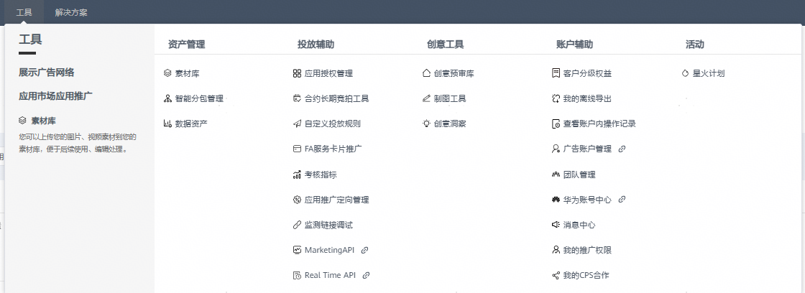
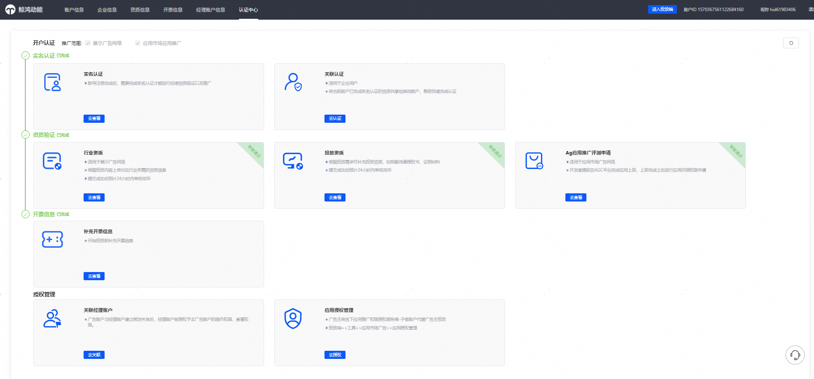
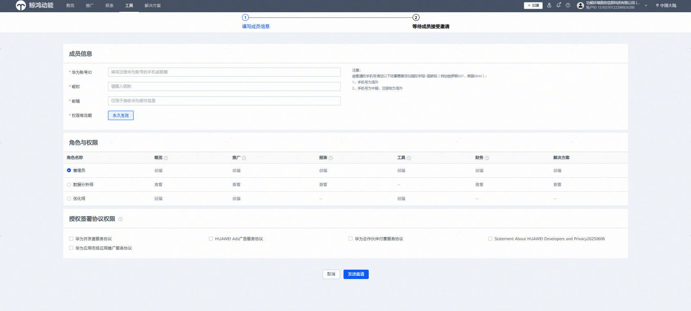

# 投放端——工具

原应用市场应用推广支持的相关投放能力，在投放端升级后保持不变。对于需开通白名单的投放工具，请您参照应用市场应用推广帮助文档中的申请流程，提交所需信息以完成开通。

- 工具Tab变化点1：应用授权入口变化。原直客账户的应用授权入口&gt;&gt;&gt;工具——投放辅助——应用授权管理

  | Before | After |
  | --- | --- |
  |  |  |
- 工具Tab变化点2：原账户信息里的应用等级、我的推广权限、团队账户等入口变化，具体如下：
  - 原我的应用等级——查看权益&gt;&gt;&gt;工具——账户辅助——客户分级权益；
  - 原我的推广权限——管理&gt;&gt;&gt;工具——账户辅助——我的推广；
  - 原账户类型——团队账户&gt;&gt;&gt;应用市场应用推广运营开通白名单后，点击“应用推广直客团队账户”升级直客管理者账户；您可在登录时选择“直客管理者”进入经理账户平台操作，或者通过投放端右上角切换账号登录进入。

    | After | Before |
    | --- | --- |
    |  | |
    |  |  |
    |  |  |
    |  |
- 工具Tab变化点3：原直客账户（直客管理者账户、直客协作者账户）转账记录入口变化
  - 原转账记录&gt;&gt;&gt;小钱包ICON——点击查看财务信息——转账记录

    | Before | After |
    | --- | --- |
    |  |  |

- 工具变化点4：工具——账户辅助入口，适配新增“广告账户管理”，“团队管理”，“华为账号中心”，“经理账户”，“消息中心”
  - 工具——账户辅助——广告账户管理：点击后可以查看账户开户实名认证材料，资质验证、开票信息、应用授权管理等

- 工具——账户辅助——团队管理：邀请团队其他成员共同管理直客账户，可以授权对应华为账号为管理员、数据分析师、优化师等，可操作权限范围参考授权界面。
- 工具——账户辅助——华为账号中心：点击进入华为账号中心，管理当前登录推广账户的华为账号，可在华为账号中心修改绑定的手机号/邮箱。

- 工具——账户辅助——消息中心：您可以对查看账户的消息列表、设置消息提醒，对应原来提醒设置入口。

