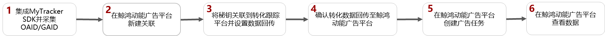
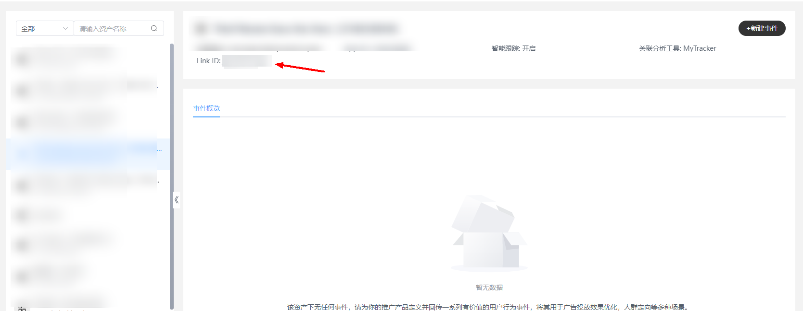

# MyTracker

## 概述

MyTracker根据不同的归因方式，支持的SDK版本如下，详情请参考[MyTracker官网链接](https://tracker.my.com/promo/)：

- OAID/GAID归因支持的SDK版本为3.0.10及以上版本；
- Referrer归因支持的SDK版本为3.0.10及以上版本。

## 操作流程

## MyTracker操作步骤

1. 集成MyTracker SDK并采集OAID/GAID。
   - 集成：详细操作请参照[MyTracker SDK集成](https://tracker.my.com/docs/sdk/android/api)；若已集成，可跳过此步。
   - 采集OAID/GAID：三方监测事件必须使用OAID/GAID跟踪归因，请确保您的应用已加入OAID采集代码，否则可能将无法正确跟踪。
2. 在鲸鸿动能广告平台新建关联。

   需要为您希望跟踪的每一个应用使用指定的监测工具新建资产，详细请参考[新建资产](https://developer.huawei.com/consumer/cn/doc/promotion/tracking-app-overview-0000001209244840#ZH-CN_TOPIC_0000001209244840__li8351194812211)。
3. 将秘钥关联到转化跟踪平台并设置数据回传。

   为了将转化跟踪平台跟踪到的转化结果传递给鲸鸿动能广告平台，以便鲸鸿动能广告平台可以将转化结果用于报表统计和投放优化，您需要将获取的秘钥复制到转化跟踪平台并在转化跟踪平台上配置数据回传给鲸鸿动能广告平台。

   - 如何获取秘钥：关联创建成功后，在已有关联列表中单击“”查看秘钥并单击“”，将获取的秘钥复制到MyTracker。

     
   - 如何配置转化事件回传给鲸鸿动能广告平台：详情请参考[MyTracker操作指导](https://tracker.my.com/docs/tracking/integration/huawei-ads/about/#tracking)。
   - 如果您希望统计付费指标的金额，详情请参考[付费指标](https://developer.huawei.com/consumer/cn/doc/promotion/tracking-app-overview-0000001209244840#ZH-CN_TOPIC_0000001209244840__zh-cn_topic_0000001122291488_li132211445203517)。
4. 确认转化数据回传至鲸鸿动能广告平台。
   - 如果您想要投放非oCPC广告，您可以直接创建广告任务，待鲸鸿动能广告平台收到转化数据后，转化跟踪指标状态为“已启用”。
   - 如果您想要投放oCPC广告，鲸鸿动能广告平台必须先收到转化数据，收到转化数据后，转化跟踪指标状态为“已启用”，此时您才能创建任务，详情可参考[如何让鲸鸿动能广告平台收到转化数据](https://developer.huawei.com/consumer/cn/doc/promotion/tracking-app-overview-0000001209244840#ZH-CN_TOPIC_0000001209244840__table594218593381)。
5. 在鲸鸿动能广告平台创建任务。
6. 在鲸鸿动能广告平台[查看转化数据](https://developer.huawei.com/consumer/cn/doc/promotion/tracking-shu-0000001139892541)。
