# Native

## 160×160（图片）

|  |  |
| --- | --- |
| <strong>广告样式</strong> | Native |
| <strong>版位名称</strong> | HUAWEI Own Media\_WEB\_160\*160 |
| <strong>展示样式</strong> | Image |
| <strong>分辨率</strong> | 160×160 |
| <strong>格式</strong> | JPG, JPEG, or PNG |
| <strong>素材大小</strong> | &lt;= 500 KB |
| <strong>文本字符</strong> | &lt;= 90 |
| <strong>品牌名称字符</strong> | &lt;= 30 |
| <strong>上线国家/地区</strong> | 菲律宾、墨西哥、智利、俄罗斯 |

广告位置尺寸标注：

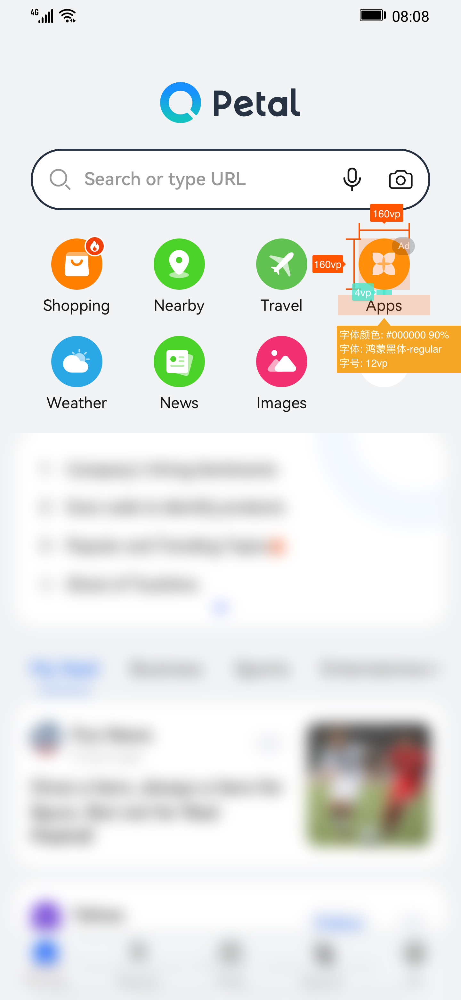

## 225×150（多图）

|  |  |
| --- | --- |
| <strong>广告样式</strong> | Native |
| <strong>版位名称</strong> | HUAWEI Own Media\_Native |
| Banner & Native Eco |
| NewsFeed for Assistant&Search |
| <strong>展示样式</strong> | Image |
| <strong>分辨率</strong> | 225×150 |
| <strong>格式</strong> | JPG, JPEG, or PNG |
| <strong>素材大小</strong> | &lt;= 500 KB |
| <strong>文本字符</strong> | &lt;= 90 |
| <strong>品牌名称字符</strong> | &lt;= 30 |

广告位置尺寸标注：

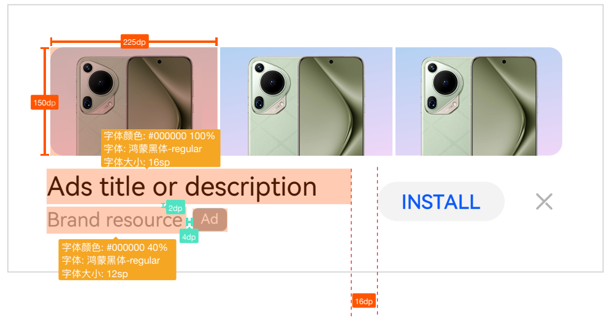

## 225×150（单图）

|  |  |
| --- | --- |
| <strong>广告样式</strong> | Native |
| <strong>版位名称</strong> | HUAWEI Own Media\_Native\_Image\_225\*150 |
| Global 3rd-Party Native Inventory |
| NewsFeed for Assistant&Search |
| <strong>展示样式</strong> | Image |
| <strong>分辨率</strong> | 225×150 |
| <strong>格式</strong> | JPG, JPEG, or PNG |
| <strong>素材大小</strong> | &lt;= 500 KB |
| <strong>文本字符</strong> | &lt;= 90 |
| <strong>品牌名称字符</strong> | &lt;= 30 |

广告位置尺寸标注：

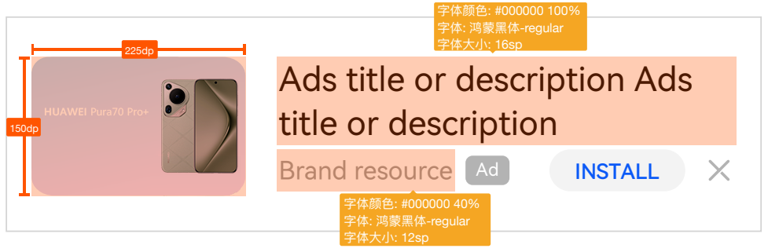

## 300×250（图片）

|  |  |
| --- | --- |
| <strong>广告样式</strong> | Native |
| <strong>版位名称</strong> | Global 3rd-Party Native Inventory |
| Banner & Native Eco |
| <strong>展示样式</strong> | Image |
| <strong>分辨率</strong> | 300×250 |
| <strong>格式</strong> | JPG, JPEG, or PNG |
| <strong>素材大小</strong> | &lt;= 500 KB |

广告位置尺寸标注：

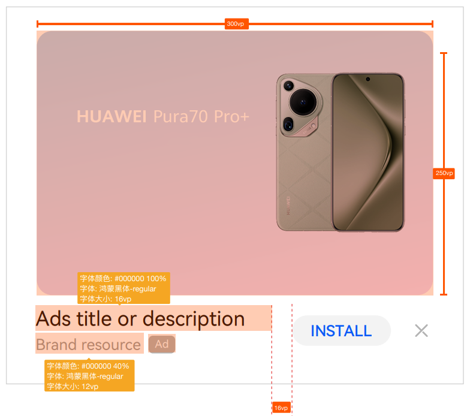

## 450×450（图片）

|  |  |
| --- | --- |
| <strong>广告样式</strong> | Native |
| <strong>版位名称</strong> | HUAWEI Own Media\_Native |
| <strong>展示样式</strong> | Image |
| <strong>分辨率</strong> | 450×450 |
| <strong>格式</strong> | JPG, JPEG, or PNG |
| <strong>素材大小</strong> | &lt;= 500 KB |

广告位置尺寸标注：

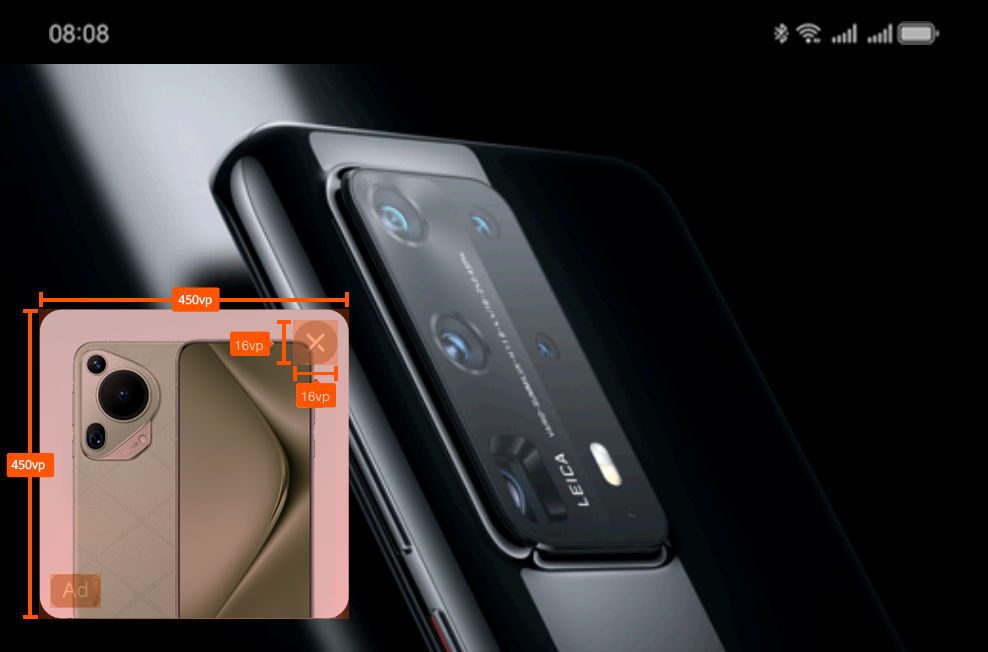

## 1080×170（图片）

|  |  |
| --- | --- |
| <strong>广告样式</strong> | Native |
| <strong>版位名称</strong> | HUAWEI Own Media\_Banner\_1080\*170 |
| NewsFeed for Assistant&Search |
| <strong>展示样式</strong> | Image |
| <strong>分辨率</strong> | 1080×170 |
| <strong>格式</strong> | JPG, JPEG, or PNG |
| <strong>素材大小</strong> | &lt;= 500 KB |

广告位置尺寸标注：

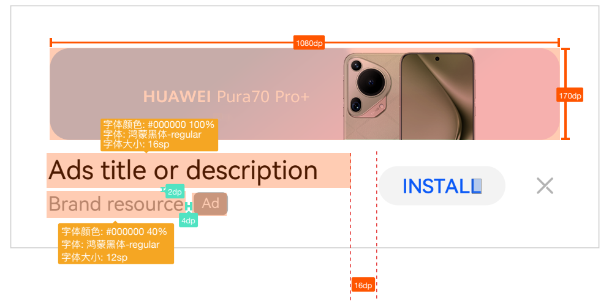

## 1080×432（图片）

|  |  |
| --- | --- |
| <strong>广告样式</strong> | Native |
| <strong>版位名称</strong> | HUAWEI Own Media\_Native\_Image\_1080\*432 |
| Huawei Video Native Masthead Ads |
| NewsFeed for Assistant&Search |
| <strong>展示样式</strong> | Image |
| <strong>分辨率</strong> | 1080×432 |
| <strong>格式</strong> | JPG, JPEG, or PNG |
| <strong>素材大小</strong> | &lt;= 500 KB |
| <strong>文本字符</strong> | &lt;= 90 |
| <strong>品牌名称字符</strong> | &lt;= 30 |

广告位置尺寸标注：

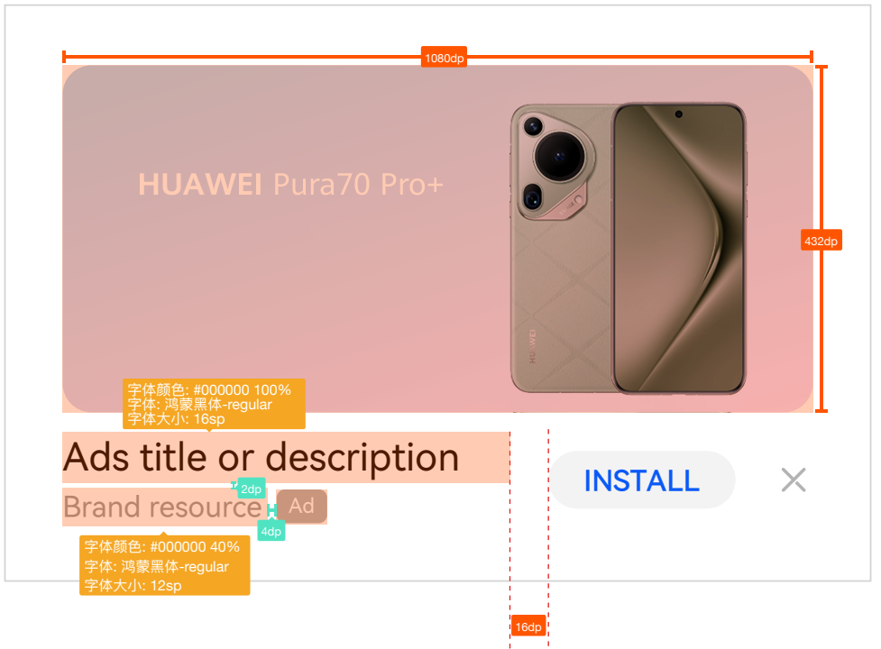

## 1080×607（图片）

|  |  |
| --- | --- |
| <strong>广告样式</strong> | Native |
| <strong>版位名称</strong> | HUAWEI Own Media\_Native |
| Huawei Video Native Masthead Ads |
| Global 3rd-Party Native Inventory |
| Banner & Native Eco |
| NewsFeed for Assistant&Search |
| <strong>展示样式</strong> | Image |
| <strong>分辨率</strong> | 1080×607 |
| <strong>格式</strong> | JPG, JPEG, or PNG |
| <strong>素材大小</strong> | &lt;= 500 KB |
| <strong>文本字符</strong> | &lt;= 90 |
| <strong>品牌名称字符</strong> | &lt;= 30 |

广告位置尺寸标注：

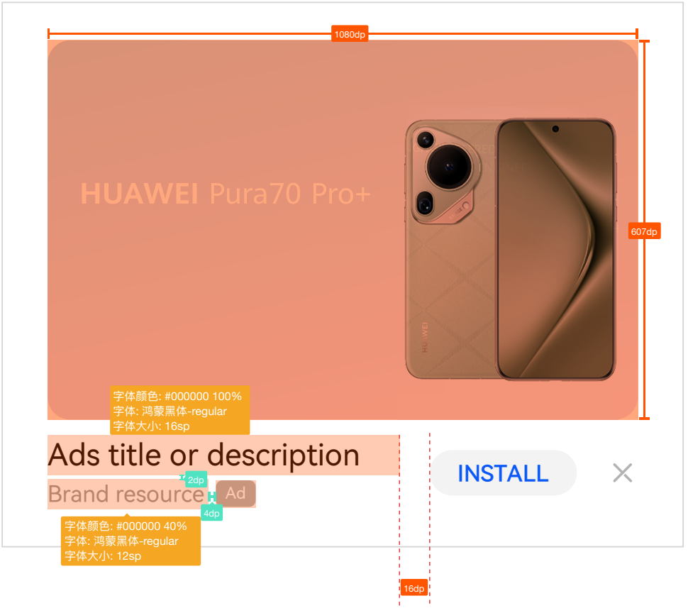

## 1200×627（图片）

|  |  |
| --- | --- |
| <strong>广告样式</strong> | Native |
| <strong>版位名称</strong> | Global 3rd-Party Native Inventory |
| Banner & Native Eco |
| <strong>展示样式</strong> | Image |
| <strong>分辨率</strong> | 1200×627 |
| <strong>格式</strong> | JPG, JPEG, or PNG |
| <strong>素材大小</strong> | &lt;= 500 KB |

广告位置尺寸标注：

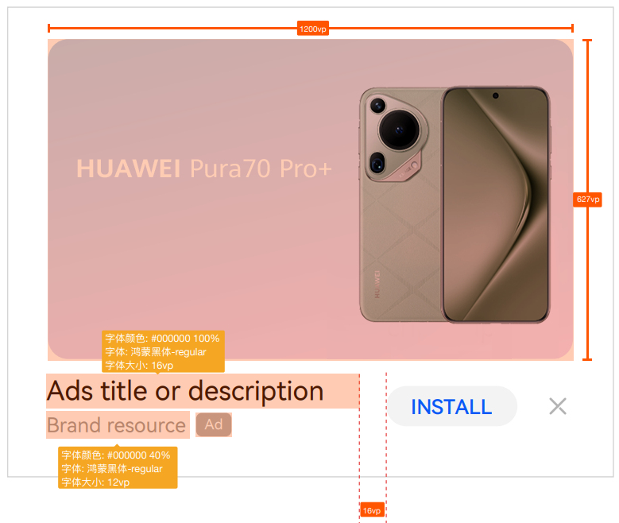

## 1334×288（图片）

|  |  |
| --- | --- |
| <strong>广告样式</strong> | Native |
| <strong>版位名称</strong> | HUAWEI Own Media\_Native |
| <strong>展示样式</strong> | Image |
| <strong>分辨率</strong> | 1334×288 |
| <strong>格式</strong> | JPG, JPEG, or PNG |
| <strong>素材大小</strong> | &lt;= 500 KB |
| <strong>文本字符</strong> | &lt;= 90 |
| <strong>品牌名称字符</strong> | &lt;= 30 |
| <strong>上线国家/地区</strong> | 俄罗斯 |

广告位置尺寸标注：

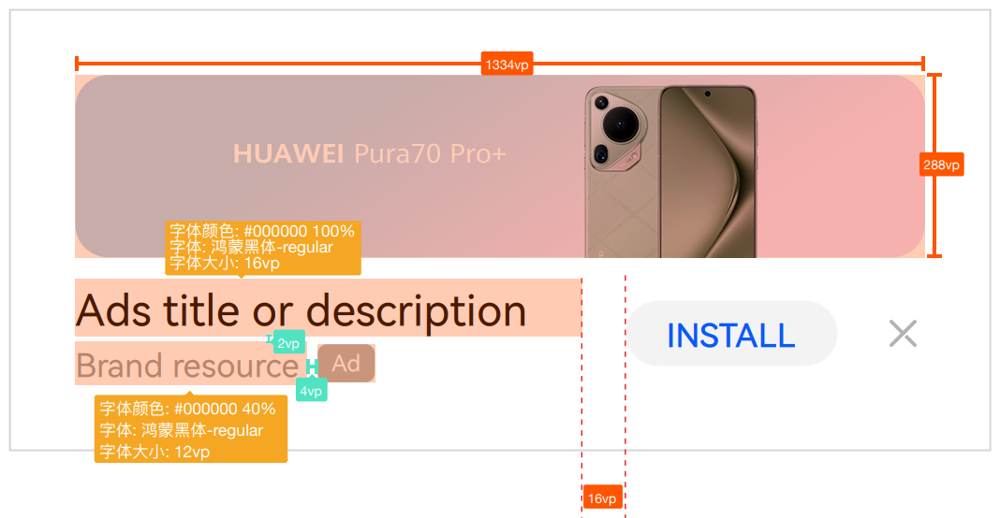

## 640×360（视频）

|  |  |
| --- | --- |
| <strong>广告样式</strong> | Native |
| <strong>版位名称</strong> | HUAWEI Own Media\_Native |
| Global 3rd-Party Native Inventory |
| Banner & Native Eco |
| NewsFeed for Assistant&Search |
| <strong>展示样式</strong> | Video |
| <strong>宽高比</strong> | 16:9 |
| <strong>格式</strong> | MP4 |
| <strong>视频封面尺寸</strong> | 640×360 |
| <strong>视频封面尺寸大小</strong> | &lt;= 500 KB |
| <strong>视频时长</strong> | 5.5~60.5s |
| <strong>视频素材大小</strong> | &lt;= 30 MB |
| <strong>文本字符</strong> | &lt;= 90 |
| <strong>品牌名称字符</strong> | &lt;= 30 |

广告位置尺寸标注：

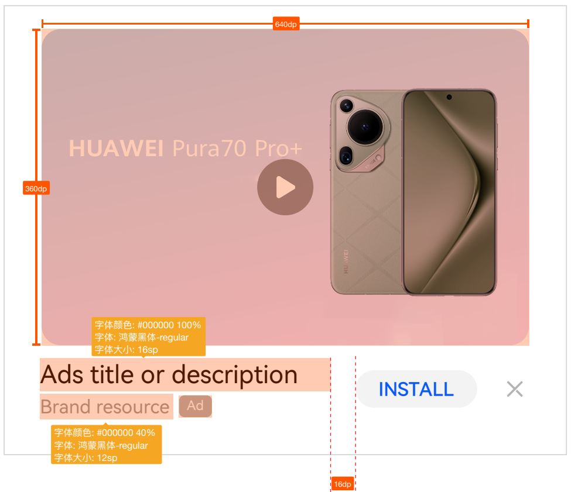

## 720×1280（视频）

|  |  |
| --- | --- |
| <strong>广告样式</strong> | Native |
| <strong>版位名称</strong> | HUAWEI Own Media\_Native |
| <strong>展示样式</strong> | Video |
| <strong>宽高比</strong> | 9:16 |
| <strong>格式</strong> | MP4 |
| <strong>视频封面尺寸</strong> | 720×1280 |
| <strong>视频封面尺寸大小</strong> | &lt;= 500 KB |
| <strong>视频时长</strong> | 4.5~60.5s |
| <strong>视频素材大小</strong> | &lt;= 50 MB |
| <strong>文本字符</strong> | &lt;= 90 |
| <strong>品牌名称字符</strong> | &lt;= 30 |

广告位置尺寸标注：

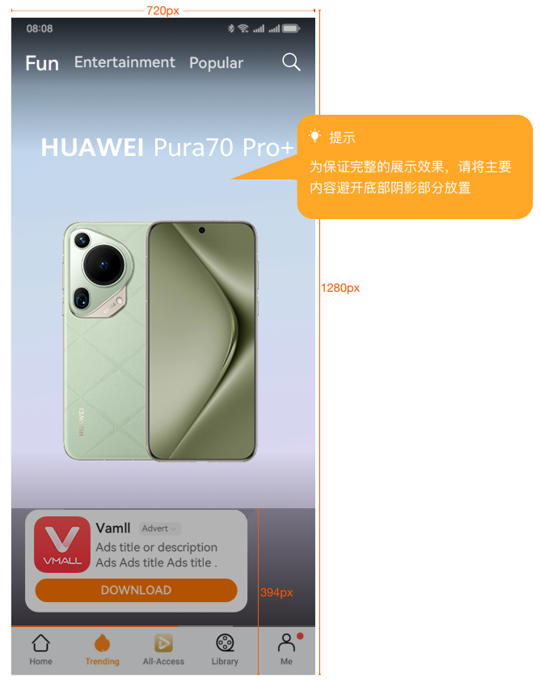

## 1280×720（视频）

|  |  |
| --- | --- |
| <strong>广告样式</strong> | Native |
| <strong>版位名称</strong> | Global 3rd-Party Native Inventory |
| Banner & Native Eco |
| <strong>展示样式</strong> | Video |
| <strong>宽高比</strong> | 9:16 |
| <strong>格式</strong> | MP4 |
| <strong>视频封面尺寸</strong> | 1280×720 |
| <strong>视频封面尺寸大小</strong> | &lt;= 500 KB |
| <strong>视频时长</strong> | 4.5~60.5s |
| <strong>视频素材大小</strong> | &lt;= 50 MB |
| <strong>文本字符</strong> | &lt;= 90 |
| <strong>品牌名称字符</strong> | &lt;= 30 |

广告位置尺寸标注：

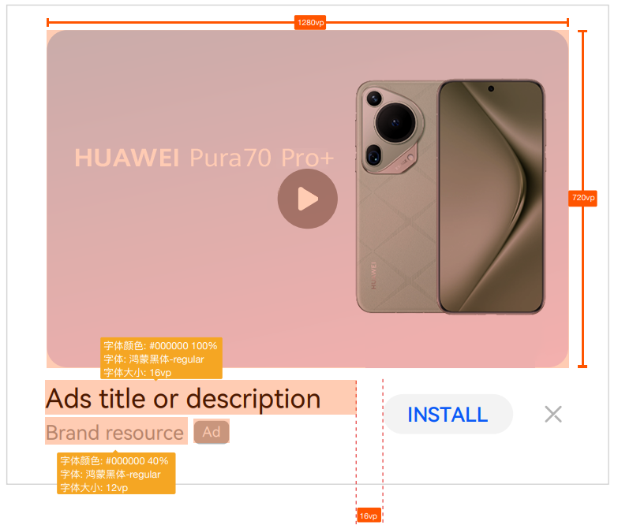
