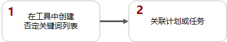
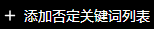
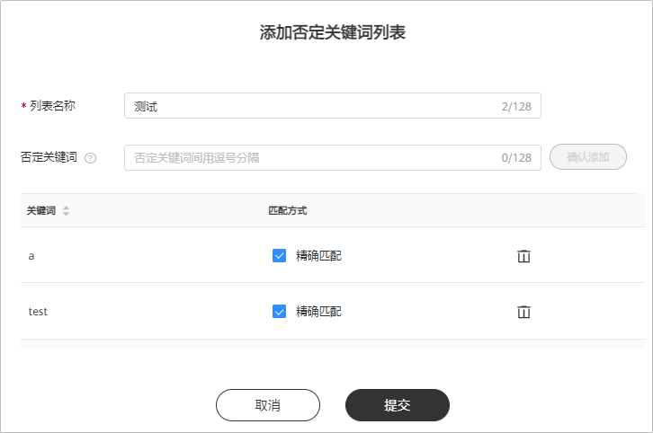
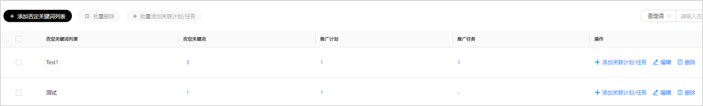
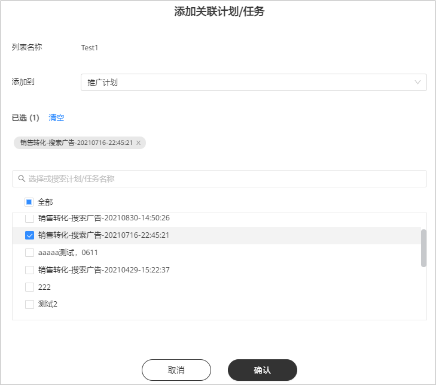
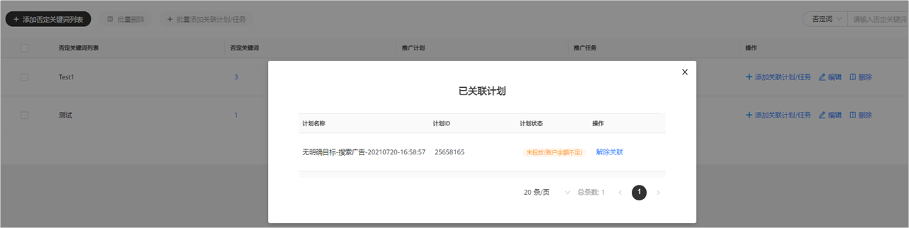
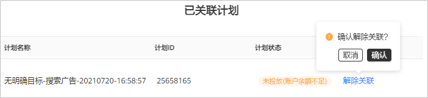
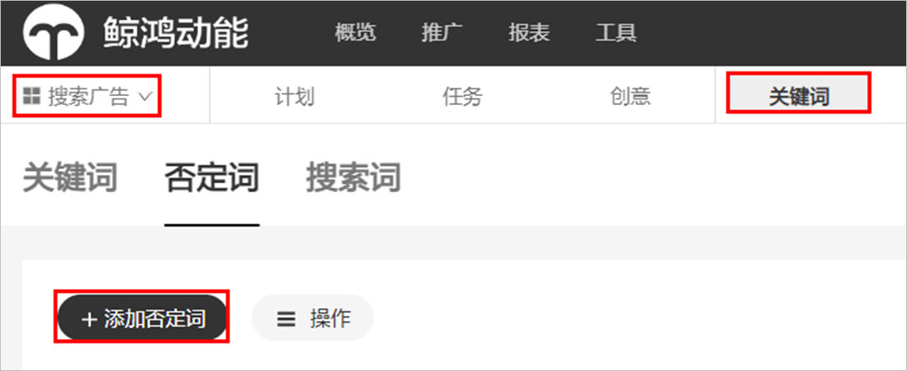
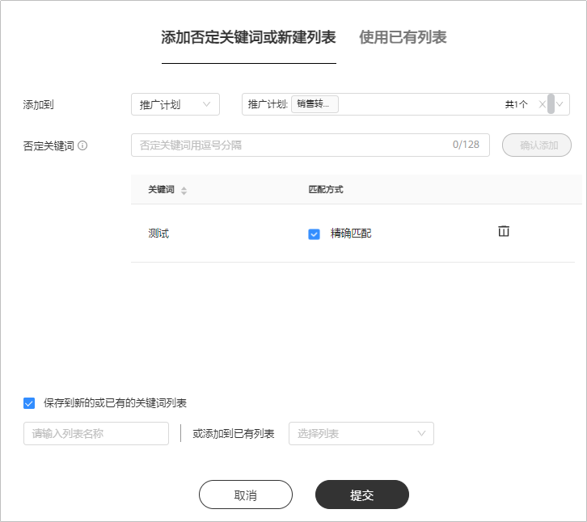
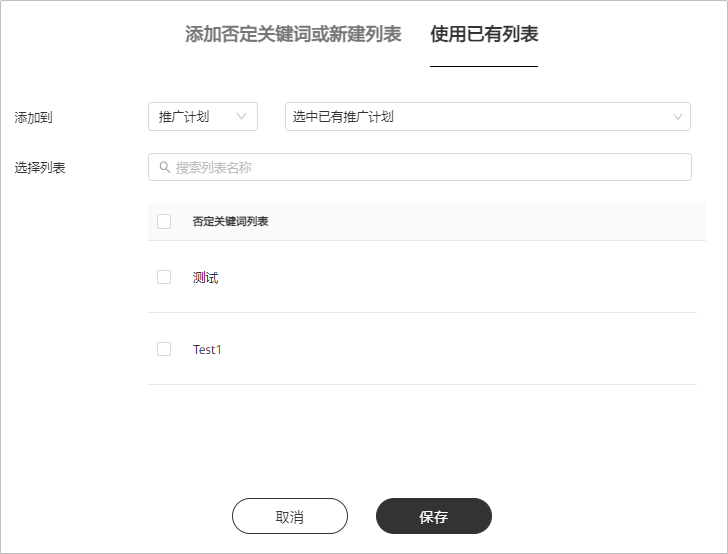

# 否定关键词管理列表

## 概述

如果您有多个计划/任务需要使用到同一批否定关键词，您可以使用否定关键词列表批量管理否定关键词。否定关键词仅支持精确匹配，选择后，若用户搜索内容中包含任一否定关键词则不对此用户展示本计划/任务中的广告。

修改否定关键词列表会对已绑定该列表的所有计划/任务批量生效。

## 操作流程

## 操作步骤

1. 创建否定关键词列表。

   单击“<strong>工具</strong>”-&gt;“<strong>否定关键词管理列表</strong>”，单击，填写列表名称、否定关键词。

   

   - <strong>列表名称</strong>：填写自定义列表名称，不得重复。
   - <strong>否定关键词</strong>：每次添加的否定关键词最多128个字符，您可以上传多个关键词，使用逗号隔开，否定关键词仅支持精确匹配。
2. 添加关联任务/计划。

   在否定关键词列表界面，单击“<strong>添加关联计划/任务</strong>”，可同时关联多条广告计划或者任务，但计划与任务不能同时选择。

   

## 解除关联

解除关联后，计划/任务上否定关键词将失效。若您需要重新添加否定关键词，您需要重新关联。

1. 点击否定关键词列表中任务或者计划的数字，您可以在跳出的页面中查看否定关键词所关联的计划或者任务。

   
2. 您可在列表中单击“<strong>解除关联</strong>”，解除关联后，计划或者任务上否定关键词将失效。

   

## 添加否定词列表

<strong>入口：</strong>单击“<strong>推广</strong>”，选择“<strong>搜索广告</strong>”，选择“<strong>关键词</strong>”，单击“<strong>+添加否定词</strong>”。

您可以将否定词添加到已有的推广计划或者推广任务，被添加的否定词也可以保存成新的关键词列表或者同步到已有的关键词列表。

您也可以使用已有列表中已有的否定词，直接添加到推广计划或者推广任务，添加后任务立即生效。

