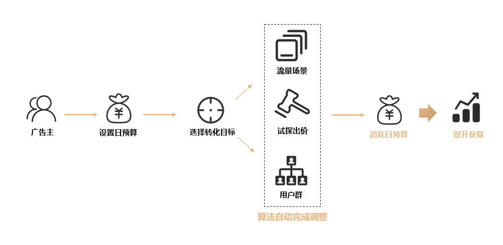

# NOBID

## 业务介绍

NOBID是一种全新上线的任务类型。无需开发者设置出价，只需完成“任务日预算”及“转化目标”等基础设置，由算法自动调配竞价策略，在投放时段内匀速完成预算消耗，主动探索最优流量以达成任务最大化转化量。

## 适用场景

该投放模式简化了传统试探出价、逐步调优的步骤，极大节约了开发者的时间成本，适合新应用冷启动期快速起量，以及需要大幅增量的应用。

## 支持目标

NOBID按下载量计费，支持选择激活、次日留存、首次付费、每次付费、注册、授信、关键行为1、老客激活、线索收集页面访问、平台首日ROI等单一转化目标，暂不支持双目标。

## 工作原理

## 创建NOBID任务

### 前提条件

- 开通归因功能（[智能分包](https://developer.huawei.com/consumer/cn/doc/promotion/bp-functions-intelligent-subcontract-create-task-0000001284811940)或[监测链接](https://developer.huawei.com/consumer/cn/doc/promotion/bp-functions-link-configure-0000001351658397)）。
- 连续回传转化数据等于或大于两天，且每天回传量超过10（平台首日ROI单目标不涉及回传）。

 

与oCPD任务类型相同，创建NOBID任务前也需要将转化数据进行回传，平台积累一段时间数据，在模型训练完成之后才能进行NOBID投放。

### 操作步骤

1. 登录[华为应用市场应用推广平台](https://ads.huawei.com/cn/)，进入“概览”主页面，点击左上角“创建”按钮，下拉框中选择“创建任务”。
2. 在“计划设置”模块，为新建任务设置日预算。并填写计划名称，点击“继续，创建任务”。
3. 在“计划设置”模块，选择投放场景为“智投”，并选择“任务类型”为“NOBID”。填写新任务名称，点击“继续，进行任务详细设置”。

    

   NOBID下挂于“智投”投放场景，支持混投推荐和搜索流量。

   
4. 继续完成转化目标及归因信息配置后，即可提交任务。

## FAQ

<strong>1.</strong> <strong>NOBID</strong> <strong>建议设置多少日预算？</strong>

投放初期可参照历史平均转化成本，设置大于3-5个转化成本的日预算。如转化成本是200元，则日预算建议不少于1000元。

投放平稳期可根据获量诉求和成本预期设置合理预算。如当前出价下获量不满足预算消耗目标，系统会逐步提高价格探索更优质的流量。

<strong>2.</strong> <strong>如何进行日预算修改？</strong>

可以根据任务跑量情况和投放诉求灵活调整日预算，系统会根据最新预算和剩余可投放时段自动调整后续出价。

为了避免成本波动过快，不建议在可投放时段快结束时大幅调高预算。

<strong>3.</strong> <strong>如何进行投放时段修改？</strong>

建议全天投放。NOBID会按投放时段做分时预算消耗调控，过窄的投放时段会缩小可调控空间。

如选择分时投放，则建议在非投放时间内对任务可投放时段进行调整，避免分时预算波动对任务日成本造成影响。

<strong>4.NOBID</strong> <strong>预算会不会消耗不完？</strong>

任务创建首日的可投放时段不是完整天，可能出现会预算消耗不完的情况，所以新建任务建议连续投放2-3天观察效果。

<strong>5.NOBID</strong> <strong>和oCPD的区别是什么？</strong>

NOBID采用智能投放策略，主要关注预算消耗达成及转化量最大化，不设后端成本约束。oCPD具有成本调控能力，如需考核转化成本，则建议使用oCPD进行投放。

<strong>5.</strong> <strong>NOBID</strong> <strong>和oCPD可以投放相同目标吗？</strong>

可以。NOBID和oCPD分属不同任务类型，投放目标一致会同时参与竞价。此外，多个相同目标的NOBID任务也会并行投放。
