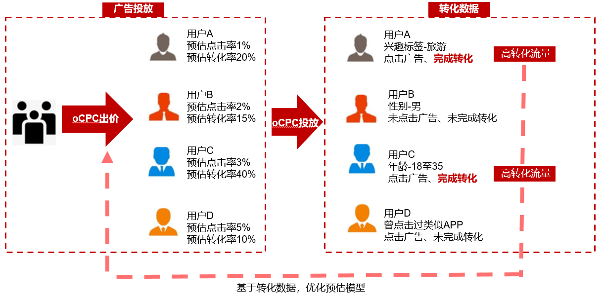
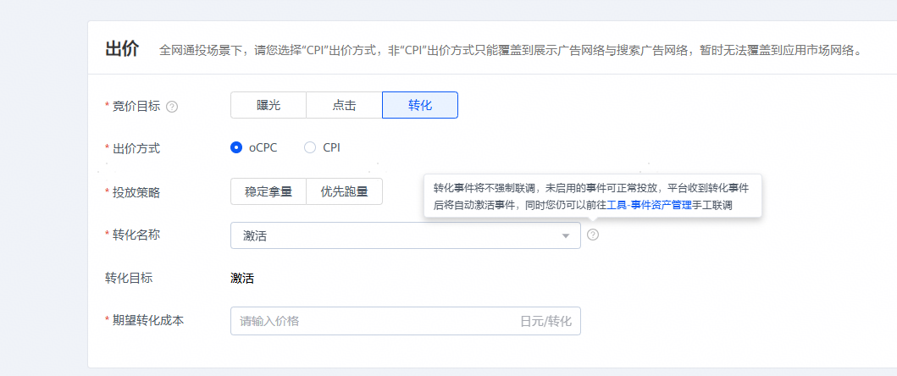
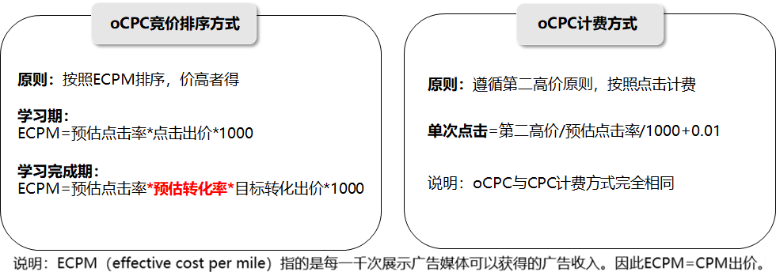
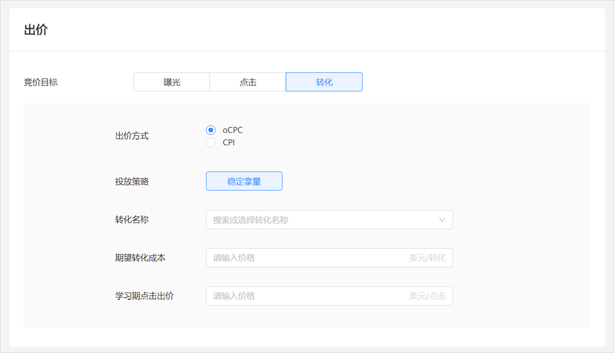
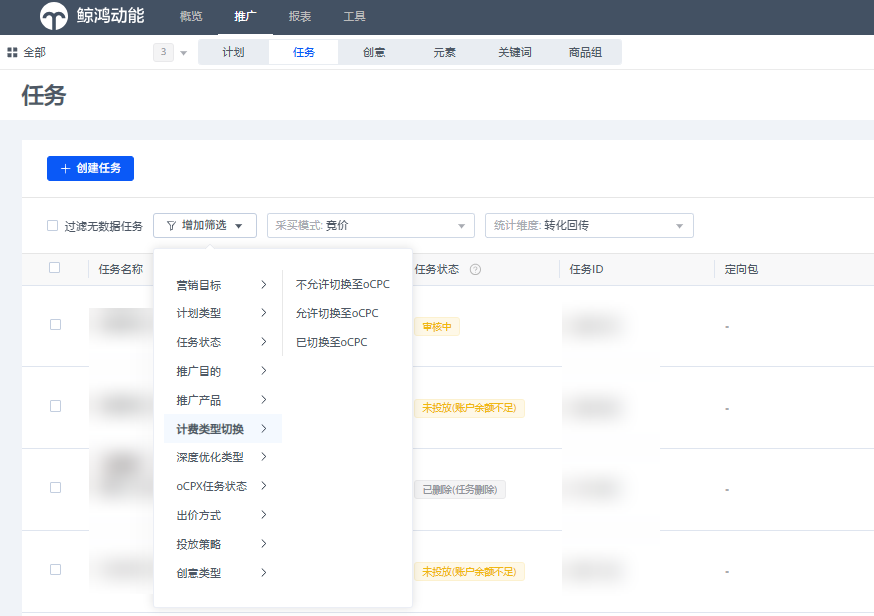
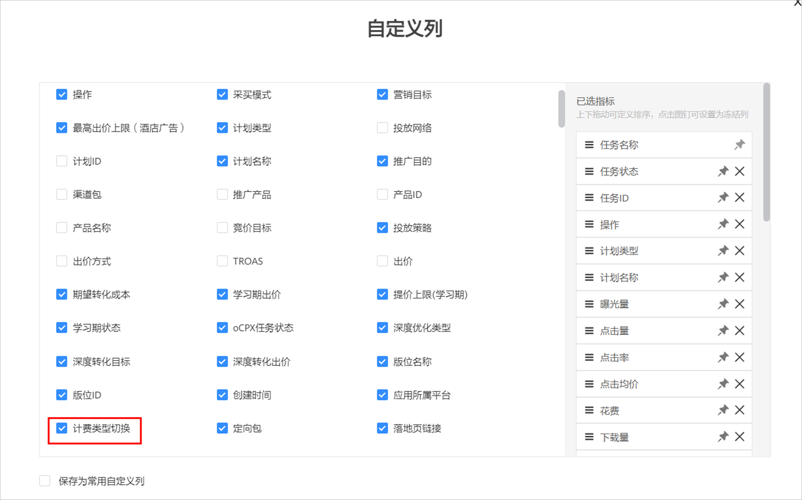

# oCPC

## 概述

 

oCPC只适用于展示广告网络大部分版位。

oCPC（Optimized Cost Per Click）是一种出价方式， 是指以广告主的推广目的为优化目标，根据预估的转化价值自动设定出价，最终按照点击计费的出价方式。系统基于对广告主转化数据的对接和深度理解，智能实时预估每一次点击的转化率并基于竞争环境智能出价，强化高转化率曝光机会的获取，弱化低转化率曝光机会的展现，以帮助广告主控制转化成本、提升转化数量并提升投放效率。

## 优势

- 控制转化成本：oCPC基于“转化率”为预估模型，能够有效降低或稳定广告转化成本。
- 获取更多优质流量：基于oCPC智能投放模式，广告主可使用较宽的定向，以实现获取更多的流量。
- 广告优化技能要求低：采用oCPC方式，您需要设置“期望转化成本”、“学习期点击出价”，对每一次展示系统将会自动出价。

## oCPC原理

oCPC投放分为两个阶段：

- 第一阶段：<strong>数据积累</strong>，又可称为学习期。该阶段系统按照点击扣费，用试探性投放策略为您获取转化时的相关数据，系统将会建立智能投放模型。在获取到转化数据后，系统基于上图原理，能够不断优化预估模型，提高“预估转化率”的预测准确度，然后动态的调整出价。

  oCPC当前支持的转化指标为：<strong>激活、</strong> <strong>激活</strong> <strong>（HMS）、唤醒、注册、付费</strong> <strong>，激活次留双出价，</strong>具体描述如下：

   

  如果您想使用以下指标：<strong>唤醒、注册、付费</strong> <strong>，激活次留双出价</strong>，需要申请[特性通行名单](https://developer.huawei.com/consumer/cn/doc/promotion/addtongxing-0000001128278195#ZH-CN_TOPIC_0000001128278195__li1616219672113)。

  | 跟踪类型 | 跟踪方式 | 支持的转化指标 |
  | --- | --- | --- |
  | 应用跟踪 | [三方监测跟踪](https://developer.huawei.com/consumer/cn/doc/promotion/tracking-overview-0000001170938773) | <strong>激活、唤醒、注册、付费，激活次留双出价</strong> |
  | [自有分析工具](https://developer.huawei.com/consumer/cn/doc/promotion/tracking-zi-0000001092895300) | <strong>激活、唤醒、注册、付费，激活次留双出价</strong> |
  | [华为分析跟踪](https://developer.huawei.com/consumer/cn/doc/promotion/ha-0000001151036374) | <strong>激活、唤醒、注册、付费，激活次留双出价</strong> |
  | [HMS跟踪](https://developer.huawei.com/consumer/cn/doc/promotion/tracking-hms-0000001093214902) | <strong>激活</strong> <strong>（HMS）</strong> |

   

  创建oCPC广告任务时，不做强校验事件联调状态，未启用的事件也可正常投放。

  只要在事件管理平台创建了事件，无论指标是否激活启动，都可以进行选择投放，平台收到转化事件后将会自动激活事件，同时您仍可以前往事件资产管理进行手动联调。

  
- 第二阶段：<strong>智能投放</strong>，在完成学习期后，系统即进入oCPC投放阶段，又可称为学习完成期。该阶段系统会根据建立的转化预估模型智能投放，最大化转化并控制转化成本使其接近目标成本。在该阶段，需要了解其“竞价排序方式”以及“计费方式”，如下图所示。

  

  为了更好的理解oCPC竞价排序与计费方式，假设某一广告位有多个广告任务进行竞价，各任务的出价以及预计点击率/转化率如下表所示：

  从中能够看到任务3竞价排序第一，则任务3获得该广告展示，而实际支付费用为0.81。

  | 广告任务 | 出价方式 | 点击出价（学习期） | 期望转化成本（学习完成期） | 预估点击率 | 预估转化率 | ECPM | 排名 | 实际扣费 |
  | --- | --- | --- | --- | --- | --- | --- | --- | --- |
  | 任务1 | CPC | 0.8 | - | 2% | - | 16.0 | 2 | - |
  | 任务2 | oCPC学习期 | 0.7 | 8（不生效） | 1.5% | 10% | 10.5 | 3 | - |
  | 任务3 | oCPC学习完成期 | 0.5（不生效） | 10 | 2% | 12% | 24.0 | 1 | 0.81 |
  | 任务4 | CPC | 0.78 | - | 1.2% | - | 9.36 | 4 | - |
  | 任务5 | CPM | 9 | - | - | - | 9 | 5 | - |

## oCPC创建方式

oCPC可以通过两种方式创建：新建oCPC任务、一键切换oCPC。

### 新建oCPC任务

1. 设置转化跟踪。

   按照oCPC支持的转化跟踪方式进行操作，详情可参考[转化跟踪](#ZH-CN_TOPIC_0000001310577317__table10977121311584)。
2. 创建oCPC任务。

   启动oCPC功能，根据实际需求输入该oCPC任务的“竞价目标”、“学习期点击出价”、“期望转化成本”等参数。

   
3. 查看oCPC任务状态。

   任务创建后会进入“学习期状态”，需要关注任务的状态，避免出现学习期失败等情况影响投放。任务学习期结束的条件是7天内满30个转化，转化超过30个之后立刻进入“智能投放”阶段。

   单击“推广-任务”中查看oCPC相关任务状态（学习期状态、 学习期出价、期望转化成本、出价方式、竞价目标），评估转化效果（激活量、激活成本等）。

   其中，针对“学习期点击出价”、“期望转化成本”参数设置以及投放建议如下表所示：

   | <strong>状态类型</strong> | <strong>竞价排序</strong> | <strong>状态说明</strong> | <strong>投放建议</strong> |
   | --- | --- | --- | --- |
   | <strong>学习期</strong> | 学习期点击成本出价 | 新建oCPC广告会进入学习中状态，此时广告主使用CPC出价 | 尽量避免修改出价和定向，以保证广告跑量稳定、成本稳定，尽快度过学习期。 |
   | <strong>学习期结束</strong> | 目标转化成本出价 | 能够稳定预估转化率后，广告转为学习完成状态，此时广告大概率会以稳定的成本持续跑量 | 尽量避免频繁修改出价和定向，启动投放时先维持原本定向，逐步优化。 |
   | <strong>学习期失败</strong> | / | 模型不能稳定的预估转化率，不能准确的识别高转化用户，成本不稳定，也不能持续跑量 | 从概率上较难获取更多转化，任务将会自动暂停，建议创建新广告任务或者修改当前任务的创意。 |

   广告任务创建后，不可再修改转化目标和出价方式，可修改每日限额、出价、定向、创意等。但不建议进行频繁或幅度过大的调整，否则可能会引起模型波动，造成实际转化成本骤升、曝光量骤减等不必要的损失。

### 一键切换oCPC

- 概述

  如果您当前单个任务最近7天内的转化数量超过30个，可以将当前任务切换成oCPC投放，不再需要重新创建任务。切换到oCPC投放的任务直接进入“稳定期”，不再需要学习期。

   

  CPD任务不支持使用“一键切换oCPC”的功能。

- 操作指导

1. 筛选出允许切换至oCPC的任务。
   - 方法1：在“推广”-&gt;“任务”中，单击“增加筛选”-&gt;“计费类型切换”，允许切换的任务显示“允许切换至oCPC”。

     
   - 方法2：在“推广”&gt;“任务”中，在右上角的自定义列中找到“属性指标”-“计费类型切换”，查看允许切换的任务并进行勾选。

     
2. 编辑任务。

   选中可切换至oCPC的任务，单击“编辑”，修改竞价目标为转化，并设置相关信息，设置成功后点击提交，完成一键切换，无需再次审核。

   完成一键切换后，任务状态为“投放中”，且该任务进入oCPC第二阶段。

   

## 如何设置和优化出价

- <strong>出价原则</strong>：贴近实际转化成本。 出价过低，并不能直接控制成本反而带来拿量问题。若对成本存在担忧，可在投放初期可通过设 置日消耗限额的方式，后期待投放逐渐稳定后逐步提高，以降低成本风险。
- <strong>设置出价</strong>：首先，计算近期使用相似素材、投放相似定向时的实际转化成本（总消耗/总转化数） 若推广诉求是拿到更多量，建议出价稍高于平均转化成本； 若对成本控制要求较高，对拿量速度接受度较高，建议出价不要高于实际转化成本。
- <strong>优化出价</strong>：不建议频繁修改出价，不建议过大幅度修改出价。 修改频率建议一天不超过2次，修改幅度＜10%为宜。优化目标出价修改的幅度过大，可能会引起实际转化成本骤升、 曝光量骤减等不必要的损失。
