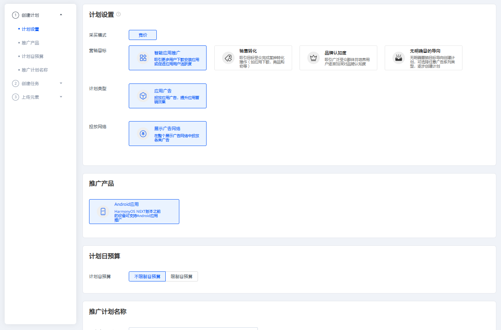
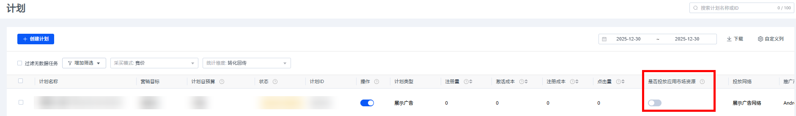

# 概述

## 概述

鲸鸿动能广告对不同产品支持的投放网络不同，在您创建广告时，需要选择正确的投放网络。对同一产品支持多种网络进行推广时，推荐您同时使用多个网络进行推广，以便达到较佳的推广效果。不同投放网络支持推广的产品类型如下：

|  |  |  |  |  |  |  |  |
| --- | --- | --- | --- | --- | --- | --- | --- |
| **投放网络** | **Android应用** | | | | **快应用** | **网页** | **商品** |
| **华为应用市场应用下载** | **非华为应用市场应用下载** | **华为应用市场应用促活** | **非华为应用市场应用促活** |
| **展示广告网络** | **√** | **√** | **√** | **√** | **√** | **√** | × |
| **应用市场** | **√** | × | × | × | × | × | × |

鲸鸿动能广告平台通过计划、任务和创意3个层级对您的广告进行管理。每个账户下可以创建多个计划，每个计划下可以创建一个或多个任务，每个任务下可以上传一个或多个创意。

 

单个计划下最多可复制50条任务。

- **计划**：在推广计划级别，您可以根据营销目标设置将您的哪类产品以何种广告形式投放到哪个广告网络，并为您的产品设置日预算。这些设置在计划创建完成之后不支持修改。
- **任务**：在任务级别，您可以设置待推广的产品、投放类型、投放版位、投放时间、出价等，还可以设置地域、运营商、语言、设备、应用行为等定向条件。不同的投放网络对应的定向条件有所不同。
- **创意**：每个任务下可以设置5个创意，创意是广告主展现给用户的推广内容，包括文字标题、图片或者视频素材等内容。创意决定了是否能吸引潜在受众，从而采取行动促成转化。

## 广告创建流程

以下通过一个简单的广告创建流程介绍您需要设置哪些信息，并对营销目标、计划类型、投放网络、定向条件等概念做简要的解释。

 

广告的审核大部分会在24个小时内完成，对于一些复杂的情况可能需要更长审核时间，一般会在1-2个工作日内完成审核；为了确保投放的及时性，不耽误您的投放计划，请提前进行安排和提交审核。

1. 创建广告计划。

   登录[鲸鸿动能广告平台](https://ads.huawei.com/usermgtportal/home/index.html#/)后，在首页单击“创建”，选择“创建计划”，进行新计划创建。创建计划时，您可以设置采买模式、营销目标、计划类型、投放网络、推广产品、日预算及推广计划名称等信息。

   

   - **采买模式**：默认选择竞价模式，在终端用户每次发起广告请求时，您的广告需要和其它广告主的广告进行竞价，鲸鸿动能广告会按照竞价eCPM进行排序，eCPM高的任务会获得本次展示机会。
   - **营销目标**：您通过此广告希望达成的推广目的，选定营销目标后，系统会只展示支持此营销目标的计划类型和投放网络，并在投放过程中根据您的营销目标进行投放优化。
     - **销售转化**：获得更多的产品销售或提升应用下载率。
     - **品牌认知度**：将品牌展示给更多用户，提升品牌认知度。
     - **智能应用推广：**吸引用户下载安装应用或促进应用用户活跃度。
     - **无明确目的导向**：如果在创建广告过程中您希望完全控制推广的各项设置，可以选择此选项。
   - **计划类型**：是指您希望投放的广告在哪种场景下被展示给用户，当前支持下述类型：
     - **展示广告**：在用户浏览信息或使用应用的过程中，您的广告将在适当的位置展示给用户。
     - **搜索广告**：在用户搜索关键词时，如果和你设置的关键词匹配，您的广告将被展示到搜索结果中。
     - **商品广告**：用户在浏览或搜索商品信息时，您的商品将被展示给用户。
     - **应用广告：**在用户浏览信息或使用应用的过程中，您的广告将在适当的位置展示给用户。
   - **投放网络**：是指您希望在哪个投放网络上推广您的广告。
     - 全网通投：广告同时投放在展示广告网络、应用市场（应用促活任务暂时不支持投放到应用市场）。
       - **展示广告网络：**广告展示在华为自有媒体、三方媒体。
       - **应用市场：**广告展示在华为应用市场上。
     - 自定义投放网络：您可以选择投放在“展示广告网络”或者“应用市场”。

     ***说明：***

     如果您不想将广告同时投放到应用市场，您可以在创建完广告后，单击“推广”->”计划”，在右上角的自定义列中，勾选“是否投放应用市场”，进行关闭操作。

     
   - **推广产品：**您可以在鲸鸿动能广告平台投放您的网页或Android应用。
     - **网页**：您希望推广某个网页时请选择此选项。推广的网页可以是您提供服务的网站页面，可以是您品牌的介绍页面、商品在线订购页面，也可以是您应用的介绍和下载页面。

        

       网页URL中不可包含中英文感叹号且必须是https开头。

       如果您使用了Google Analytics工具或者您自己的分析工具跟踪广告流量，区分用户来自哪个广告计划任务等，您可以通过宏参数实现广告流量追踪功能，您可以在网页中添加宏参数，用来监测广告流量信息。
       - 使用前提：您推广网页需要集成Google Analytics代码或者集成您自己的分析工具代码，将网页与Google Analytics或者您自己的分析工具连接成功，通过[UTM](https://ga-dev-tools.web.app/ga4/campaign-url-builder/)[落地页生成器](https://ga-dev-tools.web.app/ga4/campaign-url-builder/)或者您自己的分析工具生成落地页URL，然后才能在鲸鸿动能广告平台中使用网页追踪广告流量。
       - 鲸鸿动能广告支持的宏参数如下：

         | 参数 | 解释 |
         | --- | --- |
         | \_\_CID\_\_ | 计划ID。 |
         | \_\_ADSETID\_\_ | 任务ID。 |
         | \_\_ADID\_\_ | 创意ID |
         | \_\_CNAME\_\_ | 计划名称。 |
         | \_\_ADSETNAME\_\_ | 任务名称。 |
         | \_\_ADNAME\_\_ | 创意名称。 |
         | \_\_LANG\_\_ | 用户手机设置的语言。 |
         | \_\_OS\_\_ | 用户操作系统名称，仅支持安卓。 |
         | \_\_IP\_\_ | 用户IP地址。 |
         | \_\_UA\_\_ | UserAgent，URLEncode UTF-8格式，例如Mozilla%2f5.0。 |
         | \_\_CHANNEL\_\_ | 投放网络：展示广告网络、应用市场广告网络和搜索广告网络。 |
         | \_\_APP\_STATUS\_\_ | 区分应用安装状态。未安装场景下，区分投放素材类型，包括图片、文字和视频。 |
       - 您可以通过UTM落地页生成器或者您自己的分析工具生成自定义网页，利用上表中参数对应关系将参数进行替换，如果您的计划名称为spring\_sale，计划ID为2631421。

         例如：您使用的是UTM落地页生成器，生成自定义网页如下：

         https://ads.huawei.com/?utm\_source=Huawei &utm\_medium=CPC&utm\_campaign=\_\_CNAME\_\_&utm\_id=\_\_CID\_\_

         当广告投放后，系统会将\_\_CNAME\_\_和\_\_CID\_\_替换成实际的广告信息，替换后示例：

         https://ads.huawei.com/?utm\_source=Huawei&utm\_medium=CPC&utm\_campaign=spring\_sale&utm\_id=2631421
     - **Android应用**：如果您希望更多用户下载您的应用，或对已经下载应用的用户进行促活，推广产品请选择Android应用。应用下载支持在华为应用市场上架的应用和在其它应用市场上架的应用；应用促活只支持在华为应用市场上架的应用。

       如果您想要投放在GP上架的应用时，并且您想要追踪广告流量信息，区分用户来自哪个广告计划任务等，您可以通过宏参数实现广告流量追踪功能，您可以在自定义网页/Deeplink中添加宏参数，用来监测广告流量信息。
       - 鲸鸿动能广告支持的宏参数如下：

         | 参数 | 解释 |
         | --- | --- |
         | \_\_CID\_\_ | 计划ID。 |
         | \_\_ADSETID\_\_ | 任务ID。 |
         | \_\_ADID\_\_ | 创意ID |
         | \_\_CNAME\_\_ | 计划名称。 |
         | \_\_ADSETNAME\_\_ | 任务名称。 |
         | \_\_ADNAME\_\_ | 创意名称。 |
         | \_\_LANG\_\_ | 用户手机设置的语言。 |
         | \_\_OS\_\_ | 用户操作系统名称，仅支持安卓。 |
         | \_\_IP\_\_ | 用户IP地址。 |
         | \_\_UA\_\_ | UserAgent，URLEncode UTF-8格式，例如Mozilla%2f5.0。 |
         | \_\_CHANNEL\_\_ | 投放网络：展示广告网络、应用市场广告网络和搜索广告网络。 |
         | \_\_APP\_STATUS\_\_ | 区分应用安装状态。未安装场景下，区分投放素材类型，包括图片、文字和视频。 |
         | \_\_REQUESTID\_\_ | 广告请求ID。 |
         | \_\_ENGAGEMENT\_TYPE\_\_ | 指的是用户行为，区分用户点击下载按钮直接下载或点击广告跳转落地页或应用市场下载。 |

          

         如果您的应用已接入AppsFlyer，建议您使用**\_\_APP\_STATUS\_\_**、**\_\_ENGAGEMENT\_TYPE\_\_**这两个参数进行流量场景区分，避免被AppsFlyer判断购买了大量的作弊流量。
       - 自定义网页：您可以通过UTM落地页生成器或者您自己分析工具生成自定义网页，利用上表中参数对应关系将参数进行替换，如果您的计划名称为spring\_sale，计划id为2631421。

         例如：您使用的是UTM落地页生成器，生成自定义网页如下：

         https://ads.huawei.com/?utm\_source=Huawei &utm\_medium=CPC&utm\_campaign=\_\_CNAME\_\_&utm\_id=\_\_CID\_\_

         当广告投放后，系统会将\_\_CNAME\_\_和\_\_CID\_\_替换成实际的广告信息，替换后示例：

         https://ads.huawei.com/?utm\_source=Huawei&utm\_medium=CPC&utm\_campaign=spring\_sale&utm\_id=2631421
       - Deeplink：您可以通过**[Deeplink](https://developer.huawei.com/consumer/cn/doc/HMSCore-Guides/deeplink-0000002031358796)**获取您的Deeplink链接，利用上表中参数对应关系将参数进行替换，如果您的计划名称为spring\_sale。

         例如：deeplinkapp://com.mytest.deeplink:8080/deeplinkDetail?param1=test&campaign=\_\_CNAME\_\_

         当广告投放后，系统会将\_\_CNAME\_\_替换成实际的广告信息，替换后示例：

         deeplinkapp://com.mytest.deeplink:8080/deeplinkDetail?param1=test&campaign=spring\_sale
     - **快应用/快游戏：**如果您希望推广您的快应用/快游戏请选择此选项，快应用/快游戏是一种新型免安装应用，用户无需安装应用，点击广告即可使用您的应用，占用存储极少。仅支持展示广告网络投放快应用。
   - **计划日预算：**如果您希望控制计划下所有任务的每日消耗金额，可以为计划指定日预算金额。超过限额时系统将自动暂停此计划的投放并在次日恢复限额和投放。日预算支持修改，修改后您可以选择立即生效或者次日生效，每天可以修改10次。
   - **推广计划名称：**设置一个清晰易懂的计划名称，方便您在广告账户中轻松找到这个计划，例如：推广产品 + 营销目标 + 投放网络 + 目标人群。
2. 创建广告任务。
   - 计划创建完成后，单击“下一步”即进入创建推广任务阶段。
     - **广告投放类型**：包含[正式投放](https://developer.huawei.com/consumer/cn/doc/promotion/ads-gai-0000001095567152)及[试投放](https://developer.huawei.com/consumer/cn/doc/promotion/ads-adtest-0000001190031279)。
       - 正式投放：您的广告将正式投放给用户，此时您的广告会产生花费、展示、点击等数据。
       - 试投放：您的广告会投放到您指定的设备上，在正式投放广告前使用，便于您在手机上查看广告样式。
     - **推广产品详情**：不同的推广产品，需要设置的参数有所不同。
     - **定向**：不同的投放网络，定向会有所区别，支持地域、性别、年龄、App行为、设备等丰富的定向标签。同时支持您选择已有的定向包，详情可参考[定向](https://developer.huawei.com/consumer/cn/doc/promotion/targeting-0000001180547094)。
     - **版位**：版位提供预览效果图，不同的版位出价底价不同。

       如果您投放的广告为展示应用广告、展示网页广告，鲸鸿动能广告将版位分成通用版位和自动版位；通过流量进行区分，鲸鸿动能广告将版位分成三类：
       - 通用版位：
         - 三方媒体资源：在接入鲸鸿动能广告变现服务的三方应用上展示您的应用广告，包含Global 3rd-Party、3rd-Party等版位。
           - Global 3rd-Party版位：支持CPM, CPC, CPI出价方式，适用于华为应用市场上架的应用投放。
           - 3rd-Party版位：支持CPM,CPC出价方式，适用于非华为应用市场上架的应用投放，不建议华为应用市场上架的应用投放。
         - 自有媒体资源：在华为自有的应用上展示您的应用广告，例如：华为视频、华为音乐等，包含HUAWEI Own Media等版位。
         - 其他首选资源：精心挑选资源进行打包，可能会包含三方媒体资源、自有媒体资源或者三方SSP，包含3rd-Party\_SSP等版位。
       - 自动版位：系统自动为您选择效果较好的位置进行展示广告，无需手动选择版位，只需上传相应图片、视频等元素。

      

     系统中所有日期和时间的时区是使用您注册广告账户时设置的时区。如果您的目标客户所在时区与您广告账户的时区不同，您应对广告投放时间进行调整。

     - **投放日期**：
       - 不限制日期：如果您希望广告一直投放，您可以设置一个起始日期，起始日期默认是您创建广告的当天，您也可以指定未来的某一个日期进行投放。
       - 选择日期范围：如果您希望广告在某一段日期内投放，您可以为广告设置指定的日期。
     - **投放时间：**
       - 全天：如果您希望广告全天投放，选择后，广告将会24小时进行投放。
       - 特定时间段：如果您希望广告在一天的某个时间段开始投放，此时您需要在页面上选择相应时间开始时间点和结束时间点。
       - 多个时间段：如果您希望广告每天的投放时间都不同，以一周为维度，您可以在周一设置一段时间，周二设置一段时间，设置完成后，这一周将会以此时间段投放广告。
     - **出价：**按照竞价目标（曝光、点击、转化等），设置广告出价。
     - **任务名称**：设置一个清晰易懂的任务名称，方便您在广告账户中轻松找到这个任务，例如：任务类型+推广产品+推广国家+版位+出价方式。
   - 如果您希望在已有的计划下增加新的任务，可以在首页单击 “创建”->”创建任务”，在弹出窗口中选择已有计划。新创建的任务将被添加到您选择的计划下。
3. 添加广告创意。

   根据您计划类型、投放网络、版位的不同，需要上传对应的创意图片或视频，设置品牌名称和描述信息等。

   **创意名称：**设置一个清晰易懂的创意名称，方便您在广告账户中轻松找到这个创意，例如：版位-创意样式-尺寸-创意编号。
4. 单击提交。
   - 任务提交时请注意页面的提示信息，系统将根据不同任务的类型决定是否触发[广告审核](https://developer.huawei.com/consumer/cn/doc/promotion/review-0000001052064324)。
   - 审核结果会以邮件方式发送到您的[联系人邮箱](https://developer.huawei.com/consumer/cn/doc/promotion/register-0000001052264353#ZH-CN_TOPIC_0000001052264353__li4641112612506)，或者您可以在鲸鸿动能广告平台右上角的“”中查看审核结果，您可以在“[工具>消息设置](https://developer.huawei.com/consumer/cn/doc/promotion/message-settings-0000001227873245)”中修改消息通知方式。
   - 大部分审核会在24个小时内完成，对一些复杂的情况可能需要更长审核时间，一般会在1-2个工作日内完成审核。

## 应用直达链接获取工具

为了帮助您更快的获取到应用直达链接（特指应用首页），鲸鸿动能广告提供应用直达链接获取工具，您可以按照如下方式进行操作：

1. 您需要先安装您的应用。
2. 使用手机扫描下方二维码或点击链接下载APK安装应用直达链接工具。
3. 在应用直达链接工具中通过应用包名获取应用直达链接。

| 二维码 | APK下载 |
| --- | --- |
|  | [下载](https://h5hosting.dbankcdn.com/cch5/pps-jssdk/3.4.55.300/hiad-tool-release-3.4.55.300.apk) |
