# 概述

## 概述

 

仅支持直客与子客使用人群管理功能。

通过受众人群管理功能，您可以创建受众人群和对受众人群进行管理，您可以使用受众人群作为广告投放的定向人群或排除人群。受众人群可以通过以下方式创建或计算：

- [一方数据人群](https://developer.huawei.com/consumer/cn/doc/promotion/customized-audience-0000001182393560)：您可以使用自己的数据创建一方数据受众人群。通过一方数据人群，您可以将广告系列定位到最具价值的用户，从而更高效地从您的广告中获利。
- [受众人群定向](https://developer.huawei.com/consumer/cn/doc/promotion/audience-targeting-0000001249248257)：根据鲸鸿动能广告平台提供的细分受众人群，您可以依据某个受众群体在线使用的应用或他们感兴趣的产品和服务来定位到这个受众群体。
- [计算受众人群](https://developer.huawei.com/consumer/cn/doc/promotion/private-audience-0000001182553522)：您可使用鲸鸿动能广告平台提供的拓展人群或组合人群能力，来对已创建的人群进行拓展或交并差组合。
- [推荐受众人群](https://developer.huawei.com/consumer/cn/doc/promotion/audience-recommendation-0000001201005640)：鲸鸿动能广告平台会给您推荐有价值的人群，它们可能是某个主题相关人群集群，或者是单个的高质量人群；您可以选择是否将推荐的人群加入您的人群列表中。

## 界面与功能介绍

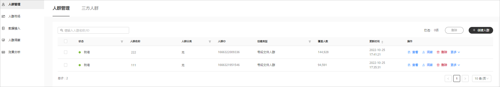

### 人群管理

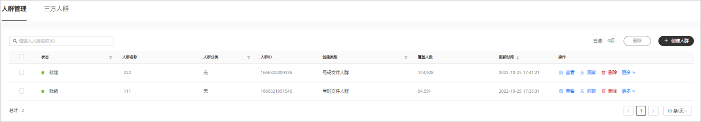

- 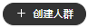创建人群：用于新建人群。
- 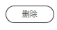删除：您可以勾选想要删除的人群进行删除操作。
- 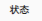状态：
  - 就绪：表示您的受众人群此时可以用于广告投放。
  - 准备中/落盘中：表示您的受众人群正在运算中，请耐心等待，如果您的受众人群超过24小时未能计算完成，请提供账户ID、人群ID，[在线提单](https://developer.huawei.com/consumer/cn/support/feedback/#/)联系我们。
  - 错误：表示您的受众人群运算错误，请提供账户ID、人群ID，[在线提单](https://developer.huawei.com/consumer/cn/support/feedback/#/)联系我们。
- 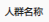人群名称：为人群创建名称。
- 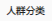人群分类：代表该人群归属的细分受众人群类目，如无，则不涉及。
- 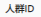人群ID：人群创建完毕后，系统会为人群自动分配人群ID，人群ID具有唯一性，可用于搜索，例如：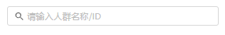。
- 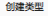创建类型：是指您创建的人群类型，比如“一方数据人群”中的号码文件人群等。
- 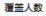覆盖人数：人群创建完成后，系统会进行计算，您可以查看覆盖人群数。
- 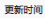更新时间：人群的更新时间。
- 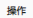操作：受众人群创建完成后，您可以对您创建的受众人群进行查看、洞察、删除操作。
  - 查看：您可以查看人群详情。您也可以在查看界面中复制、删除人群（状态为“就绪”时才能删除）。
  - 洞察：您可对受众人群进行不同维度的数据分析，辅助您投放广告，详情可参考[人群洞察](#section1150614117233)。
  - 删除：当受众人群计算完成后，状态为“就绪”时，您可以删除自己创建的受众人群。

### 人群市场

鲸鸿动能广告会给您推荐有价值的受众人群，它们可能是某个主题相关的受众人群集群，或者是单个高质量受众人群，您可以选择是否将推荐的受众人群加入您的受众人群列表中，详情可参考[推荐受众人群](https://developer.huawei.com/consumer/cn/doc/promotion/audience-recommendation-0000001201005640)。

### 数据接入

鲸鸿动能广告平台为您提供三方数据服务平台服务，您可以在三方或者您自己的数据平台创建受众人群，并同步至鲸鸿动能广告平台，您在进行广告投放时，可以选择这些三方数据人群作为指定投放人群或者排除人群，详情可参考[您的三方数据人群](https://developer.huawei.com/consumer/cn/doc/promotion/customized-audience-0000001182393560#section13869152833214)。

### 人群自动化洞察

洞察分析可以帮助客户更加全面地了解人群的属性、兴趣分类、关注点及地域特点等的特征分布情况，通过这些特征可以用来优化广告创意，指导营销策略，为进一步投放提供参考依据。客户对人群的洞察越清晰，越能准确地传达推广信息，提升投放效果。

- 支持离线任务生成人群画像。
- 支持基于TGI洞察结果创建标签人群。
- 支持导出数据、配置分析指标、加入对比人群。
- 支持TGI特征显著性分析，度量当前人群和大盘全量人群在不同属性上的差异大小，精准识别人群的显著特征。
- 可最多支持两个人群对比。

 

TGI指数= [目标群体中具有某一特征的群体所占比例/总体中具有相同特征的群体所占比例]\*标准数100。

- TGI指数接近100，说明该特征在人群包中表现处于平均水平。
- TGI指数越大于100，说明该特征表现强势，具备参考价值。
- TGI指数越小于100，说明该特征不具备参考价值。

<strong>功能入口：</strong>通过“工具”，单击进入“人群管理”操作界面

## 生成画像

 

人群包状态为“就绪”时，才可启动人群洞察离线任务。

1. <strong>生成画像有两种方式</strong>
   - 第一种：人群列表-&gt;选择对应的人群包-&gt;生成画像。

   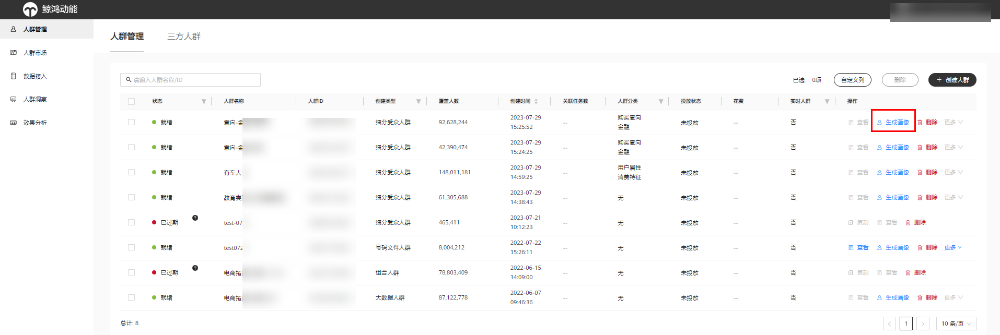

   - 第二种：人群洞察-&gt;选择人群包-&gt;生成画像。

   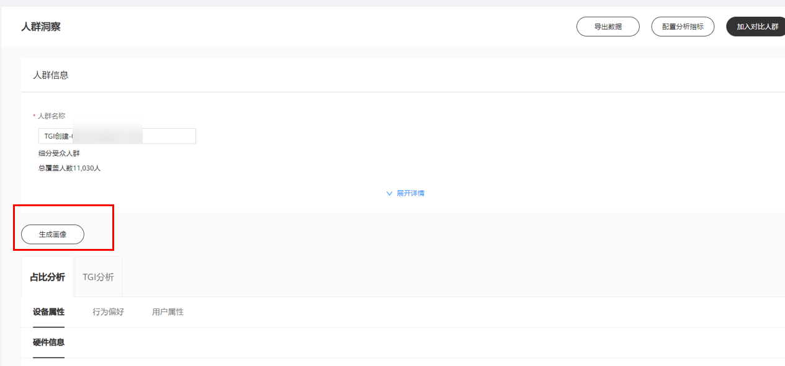

   - 等待画像生成。

   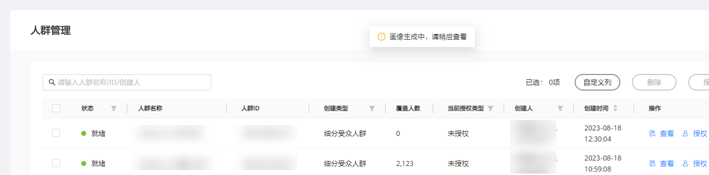

## 查看画像

1. <strong>查看画像的两种方式</strong>
   - 第一种：人群列表-&gt;选择对应的人群包-&gt;查看画像。

   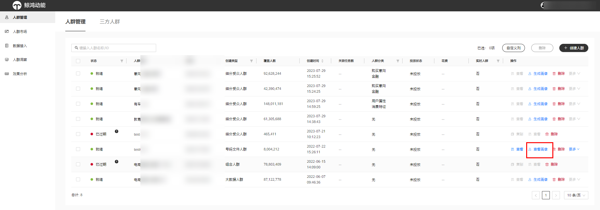

   - 第二种：人群洞察-&gt;选择对应的人群包

   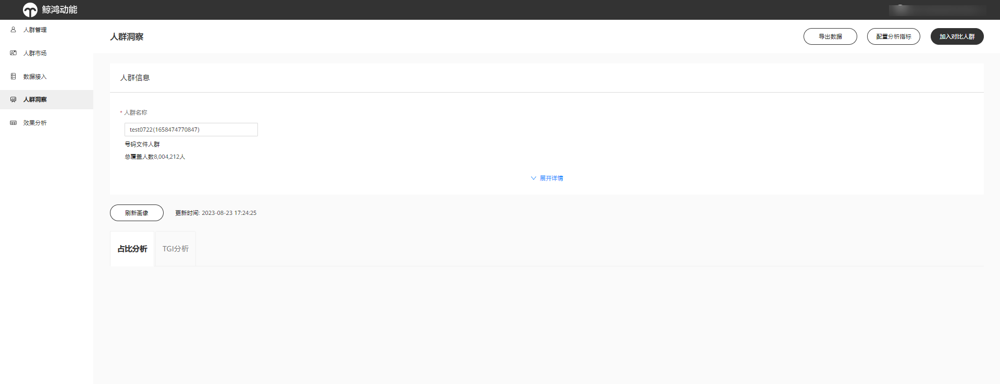
2. <strong>配置洞察维度：</strong>广告主可以根据需求添加各种分析指标维度。

   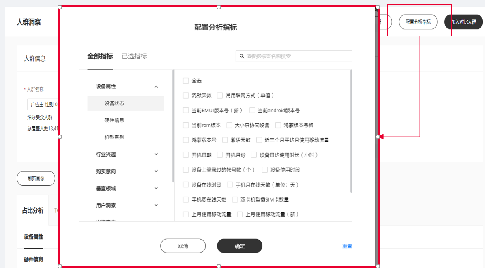

    

   1. 系统默认展示固定的20+维度，用户可自定义展示维度，添加/减少任意维度。
   2. 部分维度的画像需实时生成，等待时间较长。
   3. 人群对比：TGI只展示主人群的结果。
3. <strong>查看结果</strong> <strong>/导出结果：</strong>人群画像生成后，可以查看和导出结果。

   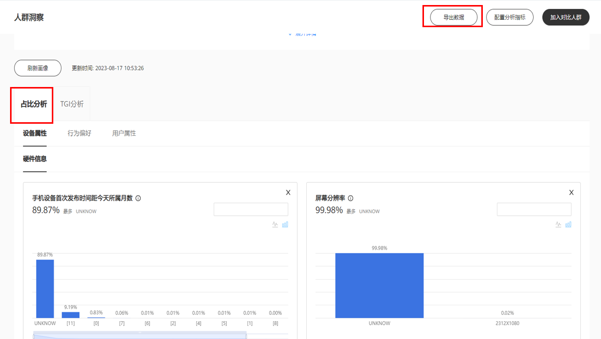

   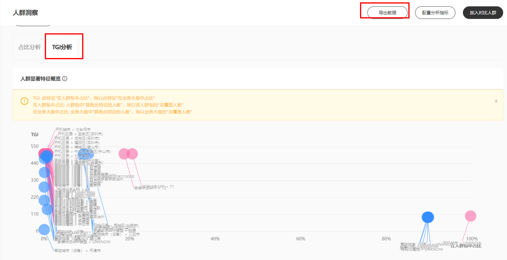

   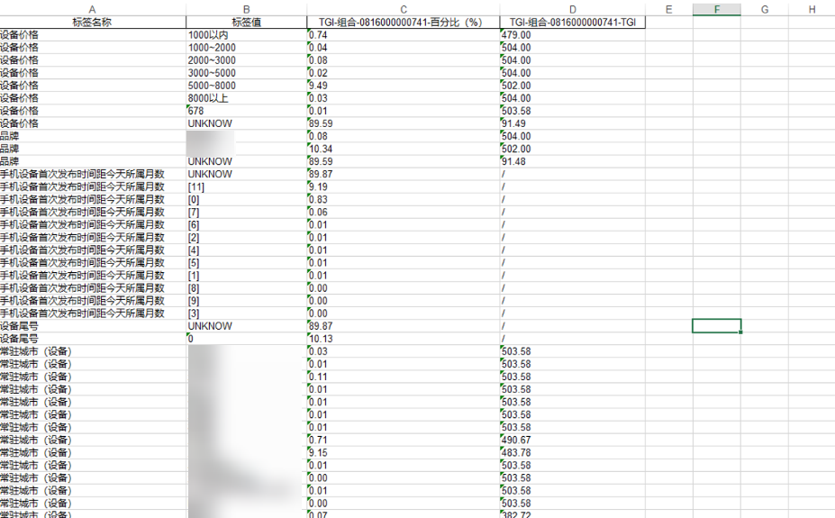

    

   1. 人群画像结果有两个分析维度：
      - 占比分析：按标签维度查看人群包画像分布
      - TGI分析：按标签维度查看人群包显著特征
   2. 画像分析结果可以导出Excel，如上图：

      主要字段为：标签-标签参数值-占比值-TGI值
   3. TGI分析：部分参数值的TGI值需要在特征显著性分析中配置后实时计算生成，需等待时间较长。
   4. TGI表格支持按TGI值/占比值过滤和排序。
4. <strong>刷新画像</strong>：已生成画像结果的人群包可单击“刷新画像”刷新洞察结果，可在最后更新时间的7个自然日后手动触发刷新。

   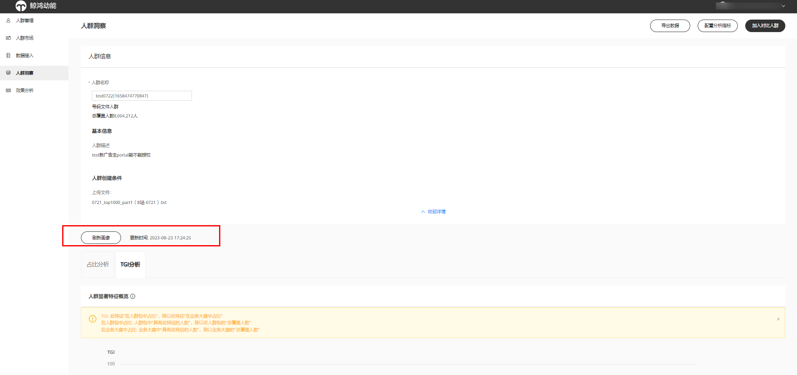
5. <strong>生成人群</strong>：支持基于TGI洞察结果生成人群包。

   可以选择目标标签值添加至人群，在右方编辑人群规则，并生成人群包。

   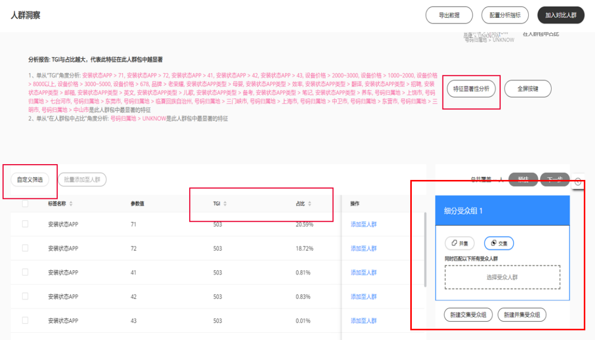

### 效果分析

您可以根据时间查看人群的效果，支持通过人群ID搜索人群，您也可以对人群使用统计进行导出，便于分析人群数据。

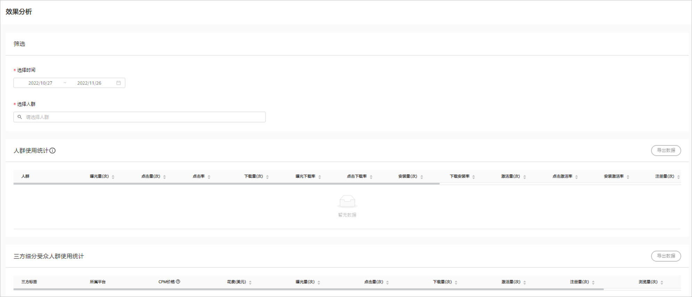

## 受众人群计算时间

受众人群计算时间受您受众人群的数据的影响，如果您的受众人群超过24小时未能计算完成，请提供账户ID、人群ID，[在线提单](https://developer.huawei.com/consumer/cn/support/feedback/#/)联系我们。

## 如何使用受众人群

- 您在创建广告任务时，可以在“自定义人群”中选择您创建的多个受众人群进行包含或者排除定向。如果您选择了多个受众人群，多个受众人群是并集关系。

  
- 系统在进行投放时“自定义人群”与其它定向条件同时生效（取交集），如果选择的“自定义人群”与其它定向条件交集较小会导致广告触达人数较少。

   

  当您在[华为应用市场](https://developer.huawei.com/consumer/cn/doc/promotion/gallery-0000001057273476)对您的应用进行推广时，如果您选择了其他定向条件，此时“自定义人群”与其它定向条件同时生效（取并集）；如果您没有选择其他定向条件（默认为“不限”），此时您只投放给自定义受众人群的人群。

  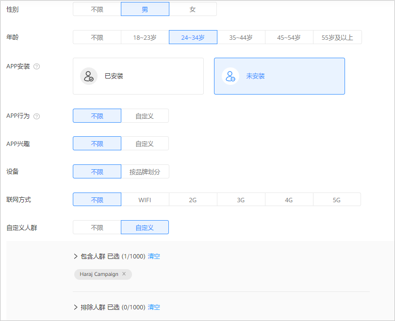
