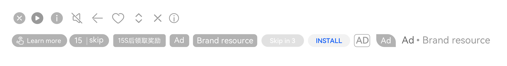

# 概述

- 不同的广告样式需要上传不同的素材，素材内容需要满足要求，包含展示样式、分辨率、素材格式、素材大小和视频长度等，否则您的广告创意无法上传成功，系统校验失败。
- 您上传的素材需要注意安全区域要求，安全区外的部分可能会被遮盖或裁剪。在广告位置尺寸标注中，我们给您标注了会出现在您广告页面中的元素、描述信息的位置，避免和重要信息重叠影响展示效果。

  广告位置尺寸标注图中，以下图标为系统默认显示图标：

  
- 对品牌名称和其它描述信息，要注意不能超过创意允许的字符，素材上传之后，您可以在创意页面的右侧预览您的广告效果，您也可以通过试投放的方式，将广告投放到您指定的手机上查看广告效果，避免因为超出页面展示范围的描述信息被以省略号展示。

- <strong>您上传的素材除了满足上述要求，还需要满足以下审核规范：</strong>

  |  |  |
  | --- | --- |
  | <strong>鲸鸿动能广告通用审核规范（非中国大陆区域）</strong> | [行业准入规则](https://developer.huawei.com/consumer/cn/doc/promotion/industry-admission-rules-0000001189244454) |
  | [通用审核规范](https://developer.huawei.com/consumer/cn/doc/promotion/general-review-regulations-0000001189084544) |
  | [内容分级审核规范](https://developer.huawei.com/consumer/cn/doc/promotion/different-ratings-0000001234125571) |
  | <strong>区域审核规范</strong> | [区域审核规范（亚太）](https://developer.huawei.com/consumer/cn/doc/promotion/regional-review-regulations-asia-pacific-0000001234284063#section2257184094512)  [区域审核规范（欧洲）](https://developer.huawei.com/consumer/cn/doc/promotion/regional-review-regulations-europe-1-0000001655495253) |

  该文档仅供参考，鲸鸿动能广告在审核过程中会严格遵守各个国家/地区法律法规要求，具体以实际审核结果为准。
