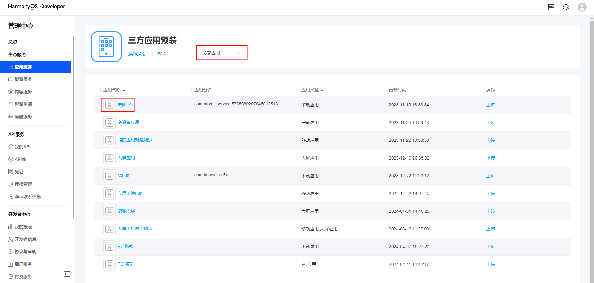
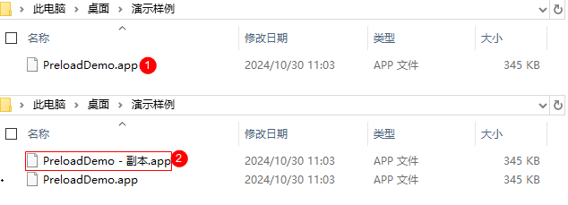
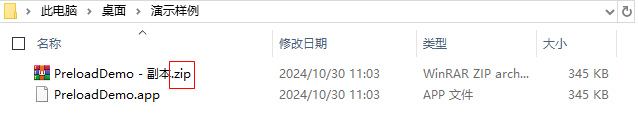
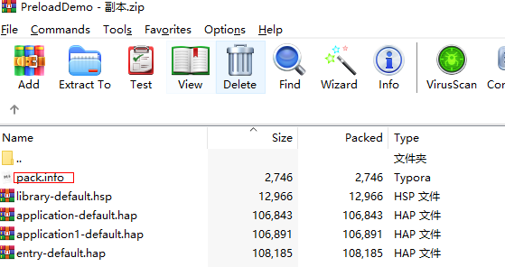
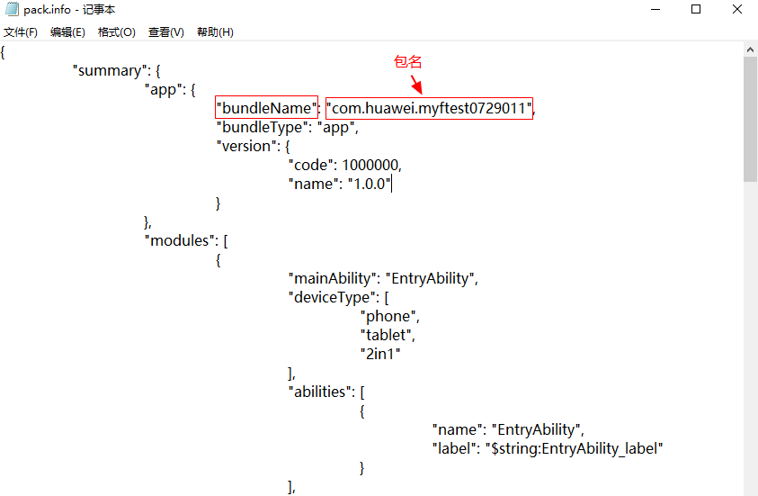
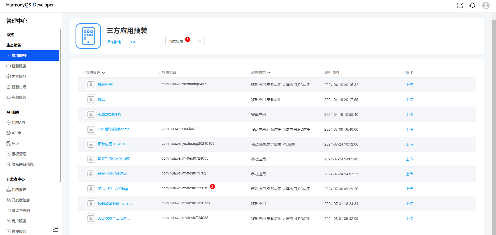
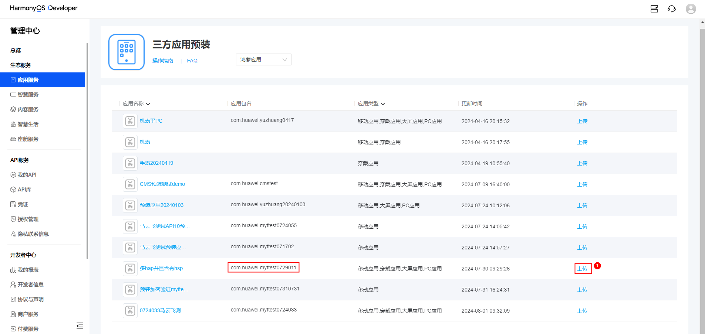

# 鸿蒙应用上传附件FAQ

## 993报错分析

请根据错误码查看相关解析：[软件包解析错误说明（HarmonyOS包）](https://developer.huawei.com/consumer/cn/doc/app/agc-help-harmonyoserror-0000001651912985)

<strong>错误码：</strong>993

<strong>错误内容</strong>：Profile文件非法。

<strong>分析</strong>：鸿蒙应用和软件包需要一一对应，具体的比对方式是校验应用在云端的Profile文件和软件包内的Profile文件是否一致。对于鸿蒙应用，均存在唯一的“包名”，作为标识。可以通过识别包名，来判断软件包和应用是否匹配。

 

软件包指代被上传的应用软件包，即.app文件。鸿蒙应用指开发者联盟上的鸿蒙应用列表中的应用，如下图。

## 上传附件指引

### 1.获取软件包内的包名

以PreloadDemo.app应用为例，找到需要上传的软件包，复制一份该软件包，避免对原有文件造成影响。

修改复制后软件的扩展名，将.app修改为.zip。

解压.zip文件，查看里面pack.info文件。如果该文件无法打开，可以更换打开方式，使用记事本打开。

查看“<strong>bundleName</strong>”后值即为包名。

### 2.上传附件

进入三方应用预装页面，点击下拉框，选择“<strong>鸿蒙应用</strong>”，根据软件包中的包名，找到包名一致的应用，点击右侧“<strong>上传</strong>”操作上传APP软件包。

