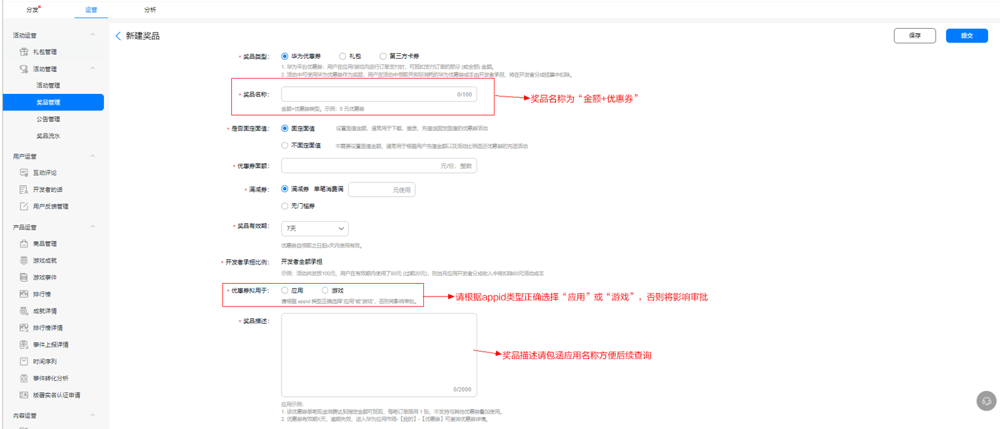
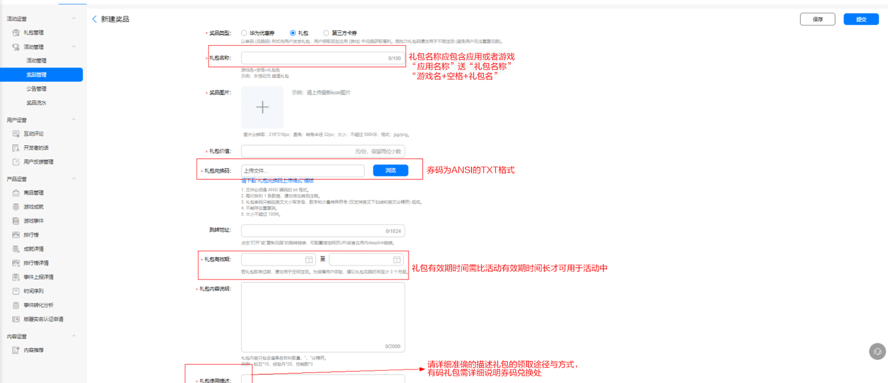
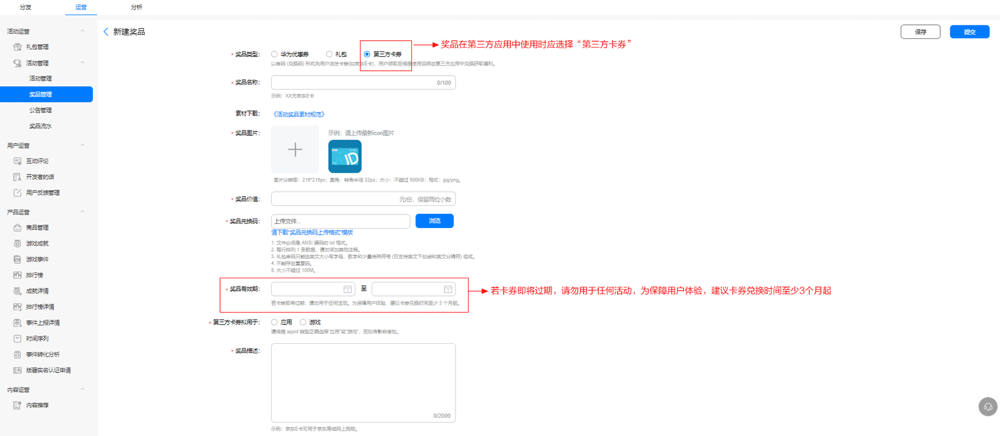

# 各类型奖品创建流程

（1）华为优惠券：图示

<strong>配置说明表：</strong>

| X元优惠券配置表 | |
| --- | --- |
| 奖品类型 | 华为优惠券 |
| 奖品名称 | 5元优惠券 |
| 优惠券面额 | 5 |
| 满减券 | 否 |
| 单笔消费满x元使用 | / |
| 奖品份数 | 99999999 |
| 奖品有效期 | 7天 |
| 优惠券拟用于 | 游戏 |
| 奖品描述 | 1.优惠券可在指定游戏中消费，有效期7天，请尽快使用，逾期失效。  2.进入游戏中心APP/游戏浮标-【我的】-【优惠券】可查询优惠券详情。 |

| X元满减券配置表 | |
| --- | --- |
| 奖品类型 | 华为优惠券 |
| 奖品名称 | 5元满减券 |
| 优惠券面额 | 5 |
| 满减券 | 是 |
| 单笔消费满x元使用 | 30 |
| 奖品份数 | 99999999 |
| 奖品有效期 | 7天 |
| 优惠券拟用于 | 游戏 |
| 奖品描述 | 1.该优惠券单笔订单满指定额度可用，每笔订单限使用1张，不支持与其他券叠加使用。  2.优惠券有效期X天，逾期失效，进入游戏中心APP/游戏浮标-【我的】-【优惠券】可查询优惠券详情。 |

（2）礼包（有码）：图示

<strong>配置说明表：</strong>

| 游戏礼包配置表 | |
| --- | --- |
| 奖品类型 | 礼包 |
| 选择应用 | 游戏名称 |
| 礼包名称 | 游戏名 新手礼包 |
| 礼包价值 | 50 |
| 礼包有效期 | 2021年7月5日-2021年12月31日 |
| 礼包内容说明 | XXX\*数量、XXX\*数量、XXX\*数量 |
| 礼包使用描述 | 进入游戏-点击头像-礼包兑换-输入礼包码即可获得奖励 |
| 配置游戏礼包注意事项： | 1、礼包名称格式：“游戏名+礼包名”，如：永恒纪元 初征礼包；  2、礼包取名规则：根据游戏及礼包内容特色取名；  3、礼包使用描述（格式）：进入游戏-点击头像-礼包兑换-输入礼包码即可获得奖励。 |

（3）第三方卡券：图示

<strong>配置说明表</strong>：

|  |  |
| --- | --- |
| 第三方卡券配置表 | |
| 奖品类型 | 第三方卡券 |
| 奖品名称 | 50元京东E卡 |
| 奖品价值 | 50 |
| 奖品有效期 | 2021年7月15日-2021年11月15日 |
| 优惠券拟用于 | 游戏 |
| 奖品描述 | 京东E卡可用于京东商城网上购物，请于有效期使用。 |
