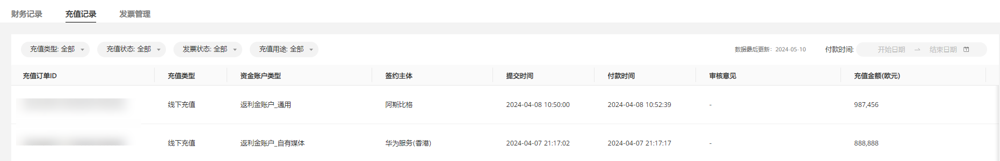
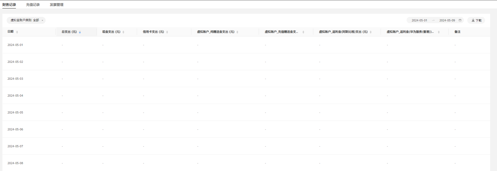

# 直客查询财务记录

本章节为直客财务结算，服务商财务结算请参考[服务商财务管理](/docs/monetize/promotion/finance-0000001058604140)。

 

财务报表日期和时间的时区为UTC+08:00，不受[广告账户注册时选择的时区](https://developer.huawei.com/consumer/cn/doc/promotion/register-0000001052264353#ZH-CN_TOPIC_0000001052264353__li2183192817543)影响。

## 充值记录

在鲸鸿动能广告平台单击-&gt;<strong>“查看财务信息”</strong>&gt;<strong>“充值记录”</strong> ，支持按照充值类型、充值状态、发票状态以及充值用途筛选查看充值、授信还款记录。在直客账户的财务信息页面，您可通过筛选“充值用途：虚拟金账户充值”查看返利金/赠送金充值记录。

- 充值类型：线上充值、线下充值。

  充值状态：待付款、交易成功、交易已撤销、交易已关闭、待审核、审核不通过、退款待审核、退款成功、已打款待审核、审核失败。

  发票状态：未开发票、已开发票、已退发票、无需发票、开票中。

  充值用途：现金账户充值、虚拟金账户充值。

## 财务记录

在鲸鸿动能广告平台单击-&gt;“<strong>查看财务信息</strong>”-&gt;“<strong>财务记录</strong>”，支持按照日期查看鲸鸿动能广告账户的财务变动情况。

- 财务记录：显示总支出、现金支出、 信用卡和虚拟账户（纯赠送金、充值赠送金、返利金）支出数据，支持下载财务记录报表。

  支持按照“虚拟金账户类别”进行记录筛选。

  虚拟金账户类别：通用、华为自有媒体。

