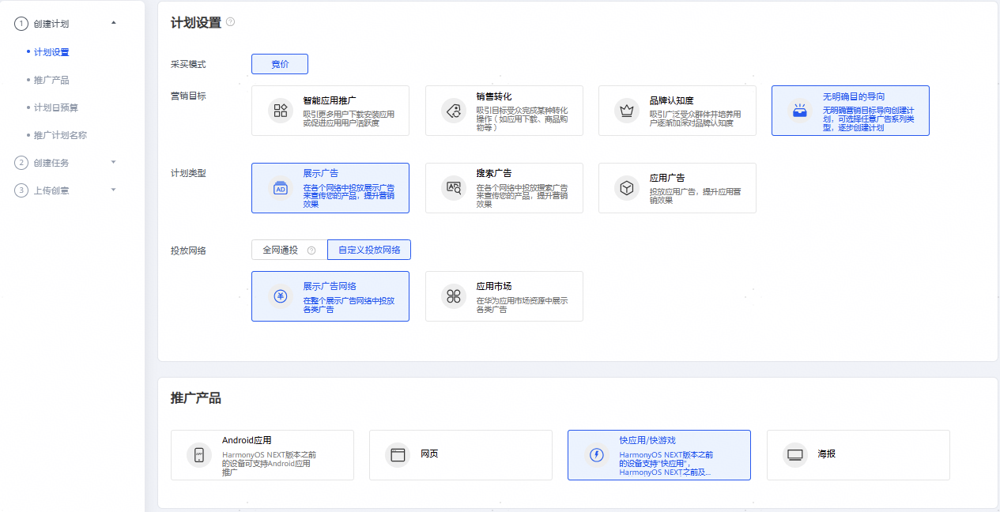
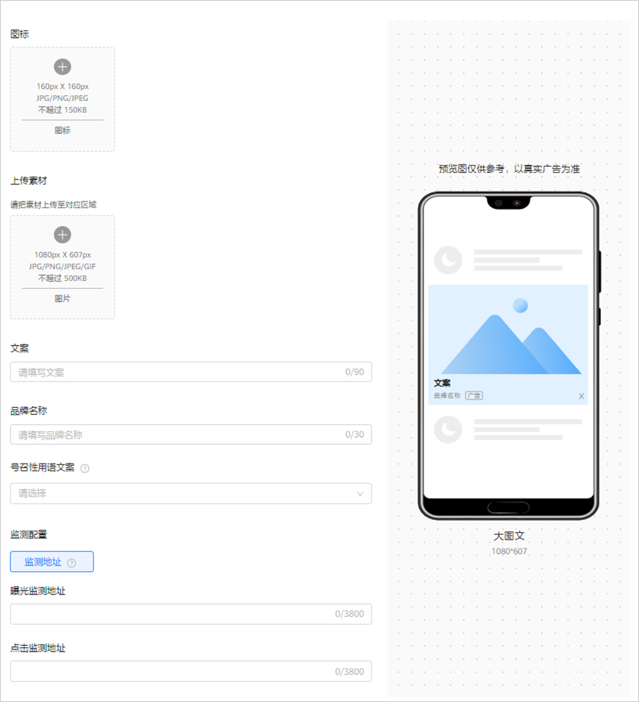

# 快应用/快游戏推广

## 概述

快应用/快游戏推广指的是在[展示广告网络的资源上](https://developer.huawei.com/consumer/cn/doc/promotion/display-0000001057113500)对您的快应用进行推广。

## 操作流程

## 操作步骤

1. 创建广告计划。

   单击“创建”，选择“创建计划”。

   

   - <strong>营销目标：</strong>选择“销售转化”或者“无明确目标”，详情参考[营销目标](https://developer.huawei.com/consumer/cn/doc/promotion/overview-cjjjgg-0000001182873508#ZH-CN_TOPIC_0000001182873508__zh-cn_topic_0000001205953939_zh-cn_topic_0000001105216776_li07111843183611)。
   - <strong>计划类型：</strong>选择“展示广告”，详情参考[计划类型](https://developer.huawei.com/consumer/cn/doc/promotion/overview-cjjjgg-0000001182873508#ZH-CN_TOPIC_0000001182873508__zh-cn_topic_0000001205953939_zh-cn_topic_0000001105216776_li234211653411)。
   - <strong>投放网络：</strong>选择<strong>“</strong>展示广告网络”，详情参考[投放网络](https://developer.huawei.com/consumer/cn/doc/promotion/overview-cjjjgg-0000001182873508#ZH-CN_TOPIC_0000001182873508__zh-cn_topic_0000001205953939_zh-cn_topic_0000001105216776_li93421166342)<strong>。</strong>
   - <strong>推广产品：</strong>选择<strong>“</strong>快应用/快游戏<strong>”</strong>，详情参考[推广产品](https://developer.huawei.com/consumer/cn/doc/promotion/overview-cjjjgg-0000001182873508#ZH-CN_TOPIC_0000001182873508__zh-cn_topic_0000001205953939_zh-cn_topic_0000001105216776_li8342416193416)<strong>。</strong>
   - <strong>计划日预算：</strong>详情参考[计划日预算](https://developer.huawei.com/consumer/cn/doc/promotion/overview-cjjjgg-0000001182873508#ZH-CN_TOPIC_0000001182873508__zh-cn_topic_0000001205953939_zh-cn_topic_0000001105216776_li14342141615342)。
   - <strong>推广计划名称：</strong>详情参考[推广计划名称](https://developer.huawei.com/consumer/cn/doc/promotion/overview-cjjjgg-0000001182873508#ZH-CN_TOPIC_0000001182873508__zh-cn_topic_0000001205953939_zh-cn_topic_0000001105216776_li1434211615342)。
2. 创建广告任务。

   如果您希望在已有的计划下增加新的任务，请参考[已有计划下创建任务](https://developer.huawei.com/consumer/cn/doc/promotion/overview-cjjjgg-0000001182873508#ZH-CN_TOPIC_0000001182873508__zh-cn_topic_0000001205953939_li5851143183912)。
   - <strong>广告投放类型</strong>：选择“正式投放”。如果您希望在正式投放之前对投放进行测试，您们可以创建[试投放](https://developer.huawei.com/consumer/cn/doc/promotion/ads-adtest-0000001190031279)任务。
   - <strong>推广产品详情</strong>：
     - <strong>快应用/快游戏包名：</strong>填写您快应用/快游戏的包名，例如：com.huawei.appmarket。
     - <strong>快应用/快游戏链接：</strong>链接由系统根据包名自动生成，默认跳转快应用首页，您也可修改为指定的快应用内详情页面。链接支持的格式为hap://app/&lt;package&gt;/[path][?key=value]/
   - <strong>定向</strong>：详情参考[定向设置](https://developer.huawei.com/consumer/cn/doc/promotion/targeting-0000001180547094)。
   - <strong>版位</strong>：详情参考[版位](https://developer.huawei.com/consumer/cn/doc/promotion/overview-cjjjgg-0000001182873508#ZH-CN_TOPIC_0000001182873508__zh-cn_topic_0000001205953939_zh-cn_topic_0000001105216776_li1776203594114)。
   - <strong>投放日期：</strong>详情参考 [投放日期](https://developer.huawei.com/consumer/cn/doc/promotion/overview-cjjjgg-0000001182873508#ZH-CN_TOPIC_0000001182873508__zh-cn_topic_0000001205953939_li73789433254)。
   - <strong>投放时间：</strong>详情参考[投放时间](https://developer.huawei.com/consumer/cn/doc/promotion/overview-cjjjgg-0000001182873508#ZH-CN_TOPIC_0000001182873508__zh-cn_topic_0000001205953939_li1237874310252)。
   - <strong>投放频次设置：</strong>您可以设置广告任务对用户的展示次数。例如：时长设置5，展示频次设置为10，则在5天的周期内此任务向一个用户展示不超过10次。
   - <strong>出价：</strong>版位不同，计费方式可能不同。
   - <strong>任务名称</strong>：详情参考[任务名称](https://developer.huawei.com/consumer/cn/doc/promotion/overview-cjjjgg-0000001182873508#ZH-CN_TOPIC_0000001182873508__zh-cn_topic_0000001205953939_li237864312259)。
3. <strong>添加广告创意。</strong>

   根据您需要版位的不同，您需要先选择创意样式及尺寸，并添加对应的创意图片或视频、设置品牌名称和描述信息等，详情参见[素材指导](https://developer.huawei.com/consumer/cn/doc/promotion/overview_ggsczd-0000001182713584)。

   
   - 同一任务下只能选一种创意样式，一种创意样式可以添加5条创意，每条创意支持独立的素材，且每条创意尺寸类型只能选一个，如果您想要添加所有的尺寸类型，那您需要为每个尺寸类型添加创意。

     例如：您创意样式选择了纯图，纯图包含了以下尺寸类型：1080\*607、640\*360、1080\*432、720\*1280，您在创意1中选择了1080\*432，那么您在创意2中可以选择1080\*607，创意3中选择640\*360。

     
   - <strong>号召性用语文案：</strong>下拉选择按钮文案，例如：去购买、立即体验等，按照您所需选择相应的按钮文案。用户看到您的广告后，点击按钮即可进入快应用链接。
   - <strong>创意名称：</strong>详情参考[创意名称](https://developer.huawei.com/consumer/cn/doc/promotion/overview-cjjjgg-0000001182873508#ZH-CN_TOPIC_0000001182873508__zh-cn_topic_0000001205953939_zh-cn_topic_0000001105216776_li1471941495513)。
4. 提交审核。

   单击“提交”，审核通过后即可推广，审核时间、审核结果通知、审核结果查看请参考[广告审核](https://developer.huawei.com/consumer/cn/doc/promotion/review-0000001052064324)。
