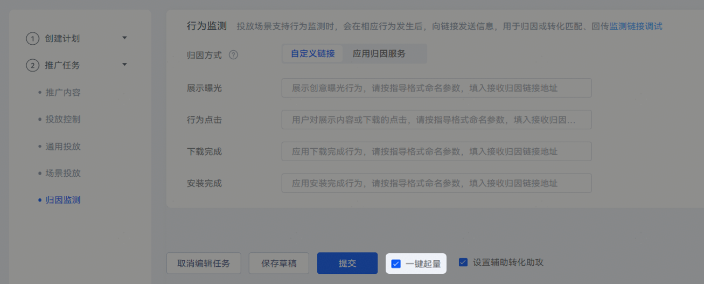
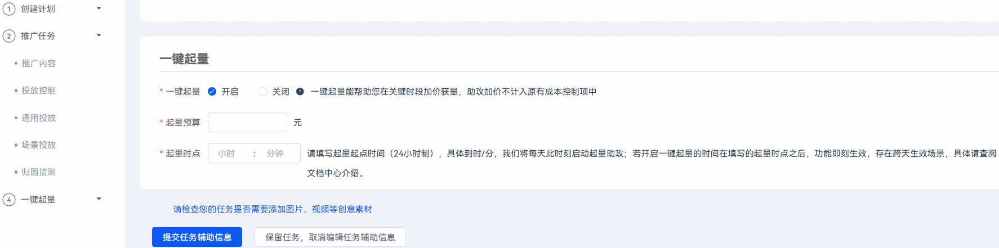

# 一键起量

## 业务介绍

"一键起量"是一款通过为oCPD/oCPC任务设置专属起量预算，系统在指定时间内帮助任务获取原出价抢不到的流量，加速曝光，帮助开发者达成冲量诉求的跑量工具。

 

“一键起量”功能需联系运营，申请使用权限。

## 适用场景

“一键起量”功能适合有获量增长需求，希望针对指定时段对高质流量提价的客户。系统基于客户设定的起量预算，智能挖掘优质流量资源，获取原任务难以获得的增量曝光，但开启后可能会存在任务成本上升情况。

## 操作步骤

1. 登录[鲸鸿动能投放平台](https://ads.huawei.com/cn/)，点击右上角“登录”，选择进入“推广”页面。
2. 创建推广oCPD/oCPC任务；或编辑原有oCPD/oCPC任务，进入任务编辑页面。
3. 完成应用推广任务配置后，默认勾选“一键起量”，并提交任务。

   
4. 在“一键起量”模块，开启一键起量，设置“起量预算”和“起量时点”，点击“提交任务辅助信息”。

   

## FAQ

<strong>1.起量预算如何设置？</strong>

起量预算越高，获得优质流量的机会越大，但成本也相对越高，请依据您的情况合理设置预算（建议设为目标增量转化数\*oCPD/oCPC子任务出价\*2倍）。

<strong>2.为什么我的“一键起量”没跑完预算？</strong>

请确认任务出价是否在平均水平 ，如果出价偏低，即使系统尝试提价，也可能无法获得理想的流量位置，从而导致起量失败。

<strong>3.为什么我的任务很快就花完预算了，却没有转化？</strong>

请确认是否设置过少的预算，“一键起量”本身是一种较为激进的流量探索策略，会带来一定的成本上升，同时不承诺转化成本。建议设置相对充足的预算，以便系统有足够空间探索优质流量，避免因预算不足影响效果。

<strong>4.为什么我的“一键起量”结束后，感觉跑量变慢了？</strong>

这是正常现象，“一键起量”的核心是通过短期高出价快速获取流量增量，帮助任务突破原有瓶颈。如果起量结束后跑量变慢，可能是任务本身仍有优化空间，建议优化原子任务出价。

<strong>5.“一键起量”开启时间如何设置？</strong>

开启时间建议设置为流量高峰期（如上午10:00或下午18:00）开启起量，或者在新任务冷启动使用，效果更佳。

<strong>6.起量中出现超成本，怎么办？</strong>

在探索优质流量的过程中，短期内成本会上升，这是正常现象。建议在起量期间适度容忍短期波动，不要频繁关停任务。

<strong>7.“一键起量”与Nobid区别？</strong>

“一键起量”不进行试探性出价，而是直接瞄准最优资源位，通过提升竞争力来快速获取流量。它的提价依据来自竞争对手的出价，而非自身的消耗速度，是一种更果断、更高效的跑量策略。

<strong>8.“一键起量”的实际消耗如何计算？</strong>

当前没有专门报表记录“一键起量”消耗，“一键起量”消耗直接计入任务消耗，并没有放入任何子任务。

<strong>9.“一键起量”预算是独立于任务预算，额外增加的么？</strong>

不是，“一键起量”预算是从现有任务预算中调配的，因此使用该功能，请同步调高原任务预算。

<strong>10.为什么我配置“一键起量”功能之后立刻开始起量，此时还没到我设置的“起量时点”？</strong>

系统会根据开始起量时间和起量预算智能调节，若系统计算当前时刻在起量时段内，会立刻进行，因此存在跨天特殊场景，举例：凌晨2点配置“一键起量”，设置的“起量时点”是23点开始，配置完之后系统认为此刻已在起量时段（例如：23:00-03:00）内，会开始起量。
