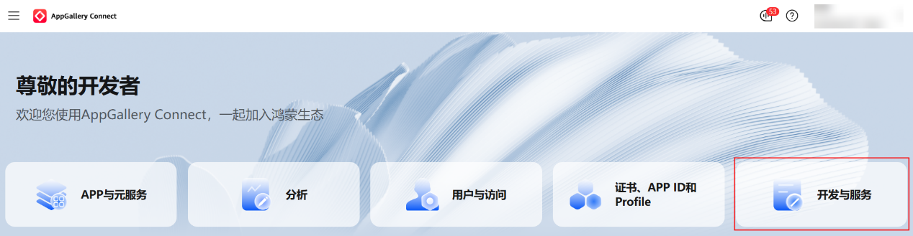
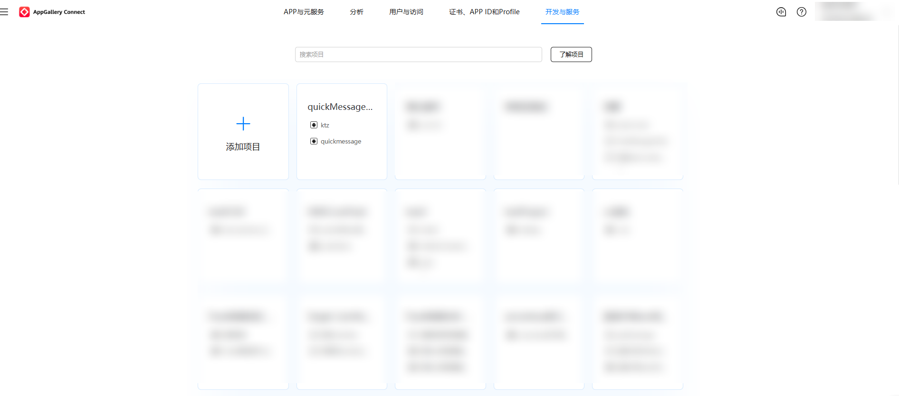
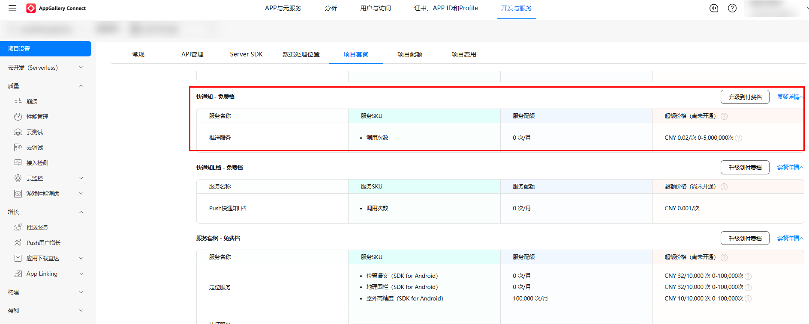
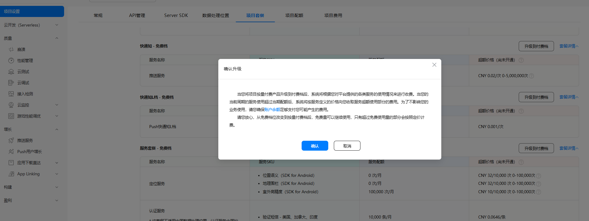
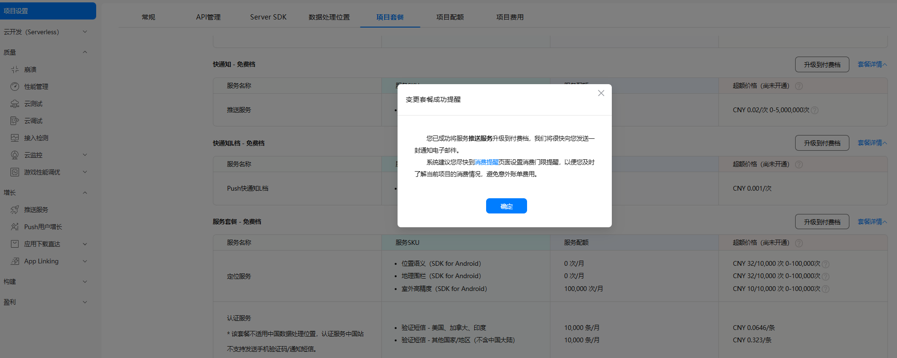
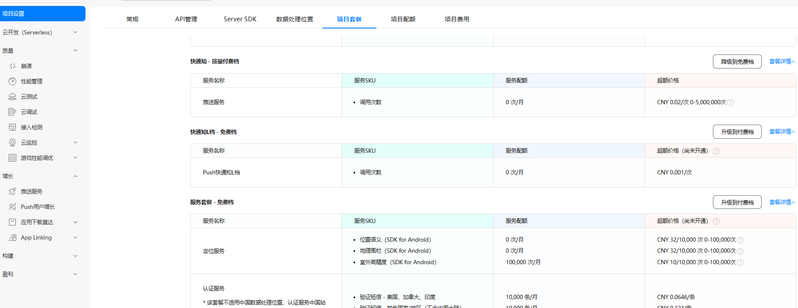
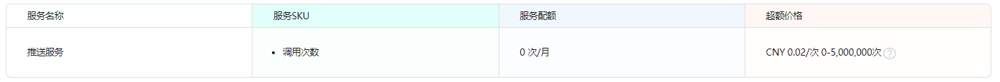
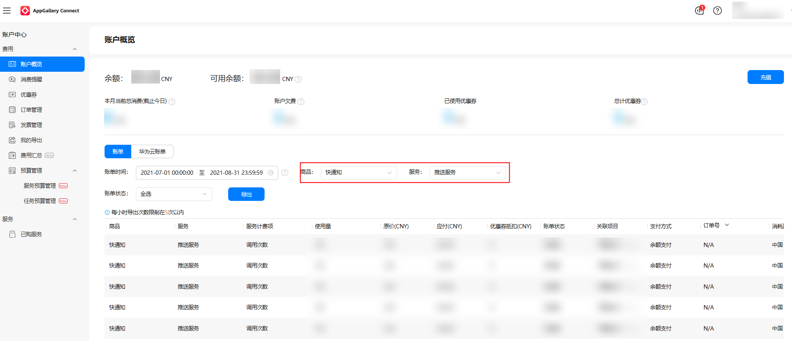

# 快通知

快通知，提供专属高优先级通道，保障消息快速触达用户，满足较高时效推送需求，保障低时延。

<strong>开通快通知</strong>

1、登录[AppGallery Connect](https://developer.huawei.com/consumer/cn/service/josp/agc/index.html#/)，登录后点击“开发与服务”。



2、选择你的项目，点击你的应用所在项目的卡片进入项目设置。



3、点击“项目套餐”页签，升级到付费档。

若之前未签署过开通协议，则弹出《华为AppGallery Connect付费服务协议》的界面，这是一个通用的服务协议，未包含快通知的具体内容。具体协议内容见另一附件“华为AppGallery Connect付费服务协议.pdf”。签署后进入“项目套餐”界面，点击“快通知-免费档”右上方的“升级到付费档” 。



4、确认开通“快通知”。



5、“快通知”开通成功。



备注：由于系统存在定时任务同步，预计等待10分钟生效。

6、如需关闭快通知，进入“我的套餐”界面，点击“快通知-按量付费档”右上方的“降级到免费档”。



<strong>发送快通知消息</strong>

请使用下面的V5接口URL以及消息格式发送消息：

&lt;https://developer.huawei.com/consumer/cn/doc/development/HMSCore-References-V5/https-send-api-0000001050986197-V5&gt

快通知消息中需要携带business\_type字段，值设置为1，示例如下：

```
{ 
    "validate_only": false, 
    "business_type": 1, 
    "message": { 
        "notification": { 
                "title": "11", 
                "body": "11" 
        }, 
        "token": [ 
                "token1" 
        ] 
    } 
}
```

说明：上述示例仅为了说明字段所处位置，非实际消息样例。

<strong>计费与账单</strong>

1、计费标准

Push快通知按调用次数（条数）计费，计费标准可在“项目套餐”-快通知的超额价格列查看：



2、查看账单

进入项目设置-&gt;项目费用界面，商品选择“快通知”，或服务选择“推送服务”，可查看消耗账单，账户存在可用的Push快通知优惠券时，系统将优先使用优惠券来抵扣相应的费用。优惠券不足以覆盖费用时，剩余部分将通过现金支付方式进行结算。

3、优惠券查询

已领取但未使用的代金券，可以在优惠券页面[查看对应的优惠信息。](https://developer.huawei.com/consumer/cn/doc/development/AppGallery-connect-Guides/agc-query-coupon-0000001154273152#section28841110669)
