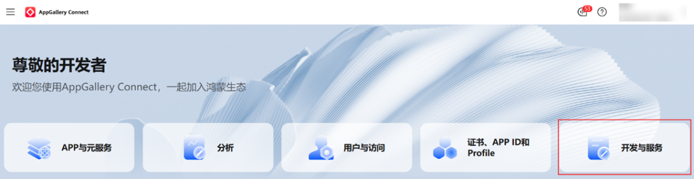
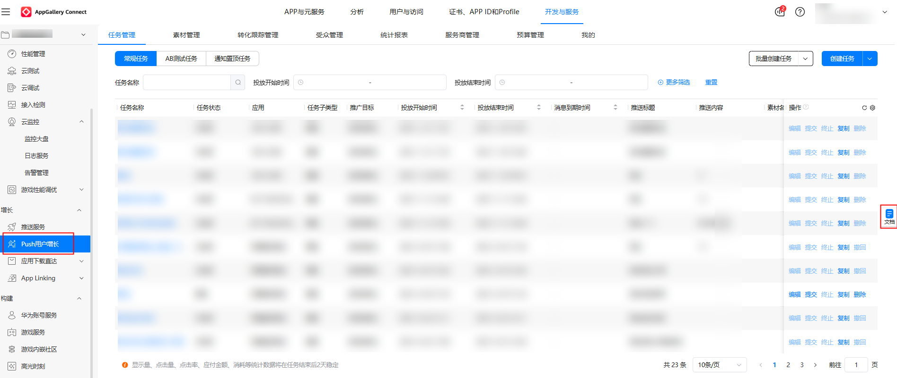

# Push用户增长

登录[AppGallery Connect](https://developer.huawei.com/consumer/cn/service/josp/agc/index.html)网站，点击“开发与服务”。

在项目列表中找到您的项目，通过“增长 &gt; Push用户增长” 导航到“任务管理”页签。

若您无法在上述路径中找到“Push用户增长服务”，请您联系华为方销售/运营并且提供您的“Developer ID”信息。

了解更多投放指导，可点击页面右侧的文档图标，查看《Push用户增长投放指南》。

