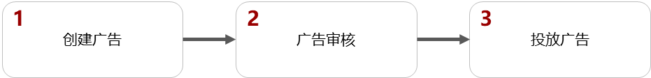
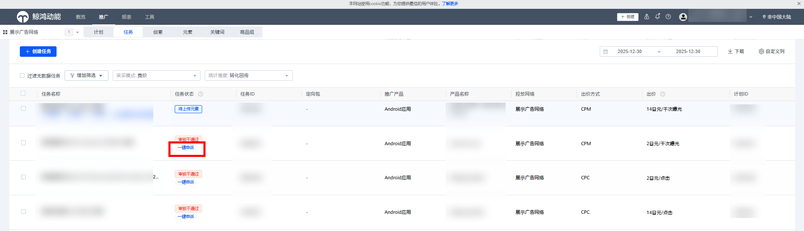
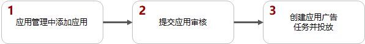

# 广告审核

## 概述

为保证华为终端用户的使用体验，您的行业需要符合鲸鸿动能广告的准入规则，确保内容合法合规。只有通过审核的广告才能进行广告投放。

视频学习请观看：[视频介绍](https://developer.huawei.com/consumer/en/training/detail/101611026432027997)。

## 展示广告审核

在[展示广告网络](https://developer.huawei.com/consumer/cn/doc/promotion/display-0000001057113500)资源创建的广告需要遵循此审核流程。

- <strong>审核流程：</strong>

  
- <strong>审核规则：</strong>

  具体审核规则参见[广告审核规范](https://developer.huawei.com/consumer/cn/doc/promotion/overview-guangaoshenheguifan-0000001188925990)，该文档仅供参考，具体以审核结果为准。

   

  展示广告是按照国家/地区进行审核的，您的广告应遵从各个国家/地区法律要求，如果您在任务中定向了多个国家/地区，那么每个国家/地区的审核都会审核该任务。
- <strong>审核时间：</strong>

  广告审核一般在1-2个工作日内完成，请根据您的投放需求合理安排任务创建时间。
- <strong>审核结果通知并查看：</strong>

  广告审核完成后，将会通知到您在注册广告账户时留下的联系人邮件。
  - 如果您的广告均未通过审核，请按照审核意见进行调整并重新提交审核。
  - 如果您的广告部分审核通过，审核已通过的任务/创意正常投放，审核未通过的请按照审核意见进行调整并重新提交审核。
- <strong>审核重新触发条件：</strong>
  - 任务：
    - 如果您增加地域或者增加排除地域，只会重新触发相关国家/地区的审核。
    - 如果您修改、增加语言定向会触发审核。
    - 如果您修改快应用/快游戏链接会触发审核。
  - 创意：如果您修改、增加创意都会触发审核。
- <strong>一键申诉：</strong>

  如果您对广告审核结果有异议，可以在任务界面单击“一键申诉”提交工单处理。

## 应用市场广告审核

在[应用市场](https://developer.huawei.com/consumer/cn/doc/promotion/gallery-0000001057273476)资源创建的广告无需审核，但是您需要先添加您的应用，此时您的应用需要先[审核](https://developer.huawei.com/consumer/cn/doc/promotion/appmanagement-0000001182393586)，审核通过后，即可创建广告并投放。

<strong>审核流程：</strong>

