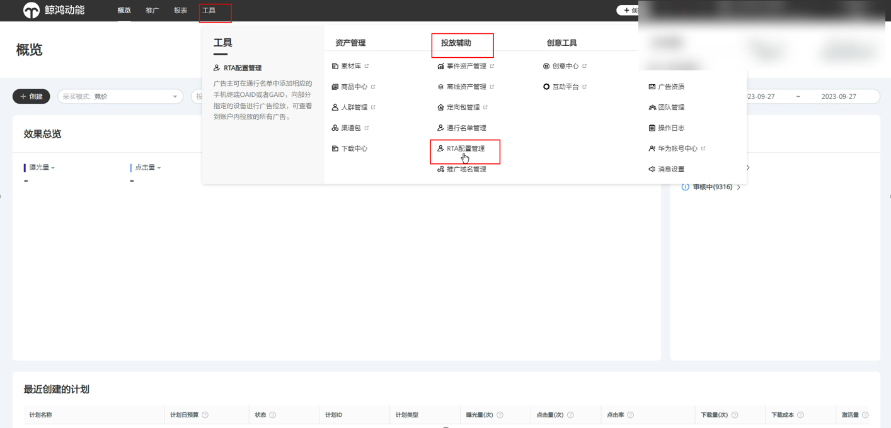
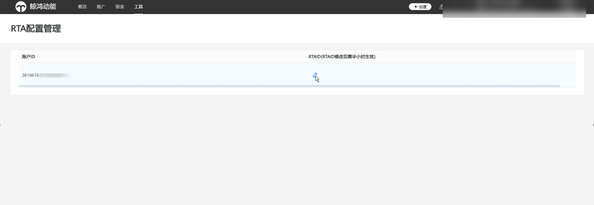

# RTA

## 广告主自行配置RTAID

## 操作指引

“投放端” -&gt;“工具” -&gt;“投放辅助”-&gt;“RTA配置管理”

 

需要广告主账户开启RTA权限时，才有“RTA配置管理”选项。

点击RTA配置管理，广告主可以配置/编辑RTAID，RTAID格式要求与当前RTA要求一致。

1. 单击“编辑”，输入RTAID。
2. 编辑完成后，请单击“确定”，如需修改，可再次单击“编辑”。
