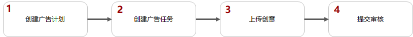
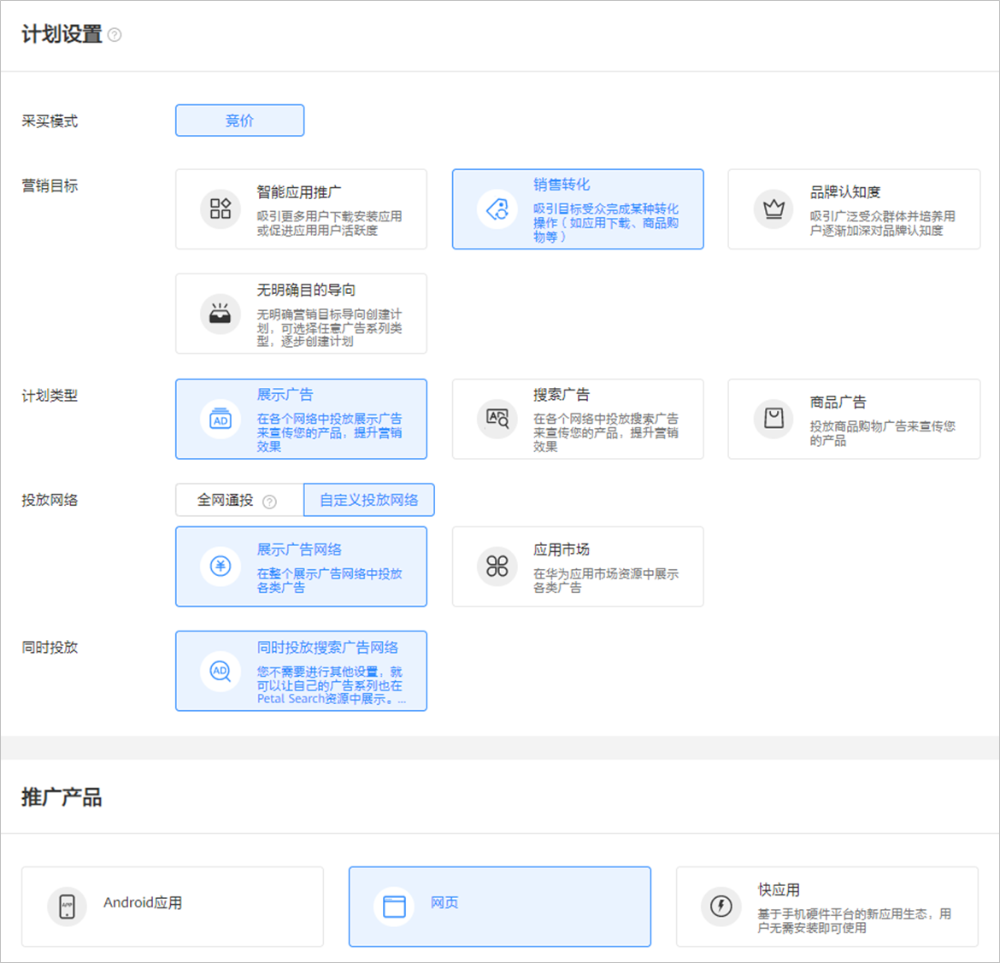
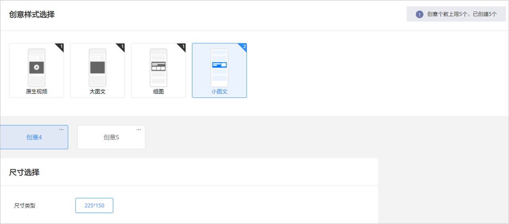
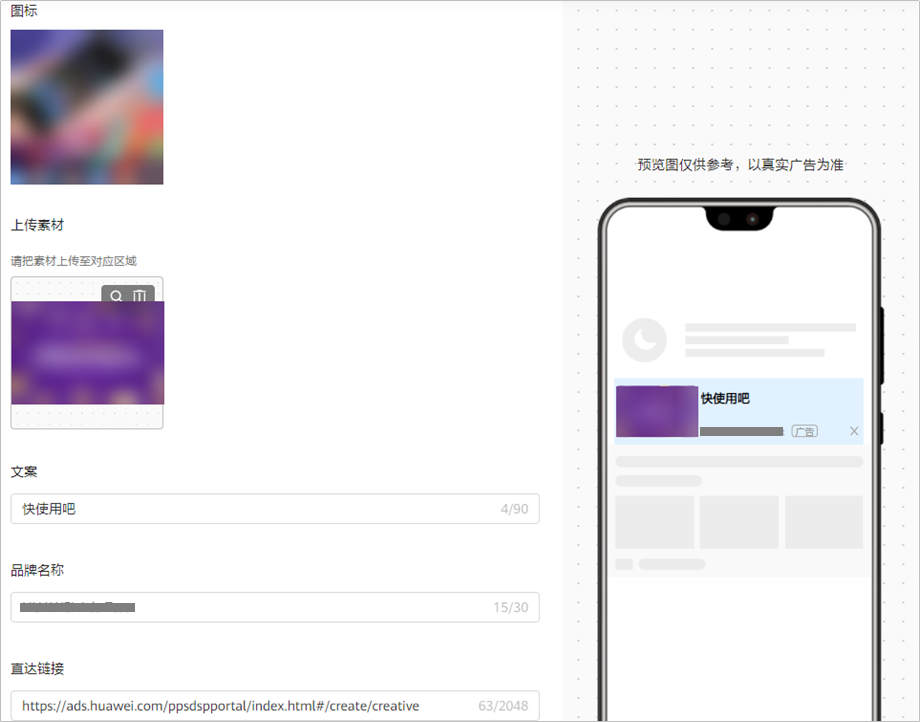

# 创建展示网页广告

## 概述

展示网页广告是指在[展示广告位](/docs/monetize/promotion/display-0000001057113500)上对您的网页进行推广，用户看见图片/视频后，单击进入您想要推广的网页，增加网页的浏览量和转化量。

## 操作流程

## 操作步骤

1. 创建广告计划。

   单击“创建”-&gt;“创建计划”，进入计划设置。

   

   - <strong>营销目标</strong>：选择“<strong>销售转化</strong>”或者“<strong>无明确目的导向</strong>”，详情参考[营销目标](/docs/monetize/promotion/overview-cjjjgg-0000001182873508#ZH-CN_TOPIC_0000001182873508__zh-cn_topic_0000001205953939_zh-cn_topic_0000001105216776_li07111843183611)。
   - <strong>计划类型</strong>：选择“<strong>展示广告</strong>”，详情参考[计划类型](/docs/monetize/promotion/overview-cjjjgg-0000001182873508#ZH-CN_TOPIC_0000001182873508__zh-cn_topic_0000001205953939_zh-cn_topic_0000001105216776_li234211653411)。
   - <strong>投放网络</strong>：选择“<strong>自定义投放网络</strong>”<strong>-&gt;“展示广告网络”</strong>，详情参考[投放网络](/docs/monetize/promotion/overview-cjjjgg-0000001182873508#ZH-CN_TOPIC_0000001182873508__zh-cn_topic_0000001205953939_zh-cn_topic_0000001105216776_li93421166342)<strong>。</strong>
   - <strong>推广产品</strong>：选择“<strong>网页</strong>”，详情参考[推广产品](/docs/monetize/promotion/overview-cjjjgg-0000001182873508#ZH-CN_TOPIC_0000001182873508__zh-cn_topic_0000001205953939_zh-cn_topic_0000001105216776_li8342416193416)。
   - <strong>计划日预算</strong>：详情参考[计划日预算](/docs/monetize/promotion/overview-cjjjgg-0000001182873508#ZH-CN_TOPIC_0000001182873508__zh-cn_topic_0000001205953939_zh-cn_topic_0000001105216776_li14342141615342)。
   - <strong>推广计划名称</strong>：详情参考[推广计划名称](/docs/monetize/promotion/overview-cjjjgg-0000001182873508#ZH-CN_TOPIC_0000001182873508__zh-cn_topic_0000001205953939_zh-cn_topic_0000001105216776_li1434211615342)。
2. 创建广告任务。

   如果您希望在已有的计划下增加新的任务，请参考[已有计划下创建任务](/docs/monetize/promotion/overview-cjjjgg-0000001182873508#ZH-CN_TOPIC_0000001182873508__zh-cn_topic_0000001205953939_li5851143183912)。
   - <strong>广告投放类型</strong>：选择“<strong>正式投放</strong>”。如果您希望在正式投放之前对投放进行测试，您可以创建[试投放](/docs/monetize/promotion/ads-adtest-0000001190031279)任务。
   - <strong>落地页类型</strong>：落地页链接是您想要推广内容的信息承载页面。输入您需要推广的落地页，用户单击广告后，即可进入落地页，落地页默认使用webview打开。在使用落地页正式投放之前，建议先用落地页创建一个试投放任务，测试落地页跳转、数据跟踪都正常之后再创建正式投放的广告任务，避免落地页异常导致广告投放费用的损失。

     落地页的内容要保证合规，审核人员会进行落地页审核并在投放过程中进行抽检。

     - <strong>自定义落地页：</strong>填写自定义的HTTPS访问地址。例如：``https://ads.huawei.com/usermgtportal/home/index.html#/``。您可以在自定义落地页中添加宏参数，用来监测广告流量信息，区分用户来自哪个广告计划任务等，详情请参考[鲸鸿动能广告支持的宏参数](/docs/monetize/promotion/overview-cjjjgg-0000001182873508#ZH-CN_TOPIC_0000001182873508__li1791495401511)。
     - <strong>维纳斯落地页：</strong>您也可以选择维纳斯落地页，用户点击您的广告后，进入您在维纳斯创建的落地页，进行填写表单等操作，具体请查看[落地页工具](/docs/monetize/promotion/venus-0000001063299665)。您也可以对维纳斯落地页进行数据跟踪，详情请参考[维纳斯网页跟踪](/docs/monetize/promotion/tracking-venus-0000001202117526)。

   - <strong>定向：</strong>详情参考[定向](/docs/monetize/promotion/targeting-0000001180547094)。
   - <strong>版位</strong>：在版位选择中，您可以决定广告出现在什么位置。在选中某个版位后，右侧会出现对应的版位预览。
   - <strong>投放日期：</strong>详情参考[投放日期](/docs/monetize/promotion/overview-cjjjgg-0000001182873508#ZH-CN_TOPIC_0000001182873508__zh-cn_topic_0000001205953939_li73789433254)。
   - <strong>投放时间：</strong>详情参考[投放时间](/docs/monetize/promotion/overview-cjjjgg-0000001182873508#ZH-CN_TOPIC_0000001182873508__zh-cn_topic_0000001205953939_li1237874310252)。
   - <strong>投放频次设置</strong>：支持广告主设置广告任务对用户的展示频率。例如：时长设置5， 展示频次上限为10，则在5天的周期内此任务向一个用户展示不超过10次。
   - <strong>出价</strong>：版位不同，出价方式可能不同。目前展示网页广告支持的出价方式包括<strong>CPM、CPC</strong>。
   - <strong>任务名称</strong>：详情参考[任务名称](/docs/monetize/promotion/overview-cjjjgg-0000001182873508#ZH-CN_TOPIC_0000001182873508__zh-cn_topic_0000001205953939_li237864312259)。
3. 上传创意。

   根据您选择版位的不同，可以选择不同的创意样式及尺寸，并上传对应的创意素材、设置品牌名称和描述信息等。详情参见 [素材指导](/docs/monetize/promotion/overview_ggsczd-0000001182713584)。

   单个版位支持多规格多创意样式同时投放，为获取更优的投放效果，建议您选择多种创意样式及创意推广产品。

   

   

   - <strong>直达链接</strong> <strong>：</strong>指定网页内容的链接。
   - <strong>创意名称：</strong>详情参考[创意名称](/docs/monetize/promotion/overview-cjjjgg-0000001182873508#ZH-CN_TOPIC_0000001182873508__zh-cn_topic_0000001205953939_zh-cn_topic_0000001105216776_li1471941495513)。
4. 任务审核。

   单击“提交”，审核通过后即可推广，审核时间、审核结果通知、审核结果查看请参考[广告审核](/docs/monetize/promotion/review-0000001052064324)。
