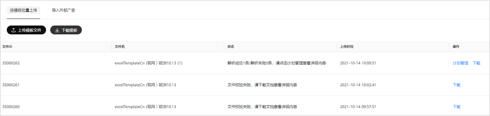
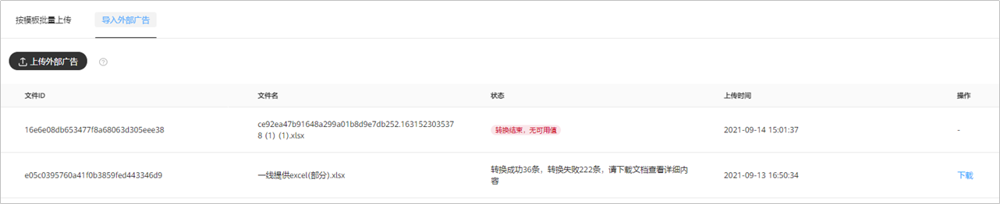
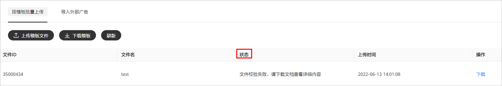
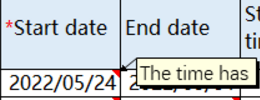
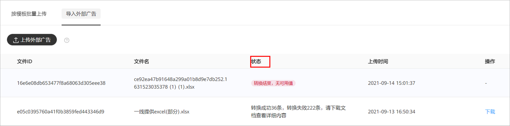

# 导入搜索广告计划

## 概述

您可以通过导入信息的方式快速批量创建搜索网页广告。您可以从鲸鸿动能广告平台下载模板，批量填写搜索网页推广计划后上传，系统会根据您导入的信息批量完成计划创建并提交审核，审核通过后即可投放。

如果您在 Google Ads上已经投放过搜索网页广告，也可以将这些广告导出后导入到鲸鸿动能广告平台，从而将这些任务同步投放到鲸鸿动能广告平台，快速提升广告的覆盖面。

## 使用鲸鸿动能广告模板批量上传操作步骤

1. 下载鲸鸿动能广告模板并填写。

   单击“<strong>工具</strong>”-&gt;“<strong>导入搜索广告计划</strong>”，选择“<strong>按模板批量上传</strong>”，下载模板并填写，每个文件最多1000行。

   
2. 上传鲸鸿动能广告模板文件并解析。

   单击“<strong>按模板批量上传</strong>”-&gt;“<strong>上传模板文件</strong>”，系统进行解析：

   - 解析失败：您可以下载解析失败的文件，在文件中查看哪些字段解析失败，修改后重新提交解析。
   - 解析成功后，系统自动生成广告计划并审核，审核通过后投放广告。

## 使用外部广告文件批量导入操作步骤

1. 导入外部广告文件。

   单击“<strong>工具</strong>”-&gt;“<strong>导入搜索广告计划</strong>”-&gt;“<strong>导入外部广告</strong>”，选择“<strong>上传外部广告</strong>”，每个文件最多1000行。导入外部广告文件后系统进行转换。

   

   - 转换失败：您可以下载转换失败的文件，在文件中查看那些字段转换失败，修改后重新上传。
   - 转换成功：您可以下载文件进行查看。
2. 上传转换成功的外部广告文件并解析。

   单击“<strong>按模板批量上传</strong>”-&gt;“<strong>上传模板文件</strong>”，上传转换成功的外部广告文件，系统进行解析：
   - 解析失败：您可以下载解析失败的文件，在文件中查看哪些字段解析失败，修改后重新提交解析。
   - 解析成功：系统自动生成广告计划并审核，审核通过后投放广告。

## 调整批量上传的搜索网页广告

您可以通过以下方式调整搜索网页广告：

- 修改并重新上传广告文件，审核通过后投放广告。
- 单击“<strong>按模板批量上传</strong>”，单击相应广告文件的“<strong>计划管理</strong>”，跳转广告计划，您点击计划名称，进入任务层级后进行广告调整。

## 文件状态说明

文件上传后，您可以通过上传的“状态”，分析您上传失败的原因：

- 按模板上传：

  

  - 文件校验失败，请下载文档查看详细内容：

    原因：字段缺失或者内容填写不规范。

    操作：请单击“下载”，打开下载后的表格，单击“”，查看具体原因。
  - 解析成功n条/失败m条：

    原因：系统异常或网络问题，数据入库部分或者全部失败。

    操作：单击操作栏中“重试”即可，如果显示成功0条时无法重试，您需要重新上传。
  - 文件处理异常：

    原因：excel处理过程中出现异常。

    操作：请重新上传。
- 导入外部广告：

  

  - 转换结束，无可用值：请检查您上传的文件中是否包含可用值。
  - 转换成功\*\*条，转换失败\*\*条，请下载文档查看详细内容。
  - 转换失败：您可以下载转换失败的文件，在文件中查看那些字段转换失败，修改后重新上传。
