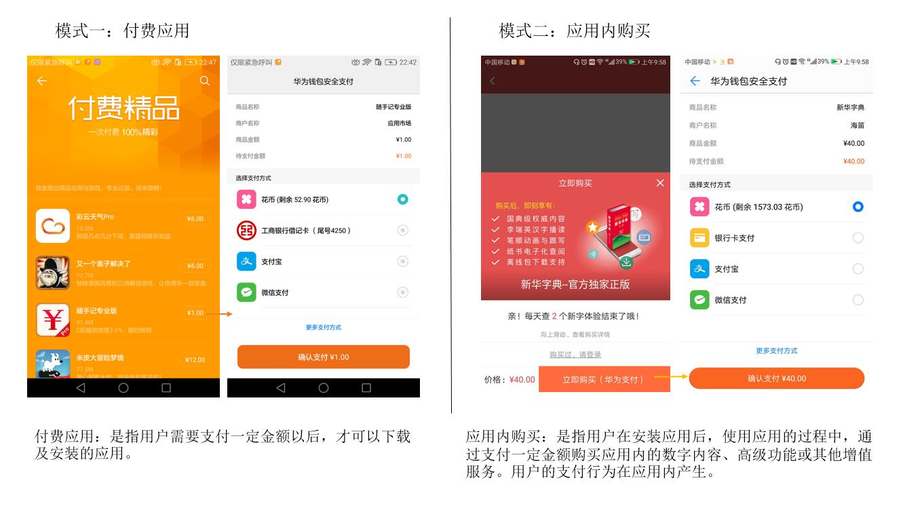
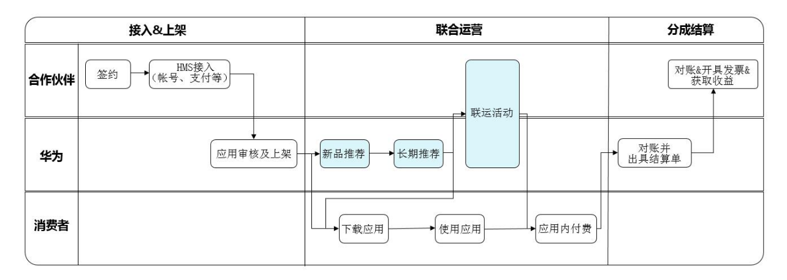
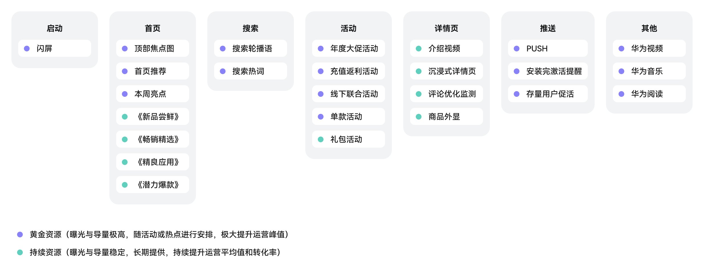
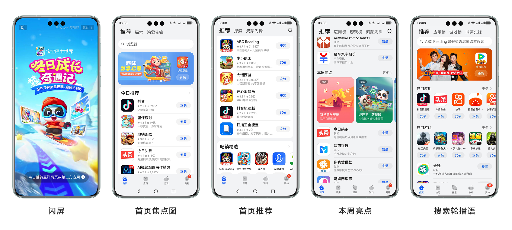
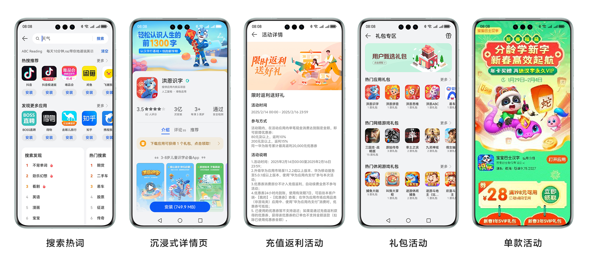
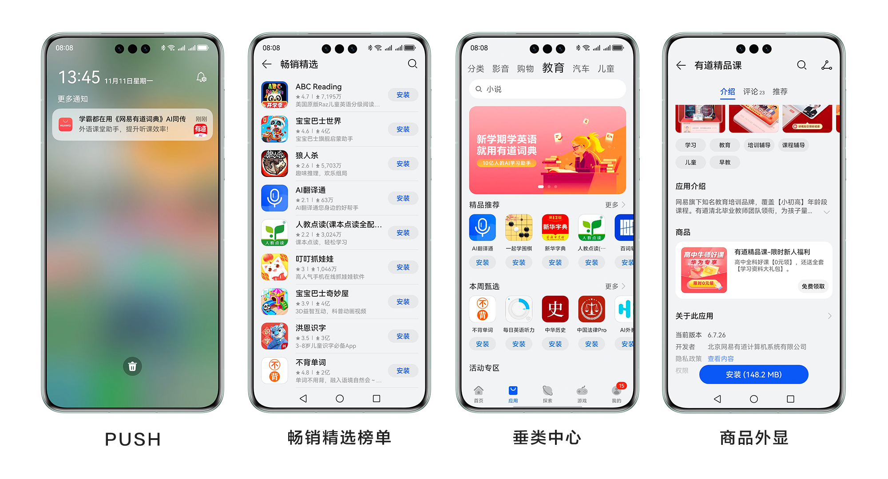

# 业务介绍

华为应用市场与开发者联合运营应用，并为此提供能力接入、数据报表、活动运营、用户运营等一系列服务。联运服务的合作模式包括但不限于付费应用与应用内购买业务。

## 1. 联运服务特点

### 强大的分发能力

面向全球华为终端用户，公平公正的自动化推荐算法，有效触达高质量用户。

### 便捷的开发者服务

全面提供账号、支付、数据分析等产品基础能力，24小时人工审核快速上线。

### 优质的联运能力

专业应用运营团队，提供免费新品评测、专题推荐、榜单曝光、数据调优等。

### 多样的营销活动

针对联运应用特性开展线上独家活动（优惠券等）及线下品牌宣传活动。

## 2. 联运服务合作模式

## 3. 联运整体流程

## 4. 开放资源

## 5. 资源使用实例

## 6. 如何获得更多曝光资源

### 核心因素

- 在垂直领域有独家内容和服务；
- 为华为用户提供独家福利；
- 经营流水高或持续增长。

### 重要因素

- 积极主导和参与联运活动；
- 丰富应用内容、优化用户体验；
- 应用有良好的评论评分。

### 降权因素

私自切换支付方式、版本更新不及时、内容质量差、用户评分过低等。详见[《华为应用市场联运服务协议》](https://developer.huawei.com/consumer/cn/doc/AGInterService#h1-1643272510859-11)第6.1条“华为应用市场联运违规处罚规定”。

## 7. 联运合作

### 客服联系方式

应用：QQ：3514534402 Email：jointoperation@huawei.com

游戏：QQ：2851508864 Email：game.business@huawei.com

### 商务联系方式

应用联运合作—张女士

Email：zhangyijia2@huawei.com

游戏综合合作—龙先生

Email：longxianqiang@huawei.com

游戏综合合作—吴先生

Email：wulei666@huawei.com

游戏综合合作（海外）—杨女士

Email：yimin.yang@huawei.com

## 8. 不合作类型如下

|  |  |  |
| --- | --- | --- |
| 不合作类型表 | | |
| 手机基础类应用 | 桌面类应用 | 省电类应用 |
| 安全辅助类应用 | 刷机类应用 | 硬件评分类应用 |
| 应用市场类应用 | Android助手类应用 | 恶意刷量应用 |
| 需使用VPN的应用 | 成人用品类应用 | 无资质金融理财、医疗类。 |
| 含积分墙的应用 | 强制ROOT权限 | 双开类、彩票类、抢红包类、夺宝类应用。 |
