# 活动结算模式

除收入抵减模式外，新增充值预购模式，仅支持活动奖品为 【华为优惠券】时，本节将重点介绍该模式使用。

- <strong>功能介绍</strong>

<strong>收入抵减模式：</strong>收入抵减模式，如奖品是华为优惠券，则按活动实际收入扣减活动流水（如非联运应用，不会造成收入扣减）

<strong>充值预购模式：</strong>分成将不再扣减活动收入流水，而计作营销费用，需开发者将活动资金预充入账户并冻结关联使用。

- <strong>使用场景示例</strong>

充值预购模式下，优惠券活动不影响开发者流水，可帮助开发者优化财务情况，开发者用于优惠券活动的营销费用，将按照正常联运分成比例进行分成，即例如开发者发了10元的优惠券，在用户使用之后，开发者将获得5元收入。

- <strong>基本操作步骤</strong>

1.权限申请 — 2.冻结金创建 — 3.奖品创建 — 4.活动创建 — 5.冻结金管理

- <strong>具体操作步骤</strong>

<strong>步骤1.权限申请</strong>

（1）入口：用户与访问→个人信息→管理→团队账号\_【修改】→角色信息【应用市场】界面；

（2）账号持有者可直接使用该功能；非账号持有者，根据实际情况，选择申请【运营】、【管理员】、【App管理员】任一个角色，即可使用该功能。

<strong>步骤2.冻结金创建</strong>

（1）入口：用户与访问→账户中心→资金冻结管理（新增）

（2）余额充值，确保余额不为0：点击【充值】→ 跳转至【我的账户】→ 点击【马上充值】→ 将金额充值至【通用基金】

（3）冻结资金创建：点击【新增】，出现【新建冻结】窗口，填写以下信息：

【冻结资金名称】，即优惠券活动名称；

【预留余额】，即优惠券充值总金额，需保证【账户可用余额】大于或等于【预留余额】；

【指定服务】选择华为优惠券。

创建完成后，可在【资金冻结管理】页面上查到创建记录。

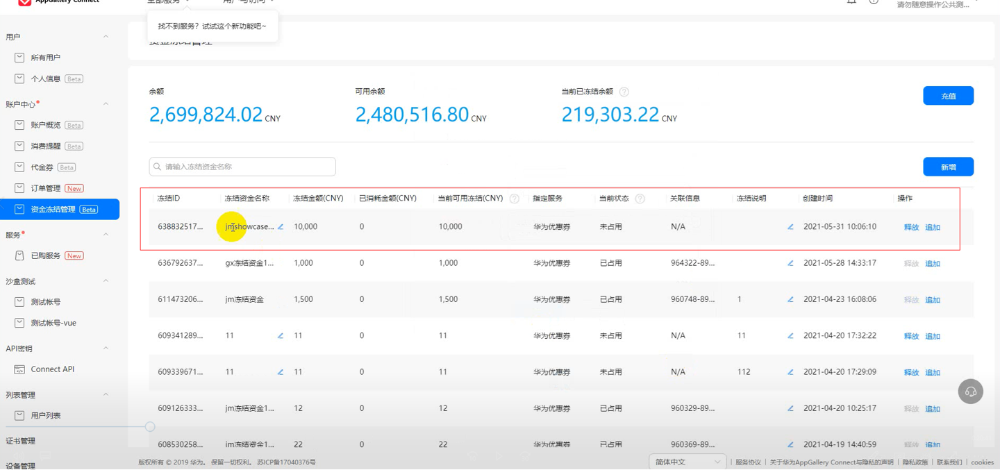

<strong>步骤3. 奖品创建</strong>

（1）入口：用户与访问→我的应用→奖品管理→点击【新增】。

（2）填写奖品的详细信息：目前开发者充值预购仅支持【华为优惠券】。

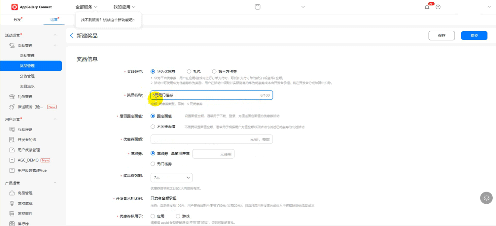

（3） 填写完毕后提交，即进入审批环节。

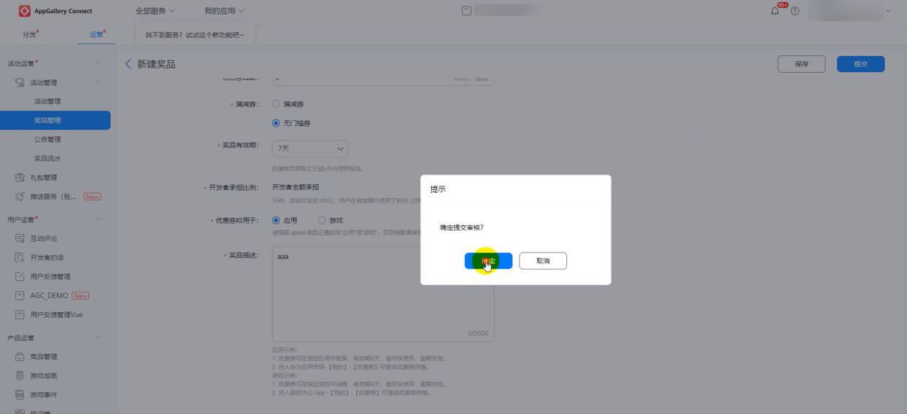

<strong>步骤4. 活动创建</strong>

（1）入口：我的应用→活动管理→新建

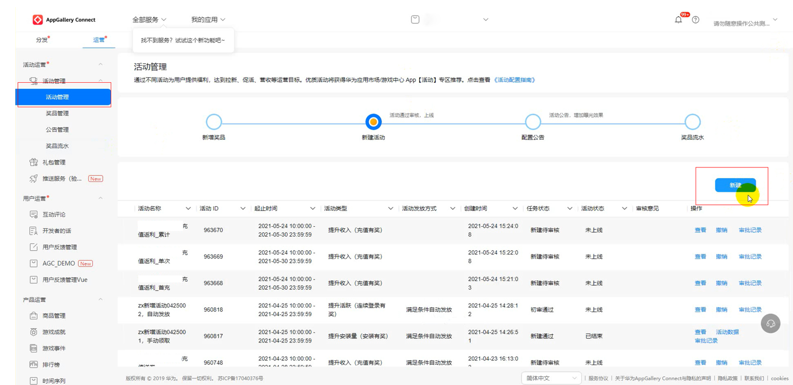

（2） 填写活动信息

- 活动目的：目前仅支持以下四种活动目的：

（1）提升安装量（安装有奖）

（2）提升新增注册（首登有奖）

（3）提升活跃（连续登陆有奖）

（4）提升收入（充值有奖）——充值返固定面额券/礼包/第三方卡券（按配置奖品返还，返还次数可配置）

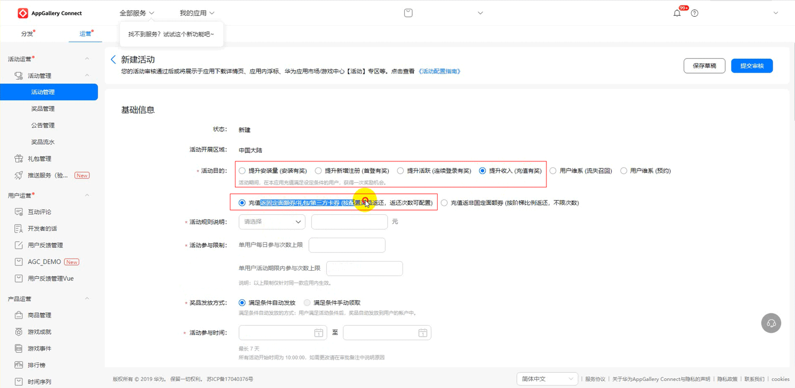

- 活动结算模式：选择【充值预购模式】
- 关联资金选择：步骤2（3）中创建的冻结资金。

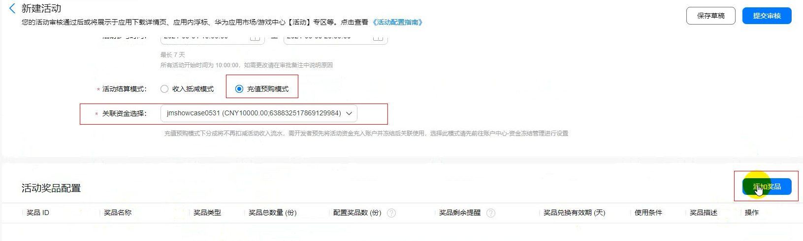

（3）活动奖品配置：点击【添加奖品】

- 奖品类型仅支持【华为优惠券】
- 选择关联步骤3中创建完成的奖品
- 奖品数量需选择【限量】

（若选择【不限量】，界面有报错提示，后台无法计算所需优惠券金额。）

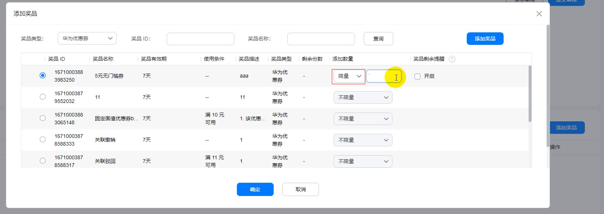

（4）创建完成后，点击【提交审核】，确认后进入运营审核阶段。

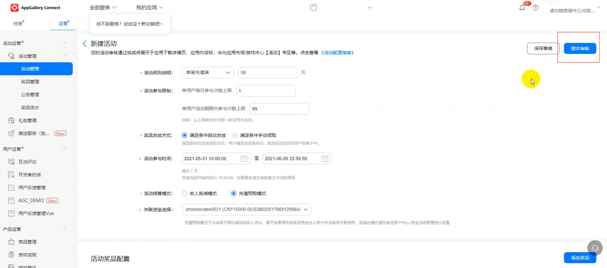

<strong>步骤5. 冻结资金管理</strong>

（1） 优惠券<strong>总体</strong>使用情况查询：

- 入口：账户中心-资金冻结管理；

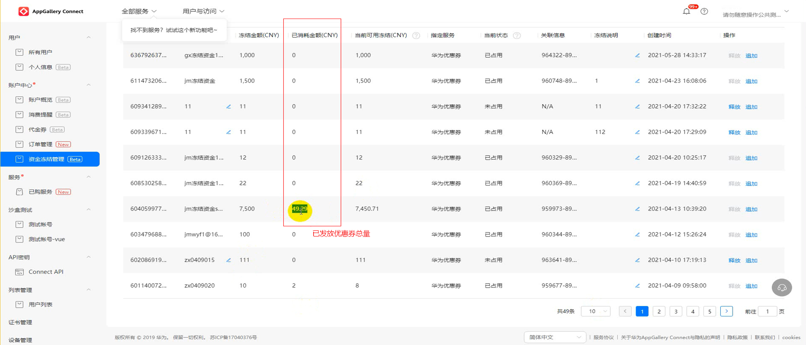

（2）优惠券<strong>逐条</strong>使用记录查询：

- 入口：账户中心-账户概览；

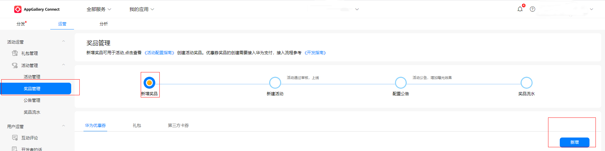

（3）核销时间：

- 活动绑定的冻结资金预计在活动中投放的优惠券全部过期后3天解绑；
- 解绑后，当前状态会从“已占用”变为“未占用”；
- 点击【释放】后，【当前可用冻结】将返回【可用余额】中，当前记录会被删除。

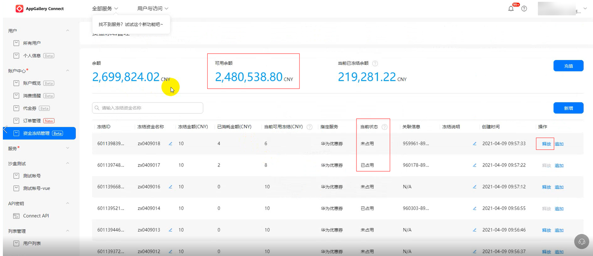
