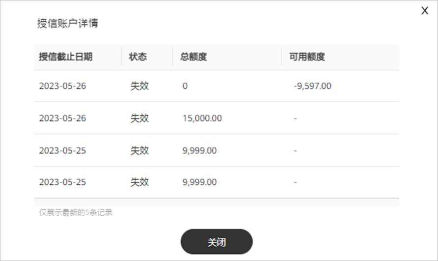
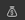
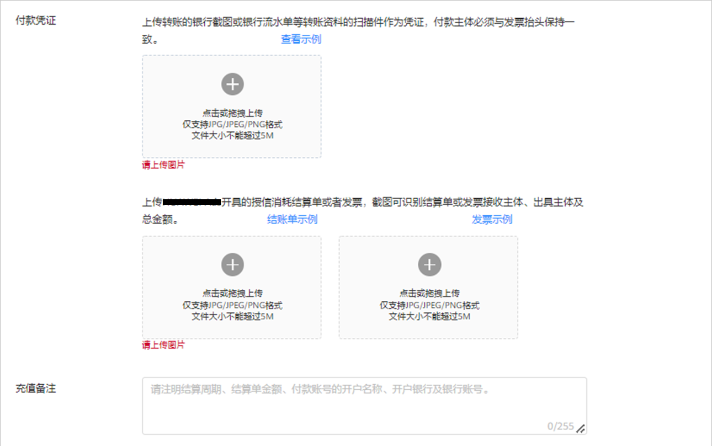

# 授信账户

本章节为直客授信账户，服务商授信账户请参考[授信账户](/docs/monetize/promotion/finance-0000001058604140#section984883812297)。

## 概述

- 授信账户：指的是您（直客）通过向鲸鸿动能广告平台申请开通授信账户（授信额度存在有效期），并分配一定的授信额度，您进行消耗后，才会产生授信账单，且需要按照“线下充值”的方式进行还款。
  - <strong>线下充值：</strong>您可以通过银行转账到[指定银行账户](/docs/monetize/promotion/settlement-overview-0000001176952305#ZH-CN_TOPIC_0000001176952305__table169021827151913)的方式进行充值，银行转账之后需要您在鲸鸿动能广告平台提交充值申请，审批通过后，还款成功。
- 额度到期：如果您的授信额度到期，但并未进行消耗，那么您广告账户中的可用授信额度将清零，无需还款。
- 还款完成：还款完成后，系统将恢复直客授信账户额度，您单击“”-&gt;“”，即可在授信账户中查看：授信截止日期、状态、总额度、可用额度。

  
- 授信通知：以下几种情况，您的账户将会收到鲸鸿动能广告平台的授信通知：
  - 额度恢复完成。
  - 授信账户额度低于20%。比例默认为20%，您也可以修改比例。
  - 授信账户快到期。
  - 授信账户到期。

## 授信账户申请

您需要发送申请邮件向对应区域进行申请，鲸鸿动能广告平台会根据您提供的信息进行信用等级评估，如果评估通过，根据评估结果给予授信额度，并在签署相关协议后生效。

- 申请邮件模板：
  - 公司名称。
  - 公司财报。
- 区域邮箱：详情请参考鲸鸿动能广告官网中的“[商务合作](https://ads.huawei.com/usermgtportal/home/index.html#/support)”。

## 线下充值

1. 银行转账。

   您需要先进行账户线下充值，可以使用银行转账的充值方式，请提前与银行确认转账时效（公对公跨行转账到账时间一般为1-3个工作日）。

    

   - 线下充值不支持个人银行账户充值。
   - 线下充值仅支持企业银行账户充值，且您用来充值的银行账户必须与广告账户主体一致，否则将无法正常还款，影响授信使用。
2. 在鲸鸿动能广告平台单击“”，提交还款申请。

   

   

   - 充值用途：选择“授信账户还款”。
   - 充值类型：选择“线下充值”。
   - 投放区域：按照鲸鸿动能广告平台为您开票的主体进行充值。
     - 投放区域选择欧洲，则收款方为阿斯比格。
     - 投放区域选择亚洲、非洲、拉丁美洲，则收款方为华为服务(香港)。
   - 充值金额：系统将会提示您最大充值金额为\*\*\*，请在限额内输入金额。
   - 付款凭证：上传转账的银行截图或银行流水等转账资料的扫描件作为凭证，付款主体必须与广告账户开户主体保持一致。
   - 备注：请注明结算周期、结算单金额、付款账号的开户名称、开户银行及银行账号。
3. 确认还款信息并提交审核。

   信息填写完毕后，确认无误并单击“提交”，您也可以“提交预览”查看您填写的信息。

   审核时间：一般为3个工作日。
