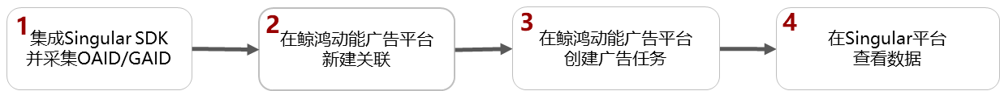
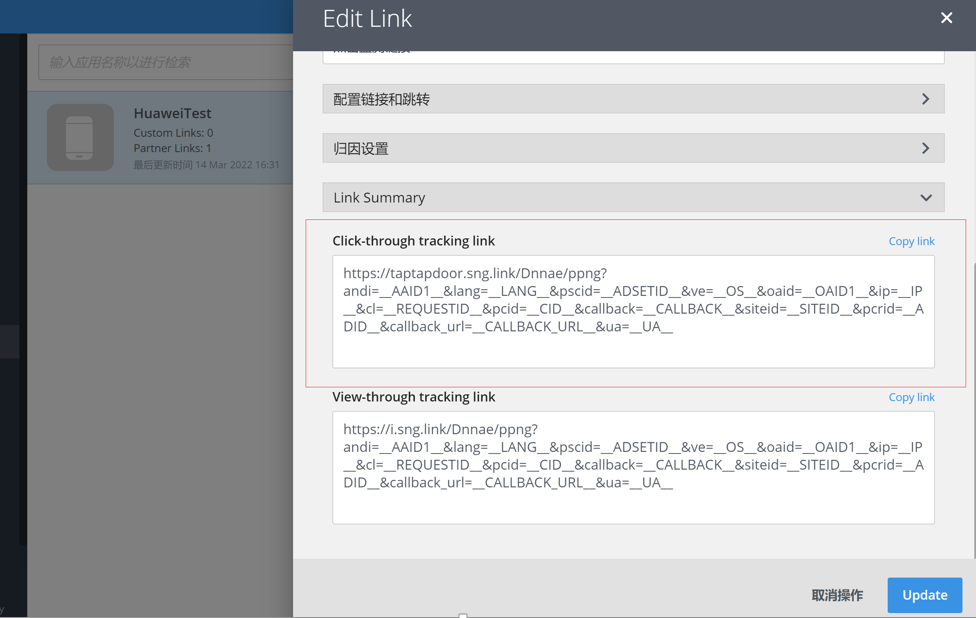

# Singular

## 概述

Singular支持12.0.7及以上版本，详情请参考[官网链接](https://support.singular.net/hc/en-us/articles/360037581952)。

## 操作流程

## 操作步骤

1. 集成Singular SDK并采集OAID/GAID。
   - 集成：详细操作请参照[Singular集成对接文档](https://alliance-communityfile-drcn.dbankcdn.com/FileServer/getFile/cmtyPub/011/111/111/0000000000011111111.20260513165912.30837723588783880084053203202605:20260531101615:2800:E8A2EF33E3F40B3E9138A0FBE005FEDE7D82CEA3AD1CB58AC8678EDBD6A2DBB8.pdf?needInitFileName=true)。
   - 采集OAID/GAID：三方监测事件必须使用OAID/GAID跟踪归因，请确保您的应用已加入OAID/GAID采集代码，否则可能将无法正确跟踪。
     - 如果您跟踪的应用是华为应用市场的应用，您必须采集OAID。
     - 如果您跟踪的应用是非华为应用市场的应用，GAID会自动采集。
2. 在鲸鸿动能广告平台新建关联。

   需要为您希望跟踪的每一个应用使用指定的监测工具新建资产，详细请参考[新建资产](https://developer.huawei.com/consumer/cn/doc/promotion/tracking-app-overview-0000001209244840#ZH-CN_TOPIC_0000001209244840__li8351194812211)。

   填写曝光监测链接、点击监测链接：监测链接获取请参考[在三方监测平台获取曝光和点击监测链接](https://developer.huawei.com/consumer/cn/doc/promotion/tracking-overview-0000001170938773#ZH-CN_TOPIC_0000001170938773__li344454212571)。

   

    

   - 如果您后期修改了关联分析工具中的曝光/点击监测链接，您需要重新对任意一个指标进行[手动测试](https://developer.huawei.com/consumer/cn/doc/promotion/tracking-app-overview-0000001209244840#ZH-CN_TOPIC_0000001209244840__section105501517172)，测试成功后新的曝光/点击监测链接才生效，其他的指标启用状态，与修改链接前保持一致。
   - 如果您想在广告投放前对您创建的转化指标进行测试，那您可以进行[手动测试](https://developer.huawei.com/consumer/cn/doc/promotion/tracking-app-overview-0000001209244840#ZH-CN_TOPIC_0000001209244840__section105501517172)。
3. 在鲸鸿动能广告平台创建广告任务。

   您在上传广告创意时，系统将会自动关联到创意中的曝光/点击监测链接（自动关联的链接不要修改，避免影响跟踪数据）。
4. 在Singular平台查看转化数据。
