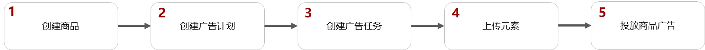
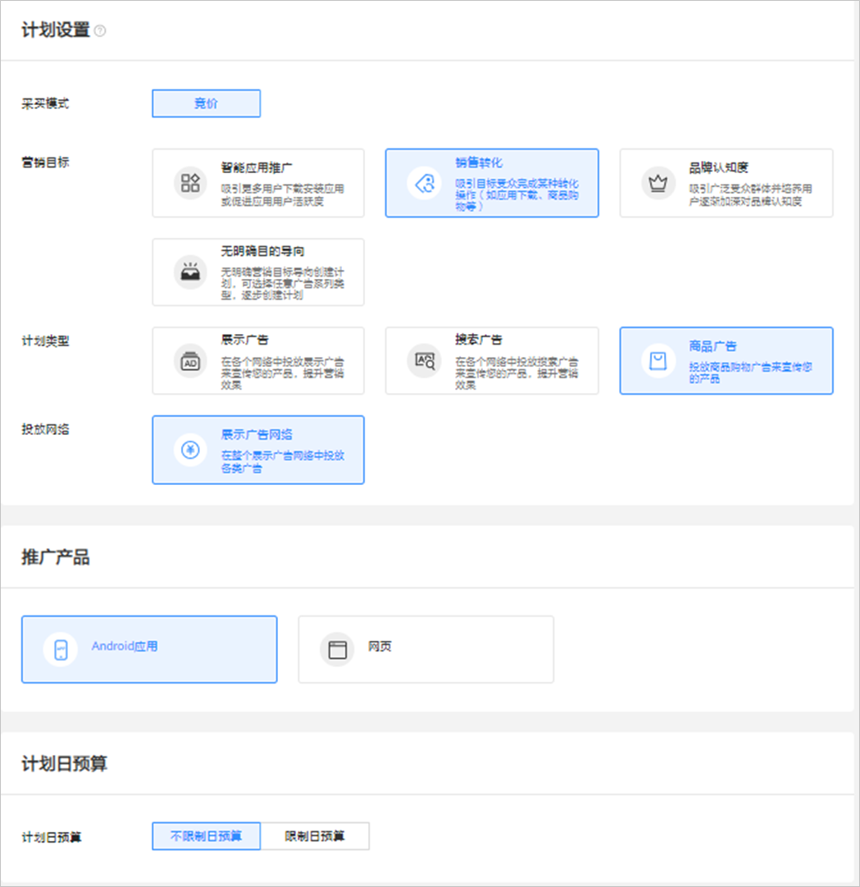
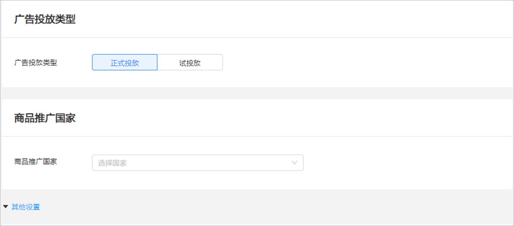
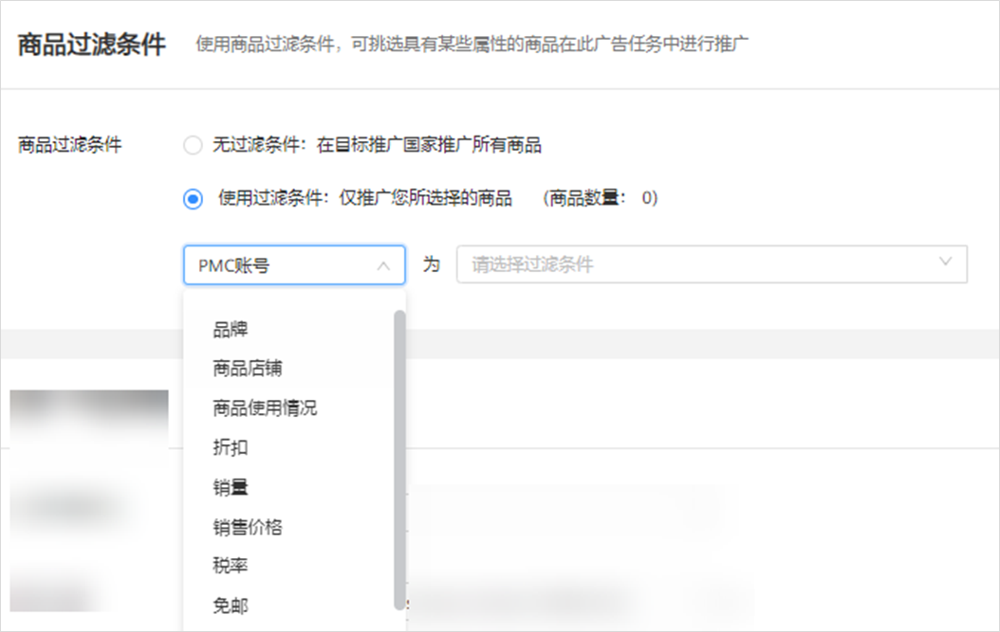
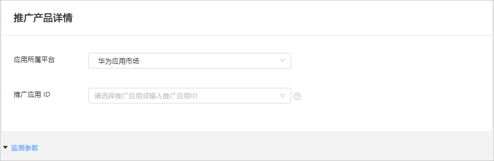
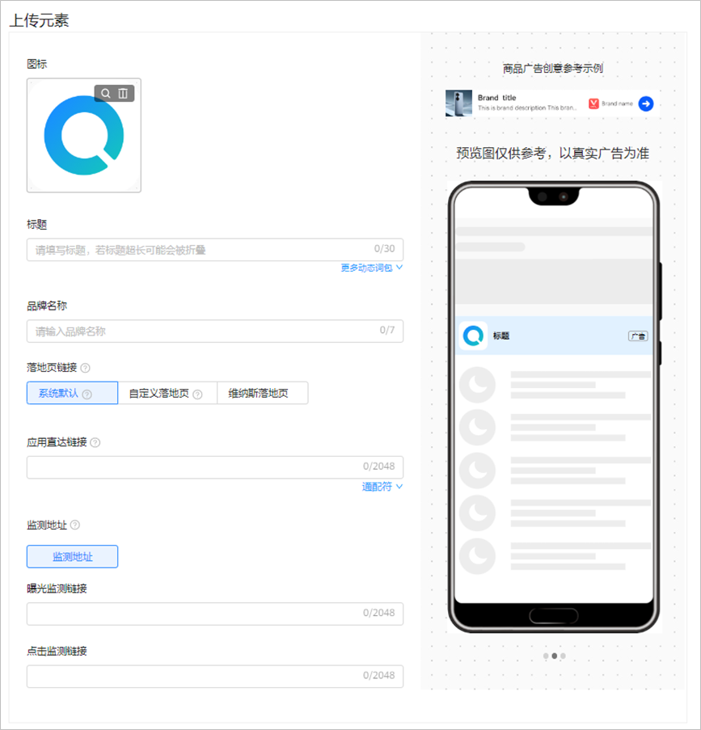

# 商品广告

## 概述

如果您希望推广自己的零售商品，可以在展示广告网络上投放商品广告来增加流量，触达更多优质潜在用户。

## 商品广告操作流程

 

如果您需要投放展示商品广告，需要申请[特性通行名单](/docs/monetize/promotion/addtongxing-0000001128278195)。

## 商品广告操作步骤

1. 创建商品，详情请参考[商品中心](/docs/monetize/promotion/item-center-0000001251845484)。
2. 创建广告计划。

   单击“创建”-&gt;“创建计划”，进入计划设置。

   

   - <strong>营销目标</strong>：选择“<strong>销售转化</strong>”或者“<strong>无明确目的导向</strong>”，详情参考[营销目标](/docs/monetize/promotion/overview-cjjjgg-0000001182873508#ZH-CN_TOPIC_0000001182873508__zh-cn_topic_0000001205953939_zh-cn_topic_0000001105216776_li07111843183611)。
   - <strong>计划类型</strong>：选择“<strong>商品广告</strong>”，详情参考[计划类型](/docs/monetize/promotion/overview-cjjjgg-0000001182873508#ZH-CN_TOPIC_0000001182873508__zh-cn_topic_0000001205953939_zh-cn_topic_0000001105216776_li234211653411)。
   - <strong>投放网络</strong>：选择“<strong>展示广告网络</strong>”，详情参考[投放网络](/docs/monetize/promotion/overview-cjjjgg-0000001182873508#ZH-CN_TOPIC_0000001182873508__zh-cn_topic_0000001205953939_zh-cn_topic_0000001105216776_li93421166342)。
   - <strong>推广产品</strong>：选择“<strong>Android应用</strong>”或“<strong>网页</strong>”，详情参考[推广产品](/docs/monetize/promotion/overview-cjjjgg-0000001182873508#ZH-CN_TOPIC_0000001182873508__zh-cn_topic_0000001205953939_zh-cn_topic_0000001105216776_li8342416193416)。
   - <strong>计划日预算</strong>：详情参考[计划日预算](/docs/monetize/promotion/overview-cjjjgg-0000001182873508#ZH-CN_TOPIC_0000001182873508__zh-cn_topic_0000001205953939_zh-cn_topic_0000001105216776_li14342141615342)。
   - <strong>推广计划名称</strong>：详情参考[推广计划名称](/docs/monetize/promotion/overview-cjjjgg-0000001182873508#ZH-CN_TOPIC_0000001182873508__zh-cn_topic_0000001205953939_zh-cn_topic_0000001105216776_li1434211615342)。
3. 创建广告任务。

   如果您希望在已有的计划下增加新的任务，请参考[已有计划下创建任务](/docs/monetize/promotion/overview-cjjjgg-0000001182873508#ZH-CN_TOPIC_0000001182873508__zh-cn_topic_0000001205953939_li5851143183912)。

   
   - <strong>广告投放类型</strong>：选择“正式投放”。
   - <strong>商品推广国家</strong>：您可以在这里选择广告投放国家，此处的国家是您在商品中心创建的目标销售国家/地区。

     一个任务只能投放一个国家的商品，如果您要投放多个国家，请创建新的任务。
   - <strong>其他设置：</strong>

     <strong>商品目录过滤条件</strong>：这是一项可选功能，默认情况下，鲸鸿动能广告平台从您的商品中心匹配商品。展示出来的商品数量跟您的过滤条件相关，鲸鸿动能广告平台将仅展示您所选择的商品进行广告投放。

     

     - PMC账号、商品店铺、品牌、商品使用情况：支持下拉选择。
     - 折扣、销量、价格、税率：均支持手动输入。

       一个商品中可能包含多个税率，鲸鸿动能广告按照精准匹配来实现。例如：某个商品在商品库中设置巴黎的税率为15%，马赛的税率为20%，里昂的税率为20%，此时您在商品目录过滤条件中的税率设置的范围是15%-25%，则商品符合税率筛选条件，反之商品不符合筛选条件。

       价格按照美元进行过滤，您选择的商品根据实时汇率进行换算。例如：PMC商品库A设置的币种为日元，您在投放端设定价格的过滤条件为50美元-100美元，则需要按实时汇率进行换算。
     - 免邮：是/否，仅支持单选，鲸鸿动能广告按照精准匹配来实现。例如：某个商品在商品库中设置巴黎运费0，马赛运费0，里昂运费不为0，若您在商品目录过滤条件中选“包邮”，则商品不符合包邮筛选条件。

   
   - <strong>推广产品详情</strong>：

     如果您选择的推广产品为应用，则需要选择应用所属平台：

     - <strong>华为应用市场：</strong>从下拉列表中选择您想要推广的应用，或者手动输入应用ID/包名，应用ID可在华为应用市场应用详情页网页链接尾部获取，例：``https://appgallery.huawei.com/#/app/Cxxxxxxxxx``，请前往[华为应用市场](https://appgallery.huawei.com/#/Featured)查看。
     - <strong>GooglePlay：</strong>
       - 应用包名：输入推广应用包名，例如：com.huawei.appmarket，请确保应用包名与GooglePlay中包名一致，否则广告将无法正确投放。
       - 应用链接：系统根据您输入的应用包名自动生成推广应用链接。通过推广应用链接，用户看到您的广告后，可以点击跳转到GooglePlay上的应用详情页面。
       - 应用名称：输入推广应用名称，请确认该名称与在GooglePlay上架时所使用的名称一致，否则广告将无法正确投放。
       - 应用图标：上传您的应用图标。
     - <strong>其他安卓应用商店</strong>：输入应用包名，即可搜索应用。例如：com.huawei.appmarket，请确保应用包名与其他安卓应用商店中包名一致，否则广告将无法正确投放。
     - <strong>第三方监测渠道：</strong>
       - 应用包名：输入推广应用包名，例如：com.huawei.appmarket。请确认输入的应用包名与应用链接，均属于相关应用市场里的同一个应用。
       - 应用链接：输入来自第三方监测渠道AppsFlyer的可到达相关应用市场上的应用详情页面链接，例如：来自三方监测平台AppsFlyer创建的OneLink。
       - 应用名称：输入推广应用名称，请确认该名称与在相关应用市场上架时所使用的名称一致。
       - 应用图标：上传您的应用图标。
       - 定向应用市场：将用户定向到相关的应用市场上，因此选择应用市场之前，请确认该应用市场里有这个推广应用。
   - <strong>监测参数：</strong>监测参数将拼接到落地页链接/直达链接地址后面，可应用于监测不同渠道转化等功能。使用前必须保证增加了后缀监测参数的链接可以正常访问。

     监测参数格式：key1=value1&key2=value2（您也可以将value替换成宏参数，鲸鸿动能广告支持的宏参数详情请参考[宏参数](/docs/monetize/promotion/overview-cjjjgg-0000001182873508#ZH-CN_TOPIC_0000001182873508__li1791495401511)）。示例：

     - H5监测参数为：source=hw，某H5链接为：``https://www.huawei.com``，真实投放时拼接的H5落地页为：``https://www.huawei.com&source=hw``。
     - 直达链接监测参数为：source=hw，某直达链接为：snssdk://123.com，真实投放时拼接的直达链接为：snssdk://123.com&source=hw。
     - 如果原来落地页链接中已有参数，系统会将原来参数的值覆盖为新的参数值。例如：原来落地页链接为``https://www.huawei.com?utm\_source=huawei``，配置了监测参数utm\_source=efg。新下发的落地页链接应当为https://www.huawei.com?utm\_source=efg
   - <strong>定向</strong>：详情参考[定向设置](/docs/monetize/promotion/targeting-0000001180547094)。

   - <strong>投放日期：</strong>详情参考[投放日期](/docs/monetize/promotion/overview-cjjjgg-0000001182873508#ZH-CN_TOPIC_0000001182873508__zh-cn_topic_0000001205953939_li73789433254)。
   - <strong>投放时间：</strong>详情参考[投放时间](/docs/monetize/promotion/overview-cjjjgg-0000001182873508#ZH-CN_TOPIC_0000001182873508__zh-cn_topic_0000001205953939_li1237874310252)。
   - <strong>出价</strong>：支持CPC、CPM。
   - <strong>任务名称</strong>：详情参考[任务名称](/docs/monetize/promotion/overview-cjjjgg-0000001182873508#ZH-CN_TOPIC_0000001182873508__zh-cn_topic_0000001205953939_li237864312259)。
4. 上传元素<strong>。</strong>

   上传标题、设置品牌名称等。

   

   - <strong>标题：</strong>可以支持30个字符，若文案超长会被折叠，您也可以在标题中使用动态词包，例如：您选择了\\{商品名称\\}，则不同用户可以看到不同的商品名称。
   - <strong>品牌名称</strong>：中文可以支持7个汉字，英文可支持14个英文字符。
   - 如果您选择的推广产品为应用，则需要填写如下信息：
     - <strong>落地页链接（选填）</strong>：
       - <strong>系统默认</strong>：如果您没有自己的落地页，系统可以为您自动生成落地页，您在投放前可以通过试投放来测试您的广告是否展示正常。
       - <strong>自定义落地页：</strong>
         - 填写自定义的HTTPS访问地址。例如：``https://ads.huawei.com/usermgtportal/home/index.html#/``。
         - 自定义落地页可选择通配符 “移动端H5商品落地页”和“移动端H5品牌落地页”，通过通配符关联商品库中的url字段链接，若落地页机器审核不通过时，则广告无法投放。
       - <strong>维纳斯落地页：</strong>
         - 普通维纳斯落地页：下拉选择在维纳斯创建的落地页，具体请查看[落地页工具](/docs/monetize/promotion/venus-0000001063299665)，用户点击您的广告后，进入您在维纳斯创建的落地页。
         - 动态商品落地页：下拉选择在维纳斯创建的与投放区域匹配的[动态商品落地页](/docs/monetize/promotion/venus-0000001063299665#ZH-CN_TOPIC_0000001063299665__li19297141415156)，用户点击您的广告后，进入您选择的动态商品落地页。
       - <strong>试玩落地页：</strong>详情参考[试玩落地页](/docs/monetize/promotion/displayad-0000001052424318#ZH-CN_TOPIC_0000001052424318__li116410333319)。
     - <strong>应用直达链接</strong> <strong>：</strong>应用下载选填，应用促活必填，指定应用内内容的详情页，如果您想获取应用首页，获取方式请参考<strong>[应用直达链接获取工具](/docs/monetize/promotion/overview-cjjjgg-0000001182873508#应用直达链接获取工具)；</strong>如果您想获取应用直达链接的指定页面，请联系您的研发同事获取。
   - <strong>监测地址（选填）</strong>：如果您使用三方监测进行转化跟踪，请先完成[三方监测](/docs/monetize/promotion/tracking-overview-0000001170938773)的对应操作，完成后在您创建任务的时候，系统将会自动关联监测地址（关联出来的链接建议不要修改，避免影响跟踪数据）。如果您修改了关联分析工具中的监测链接，系统将会自动同步到任务，任务中无需修改。
   - <strong>创意名称：</strong>详情参考[创意名称](/docs/monetize/promotion/overview-cjjjgg-0000001182873508#ZH-CN_TOPIC_0000001182873508__zh-cn_topic_0000001205953939_zh-cn_topic_0000001105216776_li1471941495513)。
5. 投放商品广告。

   单击“提交”，审核通过后即可推广，审核时间、审核结果通知、审核结果查看请参考[广告审核](/docs/monetize/promotion/review-0000001052064324)。
