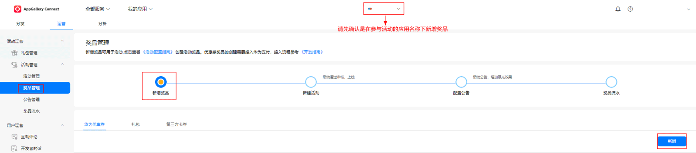
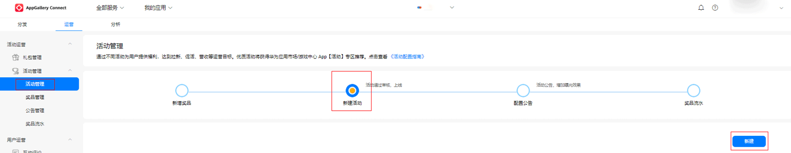

# 具体操作流程

- <strong>创建活动奖品-创建活动-关联奖品-提交素材</strong>

<strong>（1）创建活动奖品</strong>

<strong>创建路径：</strong>AppGallery Connect &gt; 我的应用 &gt; 应用类型 &gt; 运营 &gt; 活动管理 &gt; 奖品管理 &gt; 新增奖品。

<strong>奖品类型：</strong>

- 华为优惠券：用户使用华为帐号进行订单支付时，可抵扣支付订单的部分（或全部）金额。
- 礼包（有码）：以串码（兑换码）形式向用户派发礼包，用户领取后获得一个串码，根据使用说明在应用（游戏）中兑换获取福利。
- 第三方卡券：以串码（兑换码）形式向用户派发卡券（如京东E卡），用户领取后根据使用说明在第三方应用中兑换获取福利

  

说明：

1）新建奖品时，需先确定关联的活动应用，该奖品只允许在该应用下使用；

2）活动奖品与活动可同时提交审核，奖品过期后将无法用于活动中；

3）新建奖品为华为优惠券，且命名为X元优惠券时，请在奖品描述中备注应用名称，以便二次使用时查询。

<strong>（2）创建活动</strong>

创建路径：AppGallery Connect &gt; 我的应用 &gt; 应用类型 &gt; 运营 &gt; 活动管理 &gt; 活动管理 &gt; 新建活动。

<strong>活动类型</strong>：共7种，具体类型活动请参考[具体类型活动示例](/docs/monetize/promotion/activity-examples-0000001176965771)。

<strong>奖品发放方式</strong>：

- 满足条件自动发放的方式（推荐）：用户满足活动条件后，奖品自动发放到用户的账户中；
- 满足条件手动领取的方式：用户满足活动条件后，需进入活动详情页手动领取奖品。

注明：活动结算模式相关信息，请查阅 [活动结算模式](/docs/monetize/promotion/settlement-model-0000001131086022)

<strong>（3）关联奖品，提交素材</strong>

<strong>操作说明：</strong>活动需关联提交同一应用下的奖品；活动奖品与活动可同时提交审核，奖品有效期建议设置较长，否则奖品过期后将无法用于活动中；

<strong>活动素材要求：</strong>参考示例图片

|  |  |
| --- | --- |
|  |  |
