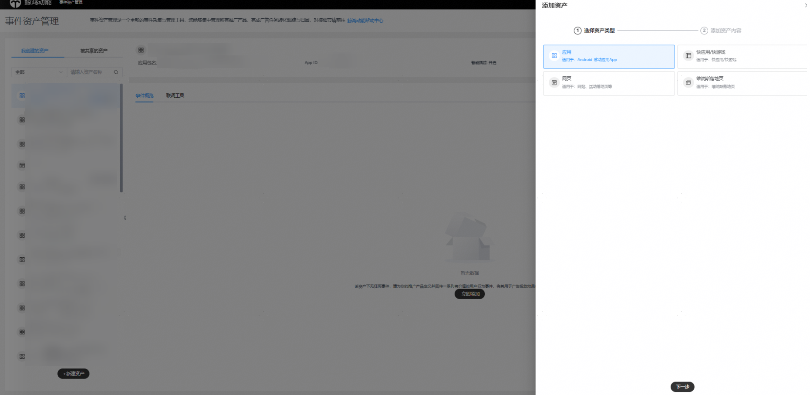
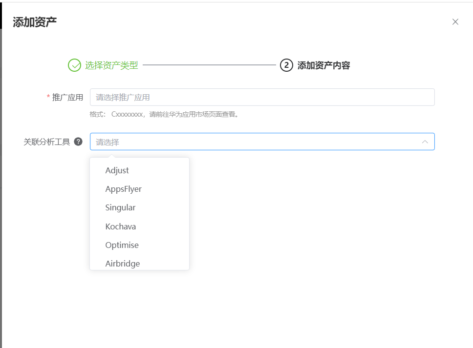
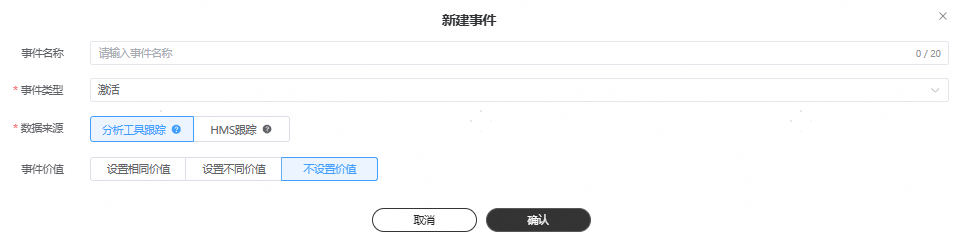
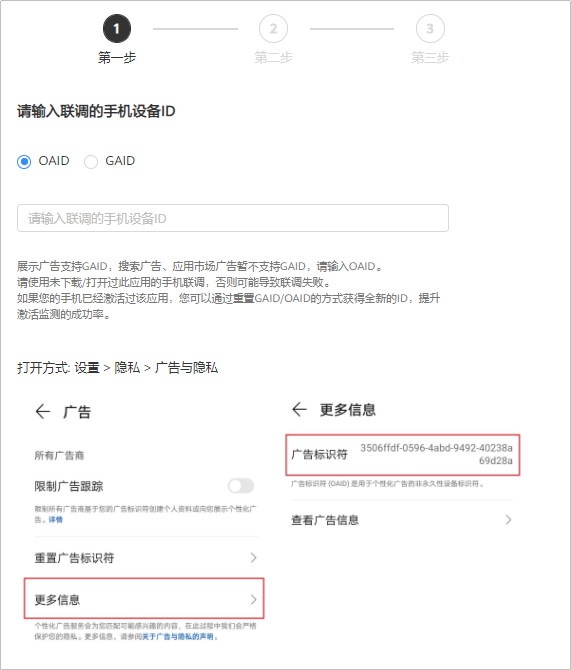
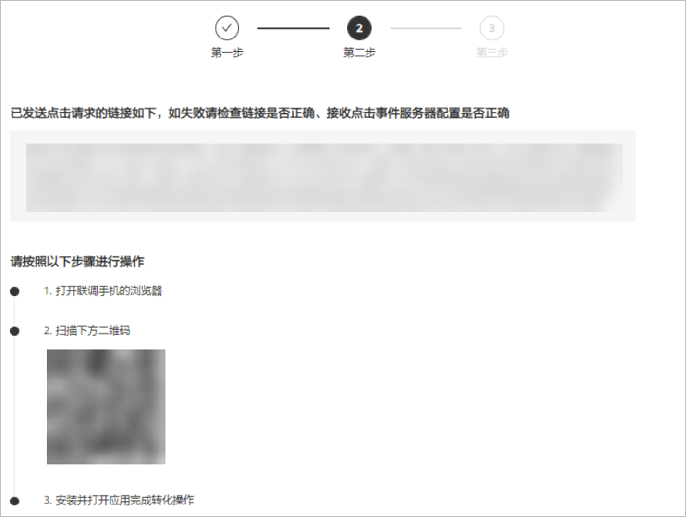

# 概述

## 应用转化跟踪创建流程

1. 集成转化跟踪平台SDK。

   | 转化跟踪平台 |
   | --- |
   | [华为分析跟踪](/docs/monetize/promotion/ha-0000001151036374) |
   | [三方监测](/docs/monetize/promotion/tracking-overview-0000001170938773) |
   | [自有分析工具](/docs/monetize/promotion/tracking-zi-0000001092895300) |
   | [HMS跟踪](/docs/monetize/promotion/tracking-hms-0000001093214902) |
2. 在鲸鸿动能广告平台创建资产并添加关联。

   需要为您希望跟踪的每一个应用使用指定的监测工具新建资产。

   1. 在鲸鸿动能广告平台新建关联：单击"工具”-&gt;”事件资产管理”-&gt;”新建资产”。
   2. 设置应用关联信息：

      

      

      推广应用：选择您需要关联的应用，或者手动输入应用ID/包名。

      分析工具提供商：选择应用分析提供商，例如：AppsFlyer、Adjust等。

      曝光/点击监测链接：仅三方监测跟踪平台的部分分析工具提供商需要填写，具体请参考在[三方监测平台获取曝光和点击监测链接](/docs/monetize/promotion/tracking-overview-0000001170938773)。
      - 曝光监测链接：用于监测曝光数据。
      - 点击监测链接：用于监测点击数据。

      智能跟踪：
      - 如果您勾选智能跟踪，您需要通过转化跟踪平台将数据回传到鲸鸿动能广告平台，系统收到回传数据后，系统将为您自动创建事件且事件指标状态变为”已启用“，您才能创建oCPC任务。
      - 如果您未选择智能跟踪，您需要通过转化跟踪平台将数据回传到鲸鸿动能广告平台，且需要[手动创建转化事件](#section1622213481529)并进行[应用测试](#section152255480210)，如果没有测试按钮，您需要等待应用产生自然转化事件或者您手动触发转化事件，系统收到回传数据后，转化指标状态变为”已启用“，您才能创建oCPC任务。
3. 将秘钥填入转化跟踪平台并设置数据回传。

   为了将转化跟踪平台跟踪到的转化结果传递给鲸鸿动能广告平台，以便鲸鸿动能广告平台可以将转化结果用于报表统计和投放优化，需要将获取的秘钥填入到转化跟踪平台并在转化跟踪平台上配置数据回传给鲸鸿动能广告平台。

   | 转化跟踪平台 | 是否需要将秘钥填入到转化跟踪平台 |
   | --- | --- |
   | [华为分析](/docs/monetize/promotion/ha-0000001151036374) | 否 |
   | [AppsFlyer](/docs/monetize/promotion/appsflyer-0000001122291488) | 否 |
   | [Adjust](/docs/monetize/promotion/adjust-0000001121931660) | 是 |
   | [Sizmek](/docs/monetize/promotion/sizmek-0000001168691457) | 否 |
   | [Kochava](/docs/monetize/promotion/kochava-0000001168891345) | 是 |
   | [Tenjin](/docs/monetize/promotion/tenjin-0000001197115949) | 是 |
   | [Airbridge](/docs/monetize/promotion/airbridge-0000001197036041) | 是 |
   | [Branch](/docs/monetize/promotion/branch-0000001272007784) | 否 |
   | [自有分析工具](/docs/monetize/promotion/tracking-zi-0000001092895300) | 是 |

   如果您希望统计付费事件的金额，可以在<strong>转化跟踪</strong>平台将转化金额进行回传，鲸鸿动能广告平台会将转化金额进行累加展示在报表的“付费金额”字段。

   - 只有完成转化事件的测试，转化事件状态为“已启用”时，您才能在鲸鸿动能广告平台上查看转化金额。
   - 付费金额是累加的，不支持查看每个用户的具体付费金额。

   转化金额通过revenue和currency两个参数进行回传，在回传转化事件时，需要您自己实现代码或其它方式获取转化金额和币种，并通过这两个参数进行回传。

   - currency：可以选择CNY/ USD/ EUR/ JPY/ GBP，如果未能识别成功或未回传，会默认使用您广告账户的币种。鲸鸿动能广告平台会将接收到的回传金额转化为您广告账户的注册币种并累加到付费金额指标中进行统计。
   - revenue：转化金额。

   举例：您希望跟踪用户在游戏中的道具购买，在上报付费的同时，上报currency USD，revenue 10，同时账户币种为EUR，鲸鸿动能广告平台在接收到回传数据时，付费事件+1，revenue按照实时汇率转化EUR之后累加到付费金额字段。
4. 确认鲸鸿动能广告平台收到转化跟踪数据。

   不同转化跟踪平台操作不同，请参考如下表格：

   | 转化跟踪平台 | 如何让鲸鸿动能广告平台收到事件数据 |
   | --- | --- |
   | 华为分析 | - 投放正式广告 - 投放试投放任务，手动触发转化事件 - 等待应用产生自然转化事件或者手动触发转化事件 |
   | AppsFlyer | - 投放试投放任务，手动触发转化事件 - [手动创建转化事件](#section1622213481529)并[手动联调](#section152255480210) |
   | Adjust | - 投放试投放任务，手动触发转化事件 - [手动创建转化事件](#section1622213481529)并[手动联调](#section152255480210) |
   | Sizmek | / |
   | Kochava | - 投放正式广告 - 投放试投放任务，手动触发转化事件 - 等待应用产生自然转化事件或者手动触发转化事件 |
   | Tenjin | - 投放试投放任务，手动触发转化事件 - [手动创建转化事件](#section1622213481529)并[手动联调](#section152255480210) |
   | Airbridge | - 投放试投放任务，手动触发转化事件 - [手动创建转化事件](#section1622213481529)并[手动联调](#section152255480210) |
   | Branch | - 投放试投放任务，手动触发转化事件 - [手动创建转化事件](#section1622213481529)并[手动联调](#section152255480210) |
   | 自有分析工具 | - 投放正式广告 - 投放试投放任务，手动触发转化事件 - 等待应用产生自然转化事件或者手动触发转化事件 |

   鲸鸿动能广告平台收到转化数据后，转化指标的转化状态会从“未启用”变为”已启用“，如果您在鲸鸿动能广告平台没有看到相应的转化数据，您需要检查应用跟踪回传配置是否正确。
5. 在鲸鸿动能广告平台创建广告任务。

   如果您使用的转化跟踪平台是三方监测，那么您在上传广告创意时，系统会将监测链接自动关联到创意中的曝光/点击监测链接（自动关联的链接不要修改，避免影响跟踪数据）。
6. 在鲸鸿动能广告平台1.1.5 转化数据。

   鲸鸿动能广告平台收到转化数据后，转化指标的转化状态会自动变为“已启用”（一般需要3-10分钟），您可以在报表中查看应用的相关转化数据。

   如果您在鲸鸿动能广告平台没有看到相应的转化数据，您需要检查应用跟踪回传配置是否正确。

## 手动创建转化事件

如果您在创建资产时，未勾选”智能跟踪”，那么对每一个您希望回传和统计的转化事件，都需要都在此创建事件，只有成功添加的转化，鲸鸿动能广告平台在收到转化数据后才会统计到报表里。

1. 单击“工具”-&gt;”事件资产管理”，选择"资产”-&gt;”新建事件"并单击“继续”。
2. 设置事件信息。

   

   - <strong>事件类别：</strong>指的是您可以跟踪的转化事件，详情可参考[事件概览](/docs/monetize/promotion/tracking-gaishu-0000001139892539#section74190476225)。
   - <strong>事件名称：</strong>仅用于事件列表的管理，且转化名称不可重复。建议设置一个清晰易懂的名称，例如：应用+事件类别。设置完成后可编辑修改。

## 应用测试

- <strong>自动激活</strong>：应用集成没有问题的前提下，您可以直接投放鲸鸿动能广告，鲸鸿动能广告平台收到转化数据后，转化状态会自动变为“已启用”（一般需要3-10分钟），您可以在报表中查看应用的相关转化数据。
- <strong>手动联调</strong>：为确保鲸鸿动能广告平台能正确接收到转化数据，您可以使用联调工具，通过模拟用户产生转化的方式，在线进行转化事件回传的测试和验证。测试通过之后，转化的状态才会变更为“已启用”，您才能在报表中查看应用的后向转化数据。手动测试步骤如下：
  1. 进入测试页面：单击“工具”-&gt;“事件资产管理”-&gt;”联调工具”
  2. 输入测试手机的设备ID，输入后，单击“下一步”，向平台发送模拟点击事件。

     手机设备ID指的是一种非永久性设备标识符，可在保护用户个人数据隐私安全的前提下，向用户提供个性化广告。主要分为OAID和GAID，HMS手机一般用OAID，GMS手机一般用GAID，GAID仅展示广告使用。

     HMS手机OAID获取方式：打开手机的设置，找到隐私功能，单击广告和隐私，单击更多信息，获取OAID。请注意因手机型号不一致，广告标识符所处的位置有所差别。

     GMS手机GAID获取方式：打开手机的设置，找到谷歌，单击隐私，找到广告，获取GAID。请注意因手机型号不一致，广告标识符所处的位置有所差别。

     
  3. 下载并在应用内完成转化操作。

     如果您的应用属于非华为应用市场：在非华为应用市场下载该应用，在应用内完成对应转化操作。

     如果您的应用属于华为应用市场：扫描二维码，进行应用安装包下载或者在华为应用市场下载该应用，在应用内完成对应转化操作。

     
  4. 查看测试状态：完成测试后您可以在界面上单击“下一步”查看测试状态，或者您在转化跟踪列表查看数据回传状态。仅“测试状态”为“已激活”的转化，您才能在鲸鸿动能广告报表中查看到相关数据。
