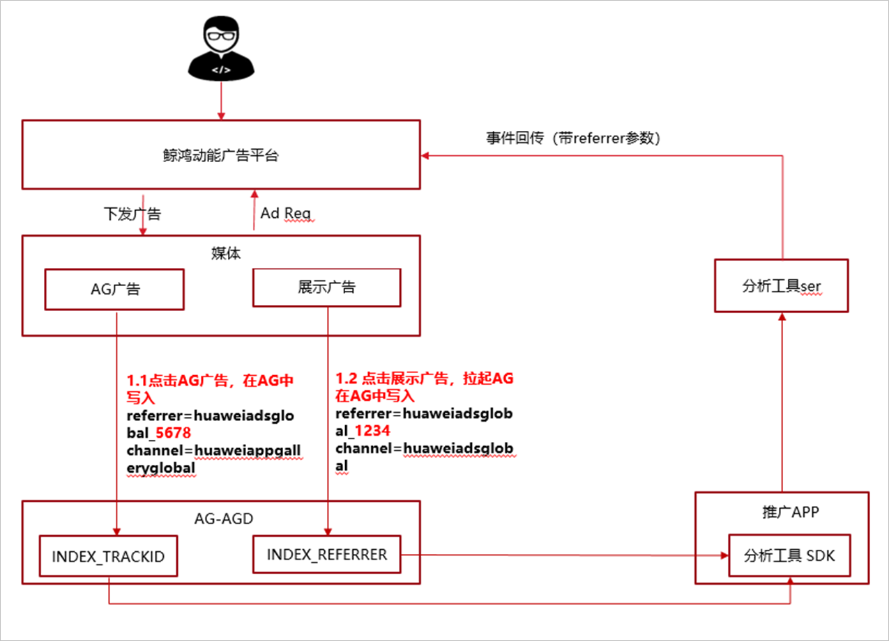

# 分析平台接入鲸鸿动能广告平台及referrer归因

分析平台接入时需按照鲸鸿动能广告平台支持的归因模式进行接入，鲸鸿动能广告平台分为自归因与非自归因:

| / | POST | GET |
| --- | --- | --- |
| 自归因 | 支持 | 不支持 |
| 非自归因 | 支持 | 支持 |

- 自归因：按照鲸鸿动能广告平台的API接口进行集成，详情请参考[SRN API](https://alliance-communityfile-drcn.dbankcdn.com/FileServer/getFile/cmtyPub/011/111/111/0000000000011111111.20260513165820.90476390402015418054900042615238:20260531101646:2800:128DF8BB9AF4EE93950408B760167A97E11A40D16F5CD31D42F5761F1A316B7E.doc?needInitFileName=true)。
- 非自归因：三方监测平台接入鲸鸿动能广告平台，详情请参考[Conversion Data Postback API v1.0.6](https://alliance-communityfile-drcn.dbankcdn.com/FileServer/getFile/cmtyPub/011/111/111/0000000000011111111.20260513165820.79910463590396778800102521443877:20260531101646:2800:EC6D0AFEA24A28B513452D6336F5B46CCB006ECAF81A13F93DD3470D68545968.pdf?needInitFileName=true)。

referrer归因是鲸鸿动能广告平台新增的归因方案，根据不同的应用市场提供不同的方案：

- <strong>Referrer</strong> <strong>归因方案支持的应用市场：华为应用市场</strong>：

  

  - <strong>鲸鸿动能广告写入参数：</strong>

    Referrer参数随广告点击下发。

    点击应用市场广告，在应用市场中写入。点击展示广告，拉起应用市场，在应用市场中写入。

    其中，应用市场广告referrer参数存到“INDEX\_TRACKID”字段；展示广告referrer参数存到“INDEX\_REFERRER”字段。
  - <strong>参数格式：</strong>

    鲸鸿动能广告写入AppGallery中的INDEX\_REFERRER和INDEX\_TRACKID，写入应用市场的参数为JSON格式。

    其中INDEX\_REFERRER格式为URL编码的值，例如：

    %7B%22reportCount%22%3A-1%2C%22contentId%22%3A%2258803091%22%2C%22slotId%22%3A%22h7jrvnsy3m%22%2C%22adType%22%3A3%2C%22referrer%22%3A%22huaweiadsglobal\_202109011137240191891%22%2C%22channel%22%3A%22huaweiadsglobal%22%7D

    INDEX\_REFERRER进行URL解码后格式：

    \\{"reportCount":-1,"contentId":"58803091","slotId":"h7jrvnsy3m","adType":3,"referrer":"huaweiadsglobal\_202109011137240191891","channel":"huaweiadsglobal"\\}
  - <strong>从应用市场获取referrer参数技术指导：</strong>

    分析工具在端侧从华为应用市场获取referrer参数，详情参考[referrer参数获取](https://developer.huawei.com/consumer/cn/doc/development/AppGallery-connect-Guides/agdlink-analysis-refer-0000001117762116)。
  - <strong>分析工具解析参数：</strong>

    推广应用产生转化事件，由分析工具调用应用市场接口读取referrer、 channel参数。

    关键点：“INDEX\_TRACKID”为未编码的值，“INDEX\_REFFERRER”为编码2次的值。

    分析工具服务器需要解析referrer参数后，回传到鲸鸿动能广告平台进行归因。
  - <strong>referrer</strong> <strong>参数上报：</strong>

    一般情况下，广告点击到应用下载，新的Referrer参数将覆盖旧的referrer参数。

    当应用产生激活事件时，分析工具在端侧立即缓存归因成功的referrer参数。若在归因窗口期内，分析工具不再从应用市场获取旧的referrer，端侧上报referrer参数及转化事件到分析工具ser。
- <strong>Referrer</strong> <strong>归因方案支持的应用市场：谷歌应用市场</strong>

  创建广告任务时，应用详情页尾部拼接referrer参数，谷歌应用市场支持缓存此参数。
