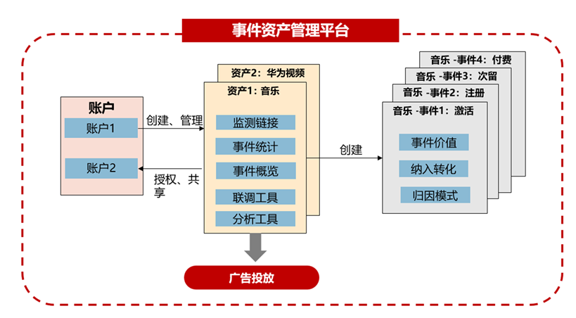
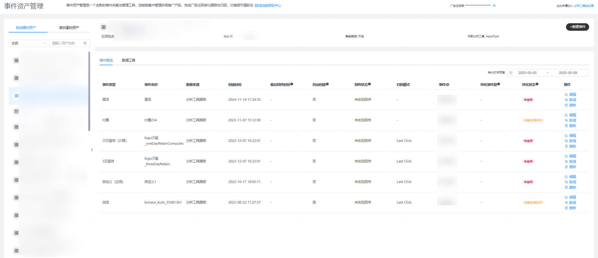
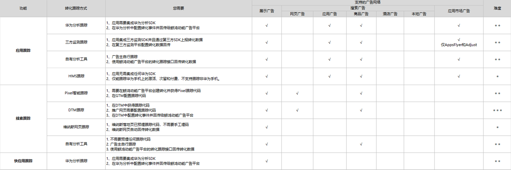

# 简介

## 简介

## （一）功能简介

【事件资产管理】作为【转化跟踪】的升级版本，是一个全新的事件采集与管理工具，您能够集中管理所有推广产品（包括应用App，快应用、Venus落地页及三方落地页）的数据，并完成数据回传的设置。同时通过事件资产管理平台，鲸鸿动能将把用户看到的广告行为数据，与看到广告后执行的转化操作数据进行关联归因，帮助您更好的度量与优化广告投放效果。

事件资产管理是将广告主关注的转化行为（OAID、转化行为、行为参数）通过API、SDK等方式上报给广告平台的产品。转化跟踪的本质是建立广告平台与广告主数据互通的通道，借助转化跟踪接口，能够将广告主侧的转化数据（如激活、付费等）收集并与广告平台侧的投放数据（如曝光、点击等）进行关联，有效提升广告投放效果分析能力。

## （二）相关名词定义详解

|  |  |
| --- | --- |
| <strong>名词</strong> | <strong>释义</strong> |
| 分析工具 | 分析工具为转化事件数据与鲸鸿动能广告进行对接的数据上报方式，可以将资产绑定具体分析工具进行数据上报；分析工具主要承载了和华为归因平台的对接秘钥。 |
| 资产 | 资产，是您在鲸鸿动能广告平台上投放的推广标的，资产具有唯一性。  应用：AppID/包名校验  快应用：包名校验  网页：网页名称校验  维纳斯落地页：账户下的创建过的维纳斯落地页校验 |
| 事件 | 事件，即对应原转化跟踪的指标，具体理解为广告投放后的转化事件，广告主可创建资产下可回传的具体转化事件类型。由于没有收到广告主回传的响应事件，无法确定是否可以对接成功，因此事件是有状态的。事件创建后默认为未启用（事件待激活）状态。通过手动联调或者自动激活，成功后可更新事件状态为已启用（事件激活）状态。 |
| 手动联调 | 非鲸鸿动能广告平台自场景，广告主通常需要触发页面选择具体事件联调，即从页面按照监测地址及监测参数格式补充相关参数生成请求地址，请求广告主或三方分析监测外发。监测地址后台收到联调数据后，广告主回调数据回传接口，触发启用具体事件状态。无论事件状态如何（“已启用”或“未启用”），手动联调入口永久保留，广告主可以进行多次手动联调操作。 |
| 鲸鸿动能归因 | 由华为广告完成归因，需要广告主将其搜集到的转化回传给华为广告归因平台，归因平台匹配曝光点击话单完成归因。 |
| HMS跟踪 | HMS跟踪借助于HMS Core的能力，能够在不借助任何其他跟踪平台、不集成任何SDK、免开发免埋码的情况下跟踪应用的激活、次留和付费，后期将开放更多事件类型。 |
| HUAWEI Analytics跟踪 | 通过在应用App/快应用内开通并集成华为分析HUAWEI Analytics SDK，您可以将应用App/快应用内的关键行为事件回传到鲸鸿动能广告平台，将这些数据关联归因到广告投放。广告主在创建资产时进行关联后，在新建事件时可以选择数据来源HUAWEI Analytics跟踪。 |
| 自动激活 | 广告主新建完资产后，手动添加事件后，无需进行联调动作。广告主可以从真实广告投放场景对接完成自动联调。广告主通过任何一条广告任务（试投放、CPC任务）推广，广告平台将该资产的在事件资产管理平台配置的监测参数，广告主归因后进行回传，若您账户下的资产存在未启用事件，平台将把事件状态变更为已启用，后续可开始投放oCPC任务。 |
| 智能跟踪 | 广告主新建完资产后，无需手动创建事件，无需手动联调，通过转化跟踪API或HA上报具体的事件类型，鲸鸿动能广告平台将解析具体事件类型，并自动创建该事件，自动创建事件将默认已启用。此智能跟踪建议广告主都开启，后续账户下任何一条广告任务（试投放、CPC任务），广告主完成归因后回传，将自动建立事件。 |
| 联动激活 | 对于专属监测工具回传的事件类型，一个资产下任意一个事件启用，该资产下所有事件都将启用，应用范围为新建资产时的专属监测工具，HUAWEI Analytics不支持联动激活，需要去HA完成具体事件配置与回传。 |
| 秘钥 | 秘钥为账户级秘钥，用于广告主通过转化跟踪API回传数据时的鉴权操作。无论资产类型，秘钥统一为一个，可点击事件资产管理平台右上角查看或复制。 |

## （三）资产&事件概览

1、资产概览

资产概览具体为您需要之后广告任务的推广标的，支持资产的编辑与删除，同时按照类别进行筛选，支持模糊输入搜索。编辑范围涉及智能跟踪开关、监测链接和宏参数。

|  |  |
| --- | --- |
| <strong>资产类型</strong> | <strong>资产明细</strong> |
| 应用(App) | 应用包名，AppID，智能跟踪，关联分析工具 |
| 快应用 | 快应用包名，智能跟踪，关联分析工具 |
| 网页 | 落地页链接，智能跟踪，关联分析工具 |
| 维纳斯落地页 | 落地页链接 |

- 资产编辑范围：智能跟踪开关、监测链接和宏参数
- 资产删除条件：

  （1）必须把资产所有事件全部删除，否则会删除失败。

  （2）删除资产可能会导致该推广产品的转化跟踪中断，广告效果无法追踪。

2、事件概览

事件概览具体为资产下的事件类型与具体属性，具体列的定义如下

|  |  |
| --- | --- |
| <strong>名词</strong> | <strong>定义</strong> |
| 事件类型 | 资产下用户可能会发生的转化事件，例如华为商城App资产下，有“激活”，“次日留存”,“付费”等事件类型。 |
| 数据来源 | 该事件的数据由哪里进行上报，通常在新建事件时。 |
| 自动创建 | 当您对资产开启智能跟踪后，平台收到具体事件类型后解析，为您自动建立该资产的事件，标记为“是”的为自动创建，标记为“否”为您手动创建的事件。 |
| 回传状态 | 回传状态为历史上广告平台是否收到过此事件类型的回传，包括手动联调、智能跟踪、自动激活带来的事件回传，分为“已收到回传”与“未收到回传”。 |
| 最后回传时间 | 回传时间为历史上广告平台收到过此事件类型的回传的时间，包括手动联调、智能跟踪、自动激活带来的事件回传。 |
| 归因模式 | 鲸鸿动能归因对于该事件的归因模式，通常为末次点击，首次点击。 |
| 转化事件量 | 转化事件量为该资产在鲸鸿动能广告投放后，回传的有效转化事件量，即成功被归因的事件量，您可通过该列监控数据回传异常，默认统计时间范围为过去7天，您可在表头自定义转化时间范围。 |
| 创建时间 | 该资产下的具体事件类型创建的时间。 |
| 事件名称 | 广告主为资产下的事件类型命名，若不命名，则默认名称为事件类型。 |
| 事件ID | 每个资产下的事件具有唯一性的ID。 |
| 转化状态 | 资产下已启用的事件将用于后续的oCPC/CPA的投放。一个资产下相同数据来源的事件联调成功后，该数据来源下的事件类型将更新为“已启用”。对于数据来源为HMS、维纳斯的事件将默认已启用。 |
| 操作 | 编辑：编辑范围仅限事件名称，数据来源暂不可编辑  联调：进入手动联调的页面  删除：删除该资产下的事件 |

- 事件编辑范围：事件名称、纳入优化目标，数据来源不可编辑
- 事件删除条件：事件删除不允许恢复，谨慎操作。如该事件已经有关联的oCPC任务，事件无法进行删除。

根据您推广的产品是应用还是网页，鲸鸿动能广告支持不同的转化跟踪方式：

1. 应用跟踪：如果您投放的产品是应用，想要跟踪用户安装您的应用或者用户通过您的应用进行了购买等其他转化，您可以使用应用跟踪中的一种跟踪方式跟踪您的应用转化情况。请参考下表中的应用跟踪。

    

   - 如果您想使用“应用市场广告支持转化跟踪功能”，当您在工具的“[应用管理](https://developer.huawei.com/consumer/cn/doc/promotion/appmanagement-0000001182393586)”中添加的应用审核通过后，鲸鸿动能广告平台将会在个3工作日内为您开通此功能，开通成功后，您在创建应用市场广告时，可以使用监测链接，若您无法使用监测链接，那您可以向鲸鸿动能广告平台申请开通特性通行名单。
2. 快应用跟踪：如果您投放的产品是快应用，想要跟踪用户在您快应用内的购买等其他转化行为，您可以使用快应用跟踪中的方式跟踪您快应用转化情况，请参考下表中的快应用跟踪。

同时不同广告网络资源支持的转化跟踪能力不同，参考下方表格中“支持的广告网络”列的标注。

 

如果您的广告账户注册地在中国大陆地区，想要使用转化跟踪的功能，需要申请通行名单。此时您需要注意：如果您投放的是展示网页广告，系统会在您的网页尾部自动添加tracking url参数，请您确保您的网页拼接tracking url参数后可以打开，否则可能导致投放失败，建议您在投放展示网页广告前，创建试投放任务，查看您的落地页是否可以正常打开。
