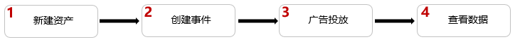
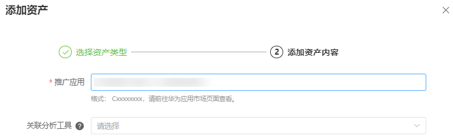
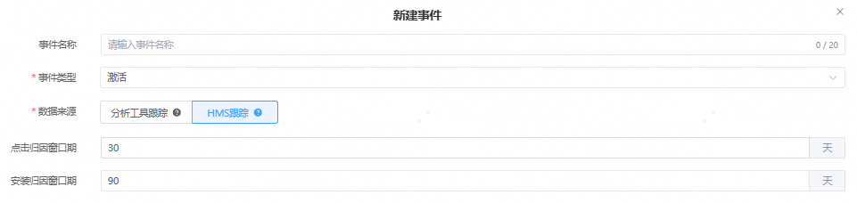

# HMS跟踪

## 概述

HMS跟踪借助于HMS Core的能力，能够在不借助任何其他跟踪平台、不集成任何SDK的情况下跟踪应用的激活、次留和付费。

<strong>激活</strong> <strong>（HMS）</strong>：指用户通过您的广告安装了您的应用后第一次打开该应用。

<strong>次留</strong> <strong>（HMS）</strong>：指激活用户在次日又打开了此应用。

<strong>付费（HMS）：</strong>该指标用于应用内付费（IAP）数据，指通过某次广告活动为您带来了新增的应用用户，这些用户在应用中通过 HUAWEI PAY完成付费操作后（如购买产品、注册付费会员）为您带来的应用内购买收益。

 

如果您需要在非华为设备上推广您的应用，无法使用HMS跟踪。

激活（HMS）、次留（HMS）、付费（HMS）仅支持oCPC单出价，不支持oCPC双出价。

## 操作流程

## 操作步骤

1. 新建资产。

   操作入口：“<strong>工具</strong>”-&gt;“<strong>事件资产管理</strong>”-&gt;“<strong>新建资产</strong>”

   输入您需要跟踪的应用ID或包名应用ID格式：Cxxxxxxxx，请前往华为应用市场页面查看。例如：应用地址为 https://appgallery.huawei.com/ app/C12345678，则其ID为“C12345678”。

   应用包名例如：com.huawei.xxxxx。当您仅需要跟踪HMS事件时，不需要选择任何的关联分析工具，单击“提交”；

   
2. 新建事件。

   操作入口："<strong>选择资产</strong>"-&gt;"<strong>新建事件</strong>"

   

   事件名称：选填，转化名称长度应在20字符内，只能包含中英文、数字、下划线和空格。如果不填事件名称默认为事件类型。

   事件类型：事件类型，广告主可以多选。

   数据来源：选择HMS跟踪。

   窗口期配置：点击归因窗口期默认30天，安装归因窗口期默认90天。支持自定义配置。
3. 广告投放。
4. 您可在鲸鸿动能广告平台报表中的“激活量，次留量，付费金额和付费量”字段查看广告级别转化数据。也可在事件资产管理平台通过“转化事件量”字段查看账户级转化数据。

## 数据回传

数据来源为HMS的事件类型不需要广告主回传任何数据，只需要完成事件创建即可。

## 统计场景

事件资产管理概览页支持查看有效转化事件量； 投放端DSP portal所有报表，不再额外提供HMS指标数据，进行指标归一化处理，例如：创建数据来源为HMS的激活指标后，你可以在报表的激活指标查看转化数据。
