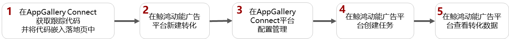
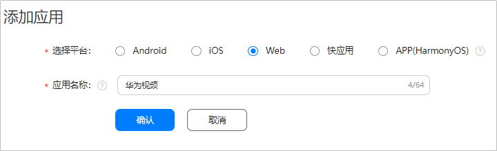
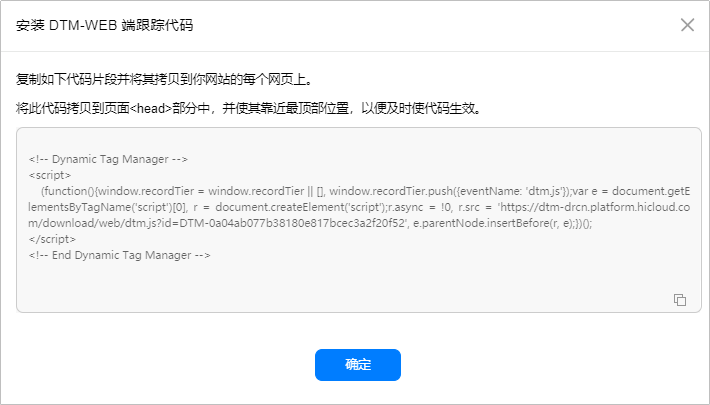
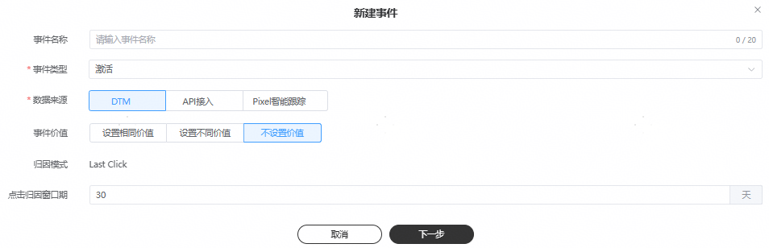
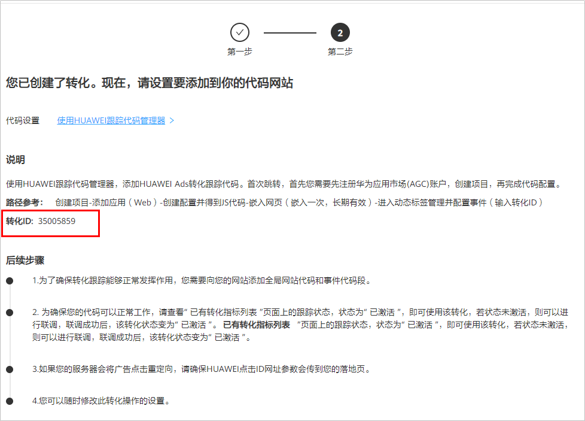
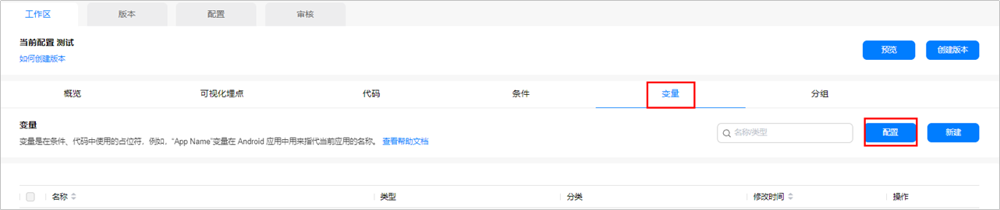
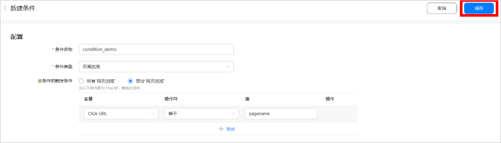
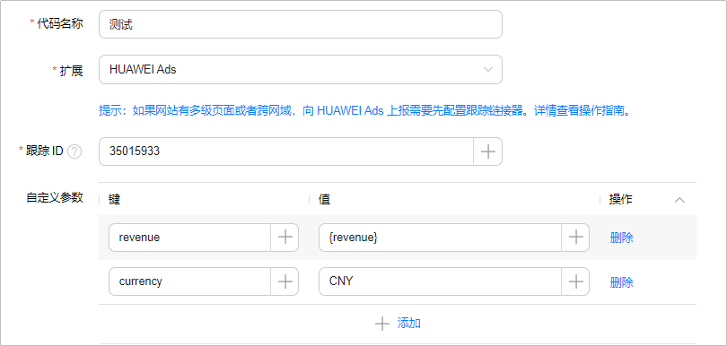
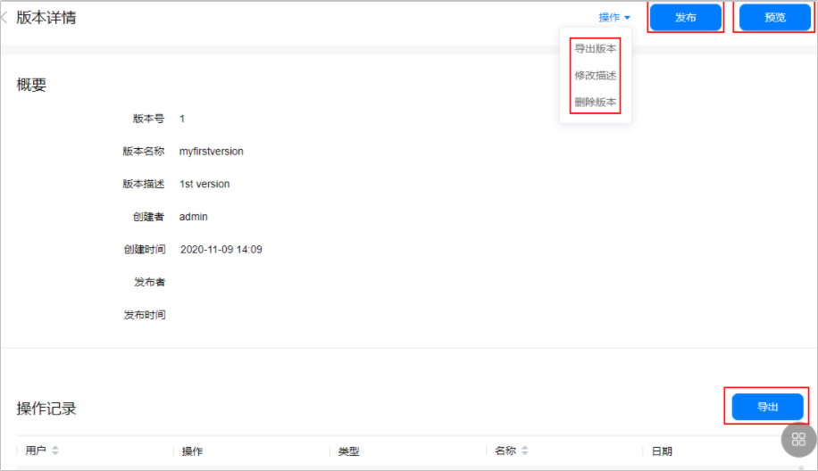

# DTM跟踪

## 概述

华为动态标签管理（Dynamic Tag Manager，以下简称“DTM”）是一个动态标签代码管理系统，您可以实现网页的灵活数据标签管理能力，轻松完成网页内特定事件的动态跟踪并将数据传送给鲸鸿动能广告平台，实现转化数据随需跟踪。

 

在同一个广告账户中，您使用DTM跟踪第一个网页链接并手动测试成功后，如果您再次跟踪相同域名的网页链接时（例如: www.<strong>example.com</strong>/test/create中加粗部分），无需再次[手动测试](/docs/monetize/promotion/manual-conversion-testing-0000001221434335#section476518108286)，系统默认测试成功，您创建的转化指标状态会自动变为”已启用“。

## 操作流程

## 操作步骤

1. 在[AppGallery Connect](https://developer.huawei.com/consumer/cn/service/josp/agc/index.html#)平台获取跟踪代码并将代码嵌入网页中。操作流程请参考[服务端配置](https://developer.huawei.com/consumer/cn/doc/development/HMSCore-Guides/web-create-configuration-0000001057616572)。

   您需要按照如下步骤获取跟踪代码，获取跟踪代码后，您将此代码拷贝到您需要推广的每个网页页面&lt;head&gt;部分中，并使其靠近顶部位置，以便及时使代码生效：
   1. 在AppGallery Connect页面单击<strong>“</strong>我的项目”-&gt;”创建项目<strong>”</strong>，填写项目名称并提交。
   2. 单击<strong>“</strong>添加应用<strong>”</strong>，填写名称并提交。
      - 选择平台：选择“Web”
      - 应用名称：填写您的网页名称。

      
   3. 单击<strong>“</strong>增长”-&gt;”动态标签管理”-&gt;”开通服务<strong>”</strong>，填写配置名称和推广链接，完成后单击“确定”，随即跳出跟踪代码弹框，复制生成的跟踪代码，嵌入到所有推广网页（包含手机端）。代码只需要嵌入一次，长期有效，更多可参见[服务端配置](https://developer.huawei.com/consumer/cn/doc/development/HMSCore-Guides/web-create-configuration-0000001057616572)。

      

    

   - 若中途中断操作，可以通过进入[AppGallery Connect](https://developer.huawei.com/consumer/cn/service/josp/agc/index.html)，单击我的项目，选择已创建的项目，左侧菜单栏中可单击进入动态标签管理，继续完成操作。
   - 若您在操作中忘记拷贝跟踪代码，可到“动态标签管理”-&gt;“配置”&gt;”接入配置”，单击“查看”获得。
2. 在鲸鸿动能广告平台创建转化。

   对每一个您希望回传和统计的转化指标，需要都在此创建跟踪，只有成功添加的转化，鲸鸿动能广告平台在收到转化数据后才会统计到报表里。
   1. 单击<strong>“</strong>工具”-&gt;“事件资产管理”-&gt;”新建事件”，选择"跟踪线索”&gt;“DTM"并单击“继续”。
   2. 设置事件信息。

      
      - <strong>事件类别：</strong>指的是您可以跟踪的转化动作，仅支持单选。如果您要添加多个转化动作，您可以创建多个线索跟踪进行跟踪，详情可参考[转化数据](/docs/monetize/promotion/tracking-shu-0000001139892541#ZH-CN_TOPIC_0000001139892541__table10838115914391)。
      - <strong>事件名称：</strong>设置一个清晰易懂的计划名称，转化名称仅用于转化列表管理且唯一，例如：线索+转化类别，设置完成后转化名称可编辑修改。
      - <strong>点击归因时间范围：</strong>点击归因时间7-30天（默认30天），指的是广告点击发生后，最长可以在多长时间内统计转化次数。初始归因时间为默认值，归因时间支持编辑，提交后不可修改。
      - <strong>纳入到“指定转化次数”：</strong>您可以将特别关心的转化类别纳入“指定转化次数“，纳入选择后，您可以在数据报表中查看特别关心的转化一共产生了多少次数据。例如：您将购买、加入购物车作为转化目标，并将纳入“指定转化次数“，广告投放后，有6个用户在您的页面上产生了购买行为，有5个用户在您的页面产生了加入购物车行为，此时您可以在数据报表中“指定转化次数”查看到11次转化数据。
      - <strong>更多设置：</strong>如果您希望在投放之前先测试回传是否正常，那您需要在此处设置网页URL。此处的网页链接需要和推广任务里的网页链接保持一致，此时您需要进行[手动测试](/docs/monetize/promotion/manual-conversion-testing-0000001221434335)。
   3. 单击“下一步”，建立线索追踪转化，生成转化ID，请保存备用。

      
   4. 单击“完成”。
3. 在[AppGallery Connect](https://developer.huawei.com/consumer/cn/service/josp/agc/index.html#)平台进行配置管理，操作流程参考[服务端配置](https://developer.huawei.com/consumer/cn/doc/development/HMSCore-Guides/web-create-configuration-0000001057616572)。

   您可以对页面监测模块进行配置管理，以获得您想要的转化数据，单击<strong>“</strong>增长”-&gt;”动态标签管理”，创建配置。
   1. 变量管理：单击"工作区”-&gt;“变量”-&gt;”配置"，配置预设变量，更多可参见[DTM变量管理](https://developer.huawei.com/consumer/cn/doc/development/HMSCore-Guides/web-variable-management-operation-procedure-0000001089520581)。

      
   2. 条件管理：单击"工作区”-&gt;“条件”-&gt;”新建“，进行名称和条件类型的配置，若有更多需求请参见[DTM条件管理](https://developer.huawei.com/consumer/cn/doc/development/HMSCore-Guides/web-condition-management-operation-procedure-0000001091200287)。

      
   3. 代码管理：单击“工作区”-&gt;“代码”-&gt;”新建”，进行代码名称、扩展的配置。若有更多需求请参见[DTM代码管理](https://developer.huawei.com/consumer/cn/doc/development/HMSCore-Guides/web-tag-management-operation-procedure-0000001077333678)。
      - <strong>代码名称</strong>：根据您的需求设置您的代码名称。
      - <strong>扩展：</strong>选择HUAWEI Ads。

        跟踪链接器：如果您推广的网站有多级页面或者跨网域，在从落地页跳转到其他子页面过程中，URL中的广告跟踪参数可能会丢失，这样将导致无法跟踪其他子页面中的转化信息。这种情况下，您需要在DTM中配置“跟踪链接器”代码，以将广告参数从落地页传递到二级、三级页面，确保DTM可以跟踪您网站中每个页面的转化信息。具体操作方式，请参考[跟踪链接器](https://developer.huawei.com/consumer/cn/doc/development/HMSCore-Guides/huaweiads-0000001129297560)。
      - <strong>跟踪ID：</strong>转化ID请参考[创建转化](#ZH-CN_TOPIC_0000001140151431__zh-cn_topic_0000001140151431_li579214323419)。
      - <strong>自定义参数</strong>：选择已创建的变量条件，例如付费，您在鲸鸿动能广告平台投放广告后，当付费事件发生时，即上报付费。
        - 如果您希望统计付费指标的金额，可以在进行转化回传时将转化金额进行回传，鲸鸿动能广告平台会将转化金额进行累加展示在报表的“付费金额”字段。
          - 只有完成转化指标的测试，转化指标状态为激活时，您才能在鲸鸿动能广告平台上查看转化金额。
          - 回传金额是累加的，不支持查看每个用户的具体付费金额。
        - 转化金额通过revenue和currency两个参数进行回传，在回传转化指标时，需要您自己实现代码或其它方式获取转化金额和币种，并通过这两个参数进行回传。
          - currency：可以选择CNY/ USD/ EUR/ JPY/ GBP，如果未识别成功或未回传，会默认使用您广告账户的币种。鲸鸿动能广告平台会将接收到的回传金额转化为您广告账户的注册币种并累加到付费金额指标中进行统计。
          - revenue：转化金额，支持到小数点后两位。

          举例：您希望跟踪用户在游戏中的道具购买，在上报付费的同时，上报currency USD，revenue 10，同时账户币种为EUR，鲸鸿动能广告平台在接收到回传数据时，付费事件+1，revenue按照实时汇率转化EUR之后累加到付费金额字段。

          
   4. 版本发布：单击“版本”-&gt;”新建”，输入版本名称，完成后进入版本信息页面，单击<strong>“发布”</strong>，跳出弹窗，单击“确定”，完成版本的发布。

      在“版本详情”页面，您可以查看到版本的概要、操作记录，并且还可以执行版本导出、更新、删除、预览、修改等操作。

      
4. 在鲸鸿动能广告平台创建任务。
5. 在鲸鸿动能广告平台[查看转化数据](/docs/monetize/promotion/tracking-shu-0000001139892541)。

   如果您在广告平台没有看到相应的转化数据，您需要检查线索跟踪回传配置是否正确。
