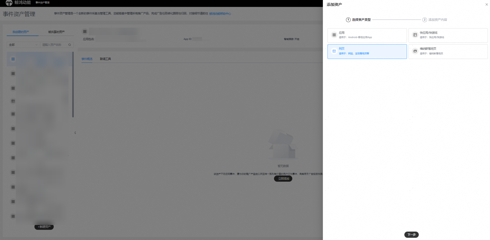
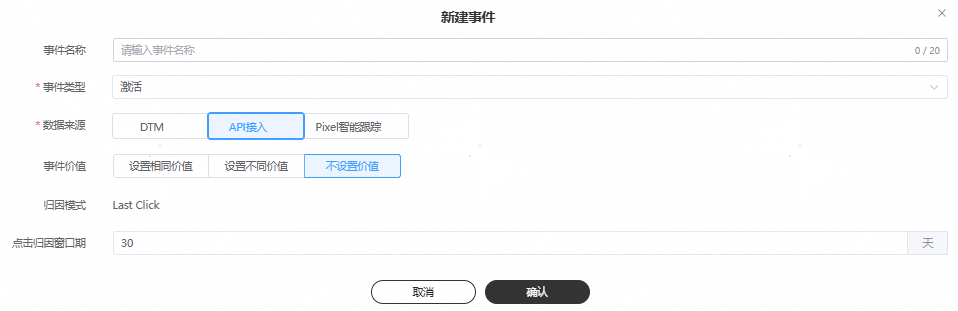

# 自有分析工具

## 概述

鲸鸿动能广告平台提供了接口API，如果您的平台具备转化数据采集能力，也可以按照接口文档和鲸鸿动能广告平台进行对接，回传转化数据到鲸鸿动能广告平台进行归因，追踪广告效果。

## 操作流程

## 操作步骤

1. 按照鲸鸿动能广告平台的线索转化回传API接口进行集成，并回传转化数据给鲸鸿动能广告平台，API集成指南请参考[API集成指南](/docs/monetize/promotion/attachments-0000001532611905#ZH-CN_TOPIC_0000001532611905__li631314557261)。

   如果您希望统计付费指标的金额，可以在进行转化回传时将转化金额进行回传，鲸鸿动能广告平台会将转化金额进行累加展示在报表的“付费金额”字段。

   - 只有完成转化指标的测试，转化指标状态为激活时，您才能在鲸鸿动能广告平台上查看转化金额。
   - 回传金额是累加的，不支持查看每个用户的具体付费金额。

   转化金额通过revenue和currency两个参数进行回传，在回传转化指标时，需要您自己实现代码或其它方式获取转化金额和币种，并通过这两个参数进行回传。

   - Currency：可以选择CNY/ USD/ EUR/ JPY/ GBP，如果未识别成功或未回传，会默认使用您广告账户的币种。鲸鸿动能广告平台会将接收到的回传金额转化为您广告账户的注册币种并累加到付费金额指标中进行统计。
   - Revenue：转化金额，支持到小数点后两位。

   举例：您希望跟踪用户在游戏中的道具购买，在上报付费的同时，上报currency USD，revenue 10，同时账户币种为EUR，鲸鸿动能广告平台在接收到回传数据时，付费事件+1，revenue按照实时汇率转化EUR之后累加到付费金额字段。
2. 在鲸鸿动能广告平台新建事件。

   对每一个您希望回传和统计的转化指标，需要都在此创建跟踪，只有成功添加的转化，鲸鸿动能广告平台在收到转化数据后才会统计到报表里。

   1. 单击“工具”-&gt;“事件资产管理”-&gt;“新建资产”,选择"网页并输入“网页名称”，单击“提交”。

      
   2. 新建事件。

      
      - <strong>事件类别：</strong>指的是您可以跟踪的转化动作，仅支持单选。如果您要添加多个转化动作，您可以创建多个线索跟踪进行跟踪，详情可参考[转化数据](/docs/monetize/promotion/tracking-shu-0000001139892541#ZH-CN_TOPIC_0000001139892541__table10838115914391)。
      - <strong>事件名称：</strong>设置一个清晰易懂的计划名称，转化名称仅用于转化列表管理且唯一，例如：线索+转化类别，设置完成后转化名称可编辑修改。
      - <strong>点击归因时间范围：</strong>点击归因时间7-30天（默认30天），指的是广告点击发生后，最长可以在多长时间内统计转化次数。初始归因时间为默认值，归因时间支持编辑，提交后不可修改。
      - <strong>转化价值：</strong>为转化指定价值可以衡量广告的影响力，币种随您广告账户的币种而定，此功能需要申请[通行名单](/docs/monetize/promotion/addtongxing-0000001128278195)。
        - 为每次转化使用相同的价值：如果您要跟踪潜在客户，建议输入每个潜在客户带来的平均价值。例如，如果您仅销售一种价格为 20 元的产品，请将价值指定为 20 元。这样，对于每笔销售，鲸鸿动能广告就会统计 20 元的价值。
        - 为每次转化使用不同的价值：您可以为某一种转化的不同产品指定不同价值。当您使用API回传时，转化事件将会回传不同的转化价值。如果您没有回传不同的转化价值，您可以输入默认价值，系统将以默认价值进行回传。
        - 不为此转化操作指定价值：对于大部分转化，不建议采用此选项，因为指定价值有助于您衡量广告的影响力，如果选择此选项，转化价值始终为0。
3. 在鲸鸿动能广告平台创建试投放任务，测试转化跟踪是否工作正常。
