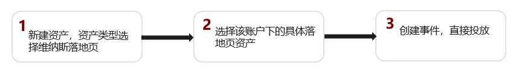
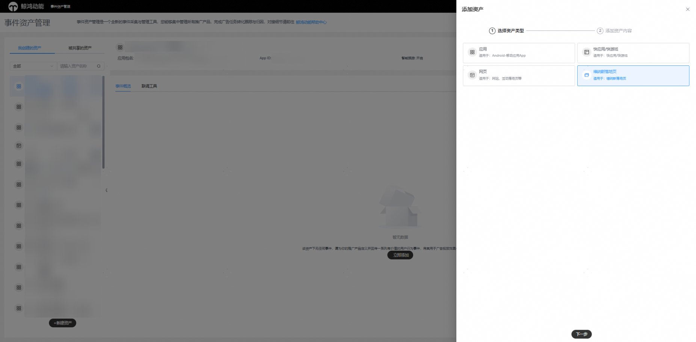
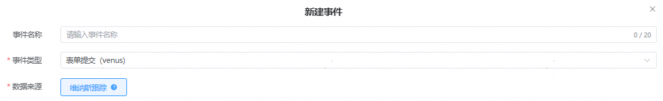

# 维纳斯网页资产

## 概述

如果您投放的是维纳斯网页，想要对用户在网页中的表单行为进行跟踪，您可以使用维纳斯网页跟踪功能，将您的用户转化数据回传给鲸鸿动能广告平台，鲸鸿动能广告平台将您的回传数据归因到相应任务和创意上，便于您进行数据分析和广告优化。

## 操作流程

## 操作步骤

1. 在鲸鸿动能广告平台新建维纳斯资产。

   对每一个您希望回传和统计的转化指标，都需要再次创建跟踪，只有成功添加的转化指标，鲸鸿动能广告平台在收到数据后才会统计到报表里。

   1. 单击“工具”-&gt;“事件资产管理”-&gt;”新建资产”,选择"维纳斯落地页"并单击“继续”。

      
   2. 设置事件信息。

      
      - <strong>事件名称：</strong>设置一个清晰易懂的计划名称，转化名称仅用于转化列表管理且唯一，例如：线索+转化类别，设置完成后转化名称可编辑修改。
      - <strong>事件类型：</strong>下拉选择“表单提交（venus）、有效线索（venus）、潜在客户线索（venus）、已经成单线索（venus）”。
      - <strong>数据来源：</strong>选择维纳斯跟踪。
2. 在鲸鸿动能广告平台创建试投放任务，测试转化跟踪是否工作正常。
