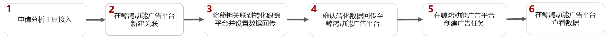
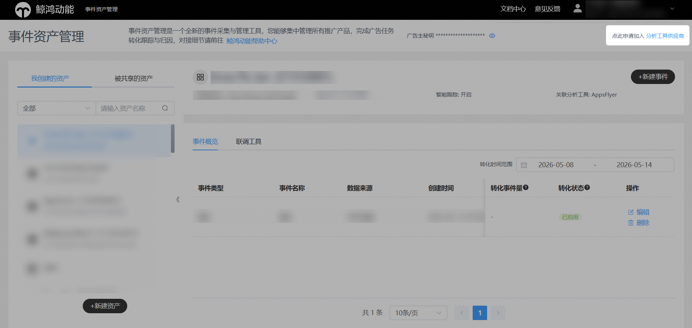
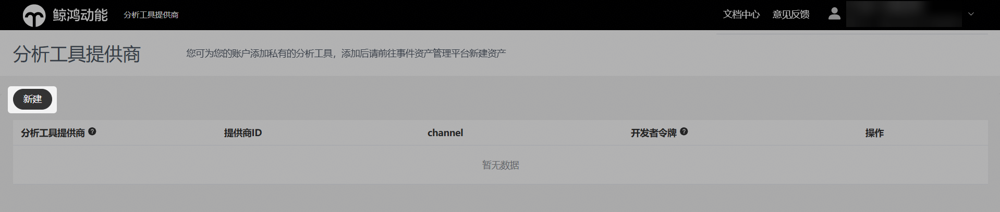
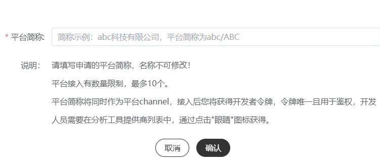
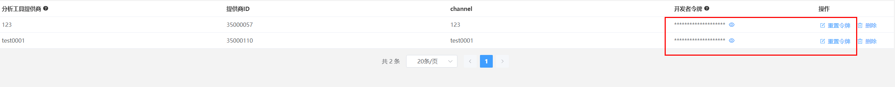

# 自有分析工具

## 概述

鲸鸿动能广告平台提供了接口API，如果您的平台具备转化数据采集能力，也可以按照接口文档和鲸鸿动能广告平台进行对接，回传转化数据到鲸鸿动能广告平台进行归因，追踪广告效果。

## 操作流程

## 操作步骤

1. 申请分析工具接入。
   1. 单击“工具”-&gt;“事件资产管理”-&gt;”加入分析工具提供商”。

      
   2. 进入后，单击“新建”。

      
   3. 填写平台简称，仅支持数字和英文字母输入，限制25字符，名称填写成功后不支持修改。

      
   4. 单击提交，生成开发者令牌。每个分析工具对应唯一的开发者令牌，您需要告知您公司的研发人员，将开发者令牌加入您的回传数据中。

      

      - 重置令牌：每个令牌都是唯一的，如果您想要修改开发者令牌，您可以对令牌进行重置，重置后您需要将新的开发者令牌告知您公司的研发人员，否则您的分析工具接入会产生异常。
      - 删除：如果您已经添加了转化事件，此时开发者令牌不能删除，您需要将分析工具关联的转化事件全部删除，删除后原来的开发者令牌将会失效，如果您想重新使用此功能，请重新创建。。
2. 在鲸鸿动能广告平台新建关联。

   需要为您希望跟踪的每一个应用使用指定的监测工具新建资产，详细请参考[新建资产](https://developer.huawei.com/consumer/cn/doc/promotion/tracking-app-overview-0000001209244840#ZH-CN_TOPIC_0000001209244840__li8351194812211)。
3. 将秘钥关联到转化跟踪平台并设置数据回传。

   为了将转化跟踪平台跟踪到的转化结果传递给鲸鸿动能广告平台，以便鲸鸿动能广告平台可以将转化结果用于报表统计和投放优化，您需要将获取的秘钥复制到转化跟踪平台并在转化跟踪平台上配置数据回传给鲸鸿动能广告平台。

   - 如何获取秘钥：关联创建成功后，在已有关联列表中单击“”查看秘钥并单击“”，获取秘钥后，需要在您自有的跟踪平台中，使用该秘钥进行关联，并在API回传接口中将转化数据回传给鲸鸿动能广告平台。
   - 如何配置转化事件回传给鲸鸿动能广告平台：详情请参考[SRN API](https://developer.huawei.com/consumer/cn/doc/promotion/attachments-0000001532611905#ZH-CN_TOPIC_0000001532611905__li63961101273)。
   - 如果您希望统计付费指标的金额，详情请参考[付费指标](https://developer.huawei.com/consumer/cn/doc/promotion/tracking-app-overview-0000001209244840#ZH-CN_TOPIC_0000001209244840__zh-cn_topic_0000001122291488_li132211445203517)。
4. 确认转化数据回传至鲸鸿动能广告平台。
   - 如果您想要投放非oCPC广告，您可以直接创建广告任务，待鲸鸿动能广告平台收到转化数据后，转化跟踪指标状态为“已启用”。
   - 如果您想要投放oCPC广告，鲸鸿动能广告平台必须先收到转化数据，收到转化数据后，转化跟踪指标状态为“已启用”，此时您才能创建任务，详情可参考[如何让鲸鸿动能广告平台收到转化数据](https://developer.huawei.com/consumer/cn/doc/promotion/tracking-app-overview-0000001209244840#ZH-CN_TOPIC_0000001209244840__table594218593381)。
5. 在鲸鸿动能广告平台创建任务。

   当鲸鸿动能广告平台收到您的分析工具回传的转化数据后，转化事件会自动激活。
6. 在鲸鸿动能广告平台[查看转化数据](https://developer.huawei.com/consumer/cn/doc/promotion/tracking-shu-0000001139892541)。
