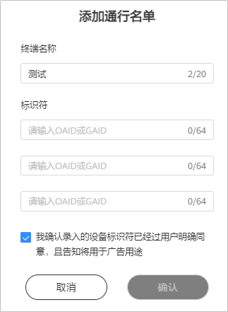

# 通行名单管理

您可在通行名单中添加相应的手机终端OAID或者GAID，账户创建的任务会被优先投放到您指定的通行名单设备，以便您查看和检查投放效果。

广告标识符获取方法：

- HMS手机OAID获取方式：打开手机的“<strong>设置</strong>”，找到“<strong>隐私功能</strong>”，单击<strong>广告与隐私</strong>”，单击“<strong>更多信息</strong>”，获取OAID。请注意因手机型号不一致，广告标识符所处的位置有所差别。
- GMS手机GAID获取方式：打开手机的“<strong>设置</strong>”，找到“<strong>谷歌</strong>”，单击“<strong>隐私</strong>”，找到“<strong>广告</strong>”，获取GAID。请注意因手机型号不一致，广告标识符所处的位置有所差别。
