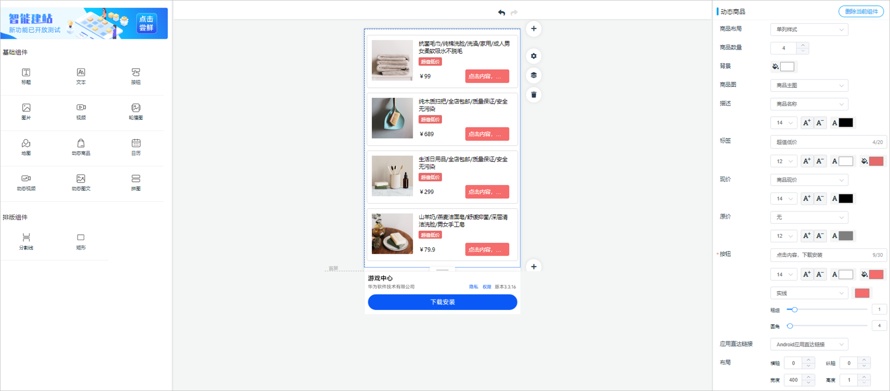
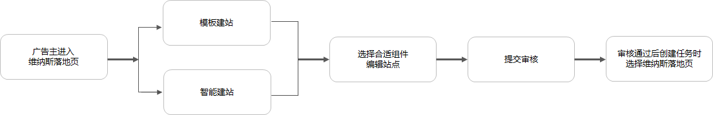
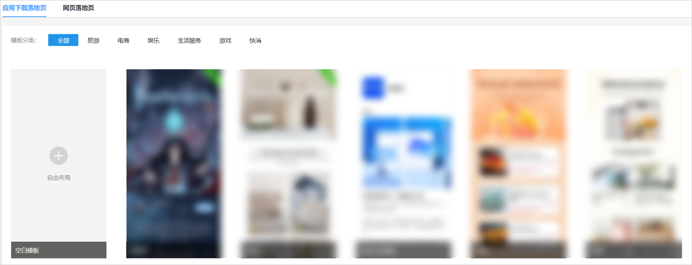
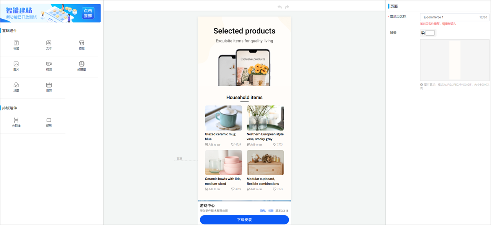
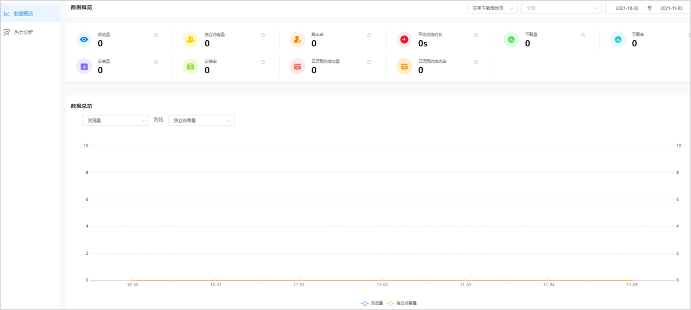

# 落地页工具

## 概述

落地页是在广告投放中，承接广告、表达广告主关键信息的详情页面，是承接用户转化行为的场景。然而，广告主在自建落地页时，往往存在以下问题：

- 页面打开速度慢，影响用户抵达率。
- 无数据跟踪，无法判断效果，不能进一步优化落地页。
- 落地页样式单一，容易审美疲劳。
- 广告创意与落地页不匹配。

为避免上述问题，您可以使用落地页工具。鲸鸿动能广告为您免费提供的落地页制作工具，提供了多场景的落地页模板和多样化的下载转化组件，以帮助广告主快速搭建高效的转化页面。

维纳斯落地页具有以下功能与优势：

- <strong>全量的生命周期管理</strong>：支持复制、移动端扫描二维码预览落地页，实时查看落地页状态。
- <strong>丰富的自建站组件</strong>：完善的基础组件及多样化的下载样式，简单拖拽组件排列组合，快速搭建及修改落地页。
- <strong>优质的产品性能</strong>：加载速度快，支持视频边播边下载应用及直达应用指定页面。
- <strong>优质的行业模板：</strong>精选应用市场落地页模板，无需具备PS能力，小白也能轻松上手，创作自如。
- <strong>有效的效果分析：</strong>提供元素级别的用户浏览热力分析，精细化的效果分析能力，助力广告主提升落地页转化效果。
- <strong>独立高效的运营</strong>：持续迭代的工具功能，完整的消息通知体系，新消息第一时间发布站内信公告。

落地页工具提供基础组件和排版组件，组件拖放功能可以高效地制作优质推广页面。不同的落地页类型包含不同的组件：

| 组件类型 | 组件 | 应用下载落地页 | 网页落地页 | 动态商品落地页 |
| --- | --- | --- | --- | --- |
| 基础组件 | 标题 | √ | √ | √ |
| 文本 | √ | √ | √ |
| 视频 | √ | √ | √ |
| 按钮 | √ | √ | √ |
| 图片 | √ | √ | √ |
| 轮播图 | √ | √ | √ |
| 地图 | √ | √ | √ |
| 日历 | √ | √ | √ |
| 倒计时 | - | √ | √ |
| 链接 | - | √ | √ |
| 动态商品 | - | - | √ |
| 动态视频 | - | - | √ |
| 动态图文 | - | - | √ |
| 营销组件 | 表单 |  | √ | - |
| 排版组件 | 分割线 | √ | √ | √ |
| 矩形 | √ | √ | √ |

 

如果您想使用动态商品落地页，此功能需要先开通[商品中心](https://developer.huawei.com/consumer/cn/doc/promotion/item-center-0000001251845484)通行名单，开通成功后即可使用动态商品落地页，在落地页基础设置中打开“动态落地页”开关，并选择投放区域，此时您才能使用动态商品、动态图片、动态视频等组件。

- <strong>基础组件</strong>：
  - <strong>标题与文本组件：</strong>支持编辑文本、颜色、字号、字体、背景等设置。
  - <strong>视频组件：</strong>包含基础视频和按钮视频两种样式。
    - 基础视频：视频点击后仅支持播放。

      按钮视频：播放视频的同时静默下载安装应用，应用安装完成后，视频界面显示“<strong>立即打开App</strong>”，展示应用的图标与名称，单击直达应用首页，完成促活转化；视频可选填Deeplink链接，应用安装完成后，单击直达对应界面。
  - <strong>按钮组件：</strong>包含基础按钮和图片按钮两种样式，单击按钮下载，支持Deeplink链接直达。
    - 基础按钮：支持小按钮样式和热区样式，热区样式可结合图片组件使用，单击按钮或热区范围即开始下载安装应用。
    - 图片按钮：可添加下载提示语，下载提示语支持修改颜色、字号、文本位置以及边距。按钮可选填Deeplink链接，应用安装完成后，单击直达对应界面。
  - <strong>图片组件</strong>：图片支持单击或拖拽上传，支持JPG/JPEG/PNG/GIF多种图片格式。
  - <strong>轮播图</strong>：轮播图支持上传5张同尺寸图片；轮播图支持4种轮播方式，播放速度和位置可自定义调整；可运用于游戏行业游戏截图展示，电商行业促销活动头图展示，房产行业房源展示，快消行业产品展示，旅游行业景点图片展示等。
  - <strong>地图</strong>：根据您提供的地址，精准定位，提供3种地图样式，用户点击地图后即可进入高德地图。
  - <strong>日历组件</strong> ：
    - 支持内容自主设置：可以对日历的预约文案、日程标题、地点、日程时间、提前提醒、说明、时区、日历颜色、按钮颜色、文案字号等进行设置。
    - 直接添加日程信息：用户点击日历后，将直接向手机日历App对应项写入日程信息。
    - 日历预约应用下载双转化：应用下载落地页支持对日历开启下载功能，开启后点击日历将同时预约日历和下载App。
  - <strong>倒计时</strong>：您可以设置倒计时或者正计时：
    - 倒计时：通过设置倒计时的结束日期，系统自动进行计算。
    - 正计时：通过设置正计时的开始日期，系统自动进行计算。
  - <strong>链接</strong>：您可以在落地页中添加跳转链接，用户进入落地页后点击链接即可完成跳转。
  - <strong>动态商品</strong>：点击组件区域即可触发应用下载，此组件初始状态包含4个商品，每个商品区域为一块下载热区，即有4个下载区域。您可以下拉选择投放区域，设置动态商品样式（分为单列、双列、三列）和展示商品数量（4-20个），商品模板直接拉取商品库中的商品主图、描述、现价、原价、应用直达链接等商品信息，并支持修改标签、按钮文案，保存提交审核。

    
    - 商品信息：
      - 商品图：自动拉取商品中心的商品图，默认显示商品主图。
      - 描述：默认显示您在商品中心填写的商品名称，可设置颜色和字号，顶多只显示两行文案。
      - 现价：即折扣价，默认显示您在商品中心填写的商品现价，展示样式为“¥现价”，可设置颜色和字号。如果您添加了动态组件，浏览币种由界面语言决定，界面语言为中文时展示￥，界面语言为英语时展示$，界面语言为俄语时展示₽，此币种只为预览效果呈现，真实投放中展示的币种为商品库中拉取的币种，与预览无关。

        如果现价（折扣价）失效，就不展示这个折扣价，仅展示原价。原价默认显示您在商品中心填写的商品原价可设置颜色和字号，选择“无”则不展示该字段。
      - 应用直达链接：支持绑定各个商品对应各自的链接 。应用下载完后后再次点击商品区域，可拉起对应的商品的应用直达页面 。
    - 标签、按钮文案：
      - 标签（选填）：默认“超值低价”，支持自定义个文案，如果您未填写文案，则不显示此标签。支持设置标签文案颜色、填充颜色和文案的字号。
      - 按钮：默认文案“下载安装查看”，支持设置按钮文案、按钮填充、按钮外框的颜色、字号大小、外框圆角。
  - <strong>动态视频</strong>：默认为商品视频，关联调用Video字段；可设置商品布局（单列、双列）和展示商品数量（4-20个），可开启商品描述与按钮视频功能；商品描述可选商品名称、品牌名称和广告文案；可编辑下载提示语并支持设置开启应用直达链接功能；商品描述与下载提示语均支持设置位置。
  - <strong>动态图文</strong>：默认为商品主图；可设置商品布局（单列、双列）和展示商品数量（4-20个），可开启商品描述与按钮下载功能；商品描述可选商品名称、品牌名称和广告文案；可编辑下载提示语并支持设置开启应用直达链接功能；商品描述与下载提示语均支持设置位置。

- <strong>营销组件</strong>：

  <strong>表单</strong>：仅网页落地页支持使用表单功能，表单可以添加姓名、电话等，自由编辑您需要的用户信息，让用户通过您的表单留下自己的信息，促成后期转化。

  如果您未创建表单，单击“新建表单”，即可进入页面设置悬浮；如果您已创建表单，单击“表单管理”，进入表单页面，选择相应表单并单击“编辑”，即可设置页面悬浮。

  

  表单提供常规表单与分步式置底表单，支持多种表单内容样式，同时支持提交跳转链接页面；其中分步式置底表单为底部悬浮表单，滑动落地页时表单持续固定在底部，地区/经销商支持分步提交填写。

  

- <strong>排版组件</strong>：
  - <strong>分割线</strong>：用于落地页排版优化，分割线组件支持颜色、长宽及布局编辑，适用于不同模块的区分。
  - <strong>矩形</strong>：您可以利用矩形工具进行留白、遮挡等操作。

   

  按钮、图片、视频、链接、表单等组件可选填Deeplink链接，应用安装完成后，单击直达对应界面。如果您需要使用此功能，需要申请[特性通行名单](https://developer.huawei.com/consumer/cn/doc/promotion/addtongxing-0000001128278195)或者直接联系您的专属运营。

## 创建落地页流程

目前您可以创建“应用下载落地页”和“网页落地页”。

- 应用下载落地页：您可以通过下载按钮来引导用户下载App，无需跳转到应用市场进行下载，用户可以在落地页内直接下载您的应用。

  应用下载落地页支持模板建站和智能建站：

  - 模板建站：根据平台提供的落地页模板，通过增加/替换视频、图片、文字等组件，完成精致转化页面的制作。
  - 智能建站：通过输入在应用市场已上架的应用ID，我们根据此应用在AG发布的内容自动生成相应的落地页，支持调整或者直接使用。

  适用场景限制：

  - 模板建站、智能建站：只支持展示广告网络任务使用。
  - 智能建站：只能推广华为应用市场的下载任务，不能投放应用促活。
- 网页落地页：您可以通过在网页落地页中增加表单，让用户通过您的表单留下自己的信息，促成后期转化。

  适用场景限制：只支持展示广告网络任务使用。

## 模板建站-创建落地页操作步骤

1. 进入落地页模板界面。

   单击“<strong>工具</strong>”<strong>-&gt;</strong>“<strong>落地页工具</strong>”<strong>-&gt;</strong>“<strong>维纳斯落地页</strong>”，进入维纳斯落地页工具界面。单击“<strong>首页</strong>”-&gt;“<strong>创建落地页</strong>”，或在单击“<strong>我的落地页</strong>”-&gt;“<strong>新建落地页</strong>”，或直接单击“<strong>模板选择</strong>”，进入创建落地页界面。目前为您提供了电商、娱乐、游戏、生活服务的行业模板以及空白模板。
2. 使用模板并编辑落地页。

   单击“”进入空白模板编辑页面，或者根据您的推广产品选择合适的行业模板，鼠标放置模板上方，单击“<strong>预览</strong>”线上预览模板样式，单击“<strong>使用</strong>”进入模板落地页编辑页面。

   

   落地页编辑页面分为3个区域，左侧为组件展示区，中部为页面编辑区，右侧为组件编辑区。单击或拖拽左侧的组件进入页面编辑区，在页面右侧进行组件内容、排版等设置。

   若使用行业模板建站，可直接在页面右侧组件编辑区替换相应组件内容。

   
3. 调整落地页组件。

   自由布局：单击“<strong>删除图标</strong>”即删除该组件，如果鼠标放置拖动图标上，您可以上下拖动该组件，进行自由排版。
4. 提交并使用落地页。

   单击“<strong>提交</strong>”，落地页提交审核，落地页审核时间一般为2小时。落地页审核通过后，创建广告创意时在下拉选项中选择需要使用的落地页。

   预览：页面基础信息与组件内容编辑完毕后，单击“<strong>预览</strong>”，实时在线预览落地页，您也可以通过手机扫码实时预览落地页。

   保存：页面基础信息与组件内容编辑完毕后，单击“<strong>保存</strong>”，当前落地页保存为草稿。

## 智能建站-创建落地页操作步骤

1. 智能建站：单击“<strong>工具</strong>”-<strong>&gt;“创意中心”-&gt;</strong>“<strong>落地页工具</strong>”<strong>-&gt;</strong>“<strong>维纳斯落地页</strong>”，进入维纳斯落地页工具界面。
2. 单击“<strong>自由布局</strong>”的空白模板，单击左上角“智能建站”,输入应用ID，选择模板，一键生成相应的应用下载落地页。

   

## 审核状态说明

- <strong>草稿：</strong>落地页处于保存状态，还未进入审核流程，暂不可用于广告投放。
- <strong>审核中：</strong>落地页正在审核中，一般会在2小时内完成审核，暂不可用于广告投放。
- <strong>审核通过：</strong>落地页内容合法合规，已通过审核，可用于广告投放。
- <strong>审核不通过：</strong>落地页内容违规，审核未通过，可根据驳回原因进行修改后重新提交审核。
- <strong>更新审核中：</strong>已审核过的落地页，经编辑后再次提交进入审核中，一般会在2小时内完成审核，暂不可用于广告投放。
- <strong>更新审核通过：</strong>已审核过的落地页，再次提交审核后通过审核，可用于广告投放。
- <strong>更新审核不通过：</strong>已审核过的落地页，再次提交审核，因内容违规审核未通过，可根据驳回原因进行修改后重新提交审核。

## 查看落地页

单击“<strong>我的落地页</strong>”，您可以实时查看落地页[审核状态](#ZH-CN_TOPIC_0000001063299665__li6262145214119)。

单击“<strong>查看</strong>”，您可以实时在线预览落地页，同时您也可以通过手机扫码实时预览落地页。

## 编辑落地页

单击“<strong>我的落地页</strong>”，您可以修改落地页名称，您也可以复制并编辑生成新的落地页。

## 删除落地页

单击“<strong>我的落地页</strong>”，您可以删除单个落地页或者批量删除落地页，如果您的落地页在审核中，将无法进行删除操作。

## 分析落地页

维纳斯落地页工具为您提供落地页数据分析功能，您可以查看<strong>数据概览</strong>和<strong>热力分析</strong>，帮助您监测数据、优化落地页内容和调整投放策略。

- <strong>数据概览</strong>

  单击“<strong>数据分析</strong>”-&gt;“<strong>数据概览</strong>”，您可以查看落地页浏览量、独立访客量、跳出率、平均浏览时长、下载量、下载率、安装量、安装率、日历预约成功量、日历预约成功率等详细数据，曲线图可以通过任意两个维度数据进行对比。

  

  - <strong>浏览量</strong>：落地页总访问次数。
  - <strong>独立访客量</strong>：访问落地页的访客数，一天内相同访客多次访问记录只记一次。
  - <strong>跳出率</strong>：访问落地页无操作离开网站的次数/总浏览量。
  - <strong>平均浏览时长</strong>：总浏览时长/总的浏览量。
  - <strong>下载量</strong>：落地页内下载应用成功的数量。
  - <strong>下载率</strong>：下载量/浏览量。
  - <strong>安装量</strong>：落地页内安装应用成功的量。
  - <strong>安装率</strong>：安装量/浏览量。
  - <strong>日历预约成功量</strong>：用户点击日历按钮成功预约日程的数量。
  - <strong>日历预约成功率</strong>：日历预约成功量/日历预约总量。
  - <strong>表单提交数：</strong>网页落地页中，用户通过表单组件留下的信息量。
  - <strong>表单提交率：</strong>表单提交数/落地页浏览量。
  - <strong>热力分析：</strong>

    单击“<strong>数据分析</strong>”-&gt;“<strong>热力分析</strong>”，您可以查看“<strong>浏览深度热力图</strong>”，浏览深度热力图展示了浏览到页面的某个具体位置的用户比例，通过浏览深度热力图广告主可以清晰地了解到用户在哪里开始流失，精准找到流失的页面位置，制定落地页优化策略。
