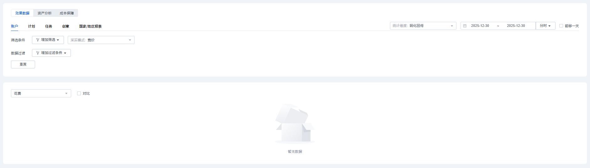
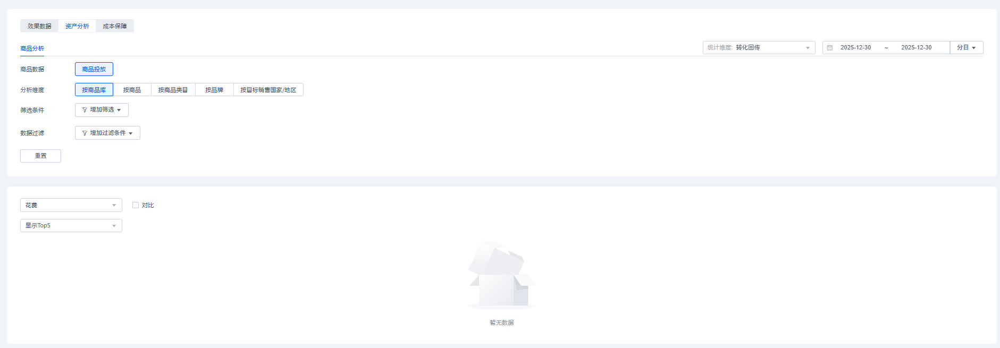
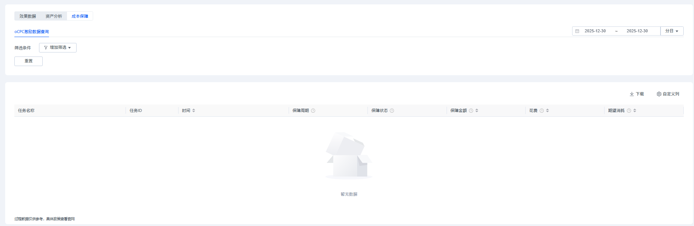
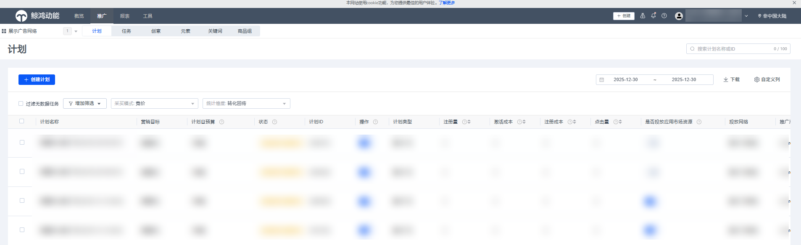
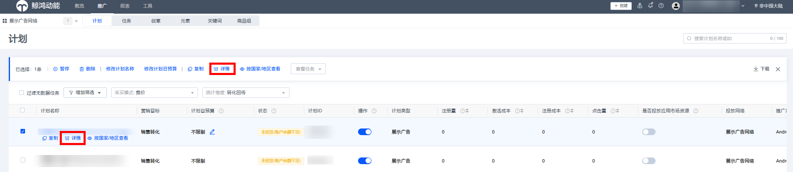
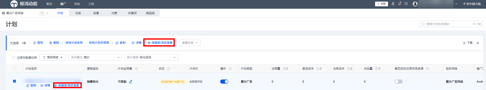
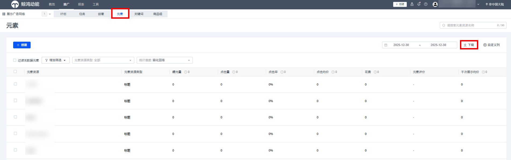
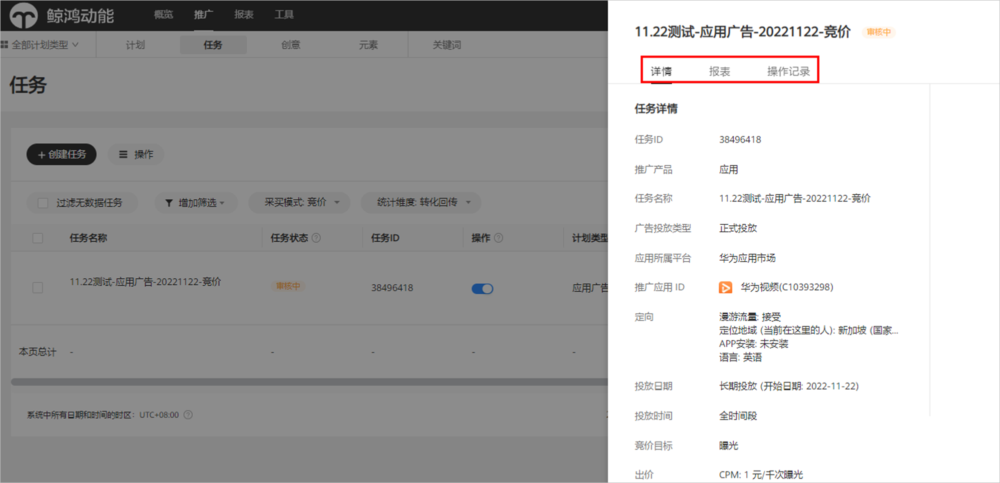
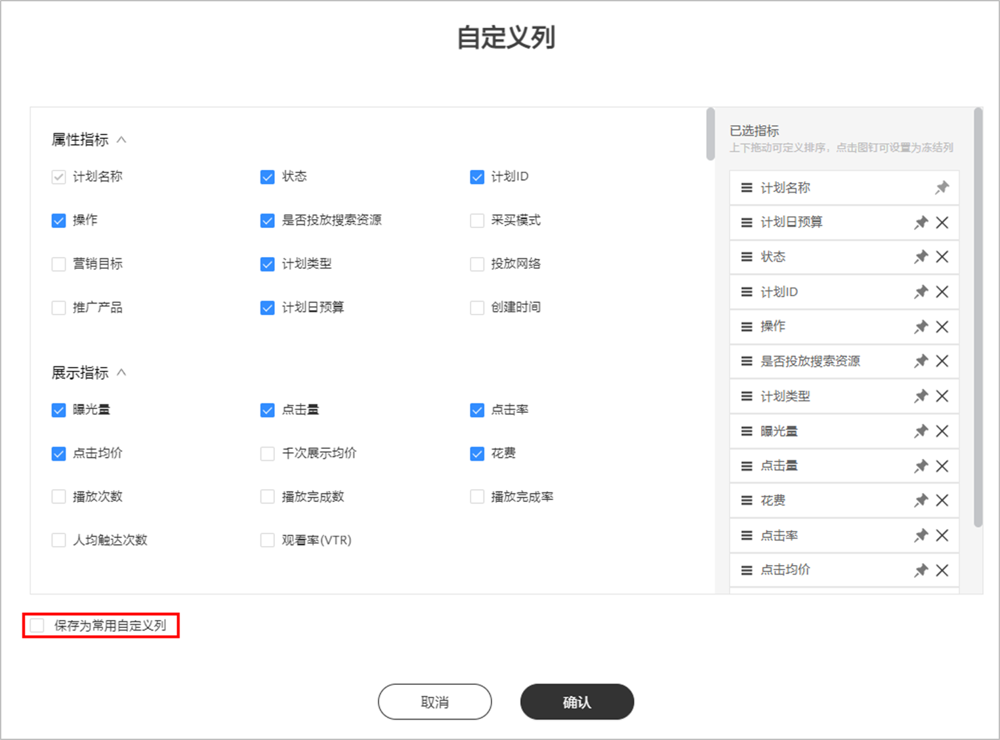

# 数据查看

## 在报表中查看数据

通过报表筛选、数据过滤功能，快速查找到您要的效果数据、资产分析。

<strong>效果数据</strong>

您可以查看或下载选定时间范围内账户、计划、任务、创意的曝光、点击、点击均价等多个指标详细数据，也可以在“推广”界面查看广告任务各项指标的详细数据，并基于指标数据对广告进行分析。

- 筛选条件：支持多选，您可以在账户、计划、任务、创意、国家/地区报表中，按照投放网络、计划类型进行筛选，完成后单击“筛选”，即可展现您想要的数据。
- 数据过滤：您可以在账户、计划、任务、创意、国家/地区报表中，按照曝光量、下载量等进行筛选，完成后单击“筛选”，即可展现您想要的数据。
- 统计维度：您可以通过统计维度对投放数据进行筛选，快速找到您关注的广告数据。
  - 广告请求： 所有指标都按照该次广告请求发生的时间统计。
  - 转化回传：转化跟踪的指标（激活、表单提交）按照实际回传转化的时间进行统计，非转化跟踪指标（曝光、点击、下载）仍按照请求发生的时间统计。

  示例：

  |  |  |  |  |  |  |
  | --- | --- | --- | --- | --- | --- |
  | 时间 | 12月1日23：55 | 12月1日23：59 | 12月2日00：01 | 12月2日00：10 | 12月3日 |
  | 用户行为 | 用户在华为视频请求广告 | 用户产生了曝光 | 用户产生了点击 | 用户下载完成 | 用户完成了激活 |
  | 广告请求口径 |  | 所有数据记录在12/1 | | | |
  | 转化回传口径 |  | 曝光：12月1日 | 点击：12月1日 | 下载：12月1日 | 激活：12月3日 |
- 时间维度：支持按照小时/日/月/整体进行统计数据。

<strong>资产分析</strong>

主要用于分析商品广告数据。

- 商品数据：支持按照商品投放查看数据。
- 分析维度：支持按照商品库、商品、商品类目、品牌、目标销售国家/地区查看数据。
  - 分析维度为按商品库时，筛选条件支持商品库。
  - 分析维度为按商品时，筛选条件支持商品库、商品的名称或ID。
  - 分析维度为按商品类目时，筛选条件支持商品库、类目。
  - 分析维度为按品牌时，筛选条件支持商品库、品牌。
  - 分析维度为按目标销售国家/地区时，筛选条件支持商品库、目标销售国家/地区筛选。
- 筛选条件：根据不同的分析维度，筛选您想要的商品数据。
- 数据过滤：按照曝光量、下载量等进行筛选，完成后单击“筛选”，即可展现您想要的数据。
- 统计维度：您可以通过统计维度对投放数据进行筛选，快速找到您关注的广告数据。
  - 广告请求： 所有指标都按照该次广告请求发生的时间统计。
  - 转化回传：转化跟踪的指标（激活、表单提交）按照实际回传转化的时间进行统计，非转化跟踪指标（曝光、点击、下载）仍按照请求发生的时间统计。

  示例：

  |  |  |  |  |  |  |
  | --- | --- | --- | --- | --- | --- |
  | 时间 | 12月1日23：55 | 12月1日23：59 | 12月2日00：01 | 12月2日00：10 | 12月3日 |
  | 用户行为 | 用户在华为视频请求广告 | 用户产生了曝光 | 用户产生了点击 | 用户下载完成 | 用户完成了激活 |
  | 广告请求口径 |  | 所有数据记录在12/1 | | | |
  | 转化回传口径 |  | 曝光：12月1日 | 点击：12月1日 | 下载：12月1日 | 激活：12月3日 |
- 时间维度：支持按照小时/日/月/整体进行统计数据。

<strong>成本保障</strong>

您可以通过成本保障报表查看账户的oCPC广告任务激励金额，该数据每日刷新一次，可以基于此数据完善考核管理。您还可查看分日或保障周期整体的oCPC激励数据。

分日：可查看保障周期内任务每日的预计激励金额，数据仅用于参考。

保障周期整体：可查看保障周期整体的激励数据，数据仅用于参考。

筛选条件：支持多选，可以根据任务、转化目标、保障周期、保障状态维度进行筛选，即可展现您想要的数据。

## 在推广中查看数据

您可以通过计划/任务/创意/元素/关键词查看详细数据。如果您对某个数据指标存在疑问，可以单击指标名后的“”，会给出此指标的口径解释，您也可以根据筛选条件查找数据：

- 筛选条件：筛选条件支持多选，按照筛选条件进行筛选，即可展现您想要的数据。
- 过滤无数据任务：如果广告计划、任务、元素、关键词没有数据，您可以选择过滤无数据任务。
- 统计维度：您可以通过统计维度对投放数据进行筛选，快速找到您关注的广告数据，详情可参考[统计维度](#ZH-CN_TOPIC_0000001234284729__zh-cn_topic_0000001160753952_li169591948161118)。
- 时间维度：支持按照日/月/整体进行统计数据。

### 查看计划/任务/创意数据

选择某个计划/任务/创意之后，单击“详情”查看对应数据，您也可以在每个计划上查看对应的任务、创意的数据，同时您在任务层级上也可以查看该任务的创意数据。

### 查看国家/地区数据

若您需要分析广告在不同国家/地区的投放情况，您可以选择您想要查看的推广计划/任务/关键词，单击“按国家/地区查看”，弹出对应推广计划/任务分地区的广告数据。

### 查看元素数据

- <strong>路径一：</strong>单击“<strong>推广</strong>” -&gt; <strong>“元素</strong>”，通过“元素资源类型”进行筛选，筛选完成之后勾选元素资源，单击“<strong>下载</strong>”，下载元素数据；如果您的应用广告任务引用了相同的元素，那么列表中的各个元素会将账户内多个相同元素跨任务合并统计数据。

  
- <strong>路径二：</strong>单击“<strong>推广</strong>” -&gt; <strong>“任务</strong>”，选中某一个智能应用任务，单击任务名称，进入元素页面，您可以通过“筛选”、“统计维度”进行筛选，筛选完成之后勾选元素资源，单击“<strong>下载</strong>”，下载您想要元素数据。

  

  点击查看详情，您可以看到元素的预览，该处预览仅为示例，并不代表所有广告样式；元素列表“操作日志”，支持元素级操作查询。界面如下：

  

## 查看自定义指标数据

广告投放后，您可以根据需要从“自定义列”中选择报表中需要查看的数据，包括“属性指标”，“展示指标”，“转化及生命周期”等，勾选后即可出现在报表中。

- 属性指标：包含计划类型、营销目标、投放网络等。
- 展示指标：包含广告曝光量、点击量、花费等。
- 转化及生命周期：大部分指标依赖转化跟踪数据回传。
- 保存为常用自定义列：您可以将您常用的指标保存，并设置名称（限制20个字符），下一次使用时可以直接进行选择。

  

  <strong>自定义指标</strong>：

  解释如下表所示：

  |  |  |  |
  | --- | --- | --- |
  | <strong>指标属性</strong> | <strong>指标名称</strong> | <strong>指标定义</strong> |
  | 属性指标 | 任务名称 | 您创建的oCPC广告任务名称。 |
  | 任务ID | 您创建的oCPC广告任务ID。 |
  | 时间 | 您创建某个oCPC广告任务的时间。 |
  | 保障周期 | oCPC广告任务的保障周期，10天为一个周期，共两个周期，若周期内无数据则不显示该周期数据。 |
  | 转化目标 | 您的oCPC广告任务设置的转化目标，如激活、表单提交等。 |
  | 深度转化目标 | 您的oCPC广告任务设置的深度转化目标，如激活-次留双出价、表单提交（Venus）-有效线索双出价等。 |
  | 保障开始时间 | 保障周期的第一天。 |
  | 保障结束时间 | 保障周期的最后一天。 |
  | 保障状态 | 当前任务的保障情况，分为成本保障中、不满足保障、保障已结束无需赔付、保障金额统计完成、保障核实中、不涉及等6种状态。 |
  | 展示指标 | 保障金额 | oCPC广告任务的赔付金额，过程数据可能为负，随转化回传，金额会发生变化。 |
  | 花费 | 广告主为投放付出的费用成本，实际扣费以财务记录为准。 |
  | 期望消耗 | 目标成本\*转化数 |
  | 转化数 | 转化数是指由广告投放带来的与投放计划的转化目标一致的转化事件量的加和。如您选择了“激活”事件为您广告任务的oCPC转化目标，则转化量为注册广告任务归因到的“激活”事件的量。 |
  | 深层转化数 | 深层转化数指由广告投放带来的与投放计划的深层转化目标一致的深层转化事件量的加和。如您在双出价情况下，选择“激活”事件为您的转化目标，“次留”事件为您的深层转化目标，则深层转化量为广告任务归因到的“次留”事件的量。 |
  | 转化成本 | 花费/转化数 |
  | 深层转化成本 | 花费/深层转化数 |
  | 目标转化成本 | 您的oCPC广告任务设置的目标转化成本。 |
  | 深层目标转化成本 | 您的oCPC广告任务设置的深层目标转化成本 |
  | 保障后转化成本 | 考虑保障金额后的实际转化成本。 |

## 查看转化回传数据

完成应用跟踪或线索跟踪后，回传的转化数据可以在鲸鸿动能广告平台查看，进入“推广”或“报表”菜单下的相关页面，选择“自定义列”，选择您跟踪的[转化指标](/docs/monetize/promotion/tracking-shu-0000001139892541#ZH-CN_TOPIC_0000001139892541__table10838115914391)进行查看。

如果您在广告平台没有看到相应的转化数据，您需要检查应用跟踪或者线索跟踪回传配置是否正确。
