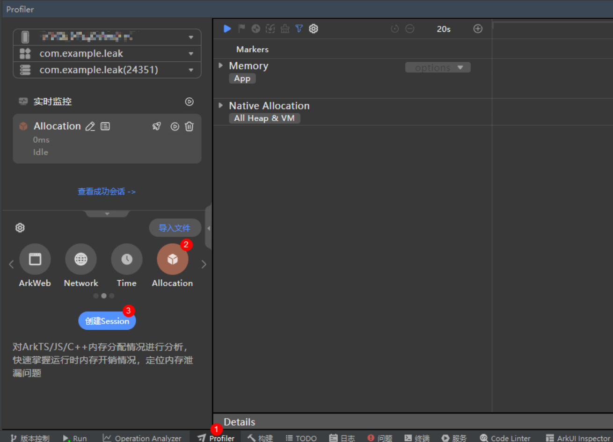
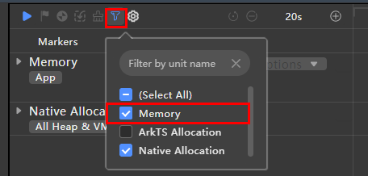
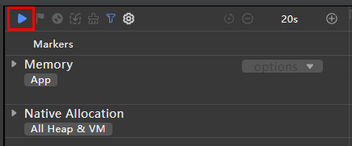

# 分析内核态内存

**DevEco 工具堆内存抓栈功能说明**

DevEco Studio Profiler插件Allocation模板可以帮助用户分析堆内存分配、释放的信息，memory mapping信息，调用栈信息。

## 操作步骤

1. 打开IDE后，选择Profiler。
2. 点击Allocation选项。
3. 点击Create Session创建录制会话。

   
4. 在筛选中勾选Memory。

   
5. 点击按钮开始抓栈。

   
6. 录制完成后点击录制的结果，分析Memory中各内存的增长趋势。

   

## 内存类型说明

* FilePage Other：应用使用的ashmem内存；
* GL：应用使用的GPU内存；
* Graph：应用使用的ION内存。

如果这类内存发生膨胀，往往会导致卡死、花屏等较严重的整机问题，遇到这类问题，需要尽快修复，具体分析方法见[内存泄漏分析方法](/docs/quality/stability-leak-way#section2825227501)中的ashmem、ION内存泄漏分析方法。
