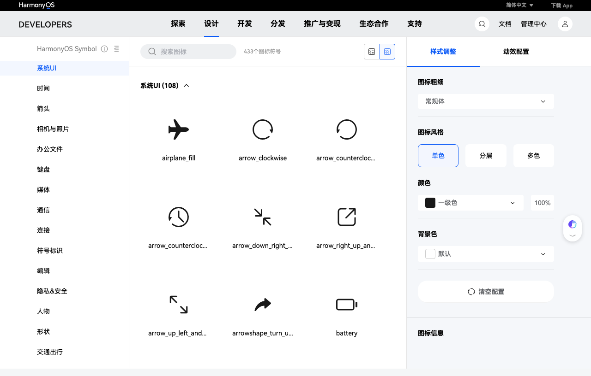

# HarmonyOS Symbol

HarmonyOS Symbol 是华为官方提供的**主题图标库**，为 HarmonyOS 应用开发者提供海量高质量的图标素材，所有图标均可免费下载使用。

## 功能特性

- **海量图标**：覆盖系统、应用、设备等多种场景的图标符号
- **样式可调**：支持 Regular、单色、分层、多色等多种图标风格
- **动效配置**：可对图标进行动效参数调整
- **粗细调节**：支持图标描边粗细的自定义调节
- **颜色配置**：可自定义一级色和背景色
- **ArkTS 直接调用**：图标可通过 ArkTS 代码直接在应用中使用

## 如何使用

访问 [HarmonyOS Symbol 官方页面](https://developer.huawei.com/consumer/cn/design/harmonyos-symbol/) 即可在线浏览、搜索和下载所需图标素材。图标支持多种格式导出，可直接集成到 HarmonyOS 应用开发中。

