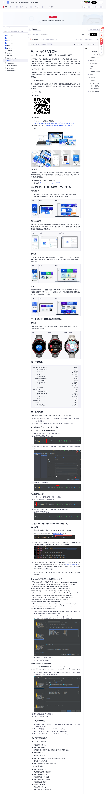

# HarmonyOS 代码工坊

HarmonyOS 代码工坊是基于 HarmonyOS 生态的应用开发代码示例项目，托管在 [GitCode](https://gitcode.com/HarmonyOS_Samples/sample_in_harmonyos)，由 **HarmonyOS_Samples** 组织维护。

> 访问 [HarmonyOS 代码工坊](https://gitcode.com/HarmonyOS_Samples/sample_in_harmonyos) 查看完整代码。

## 项目概览

- **项目名称**：sample_in_harmonyos
- **描述**：基于 HarmonyOS 生态的应用开发代码示例项目
- **Star**：26 | **Fork**：21
- **提交数**：63 commits
- **当前版本**：v1.0.2.300

## 工程结构

| 目录 | 说明 |
|------|------|
| `AppScope/` | 应用全局配置和作用域 |
| `common/` | 公共组件和工具类 |
| `features/` | 各功能模块示例代码 |
| `hmosword-build/` | 构建配置与脚本 |
| `hvigor/` | hvigor 构建工具配置 |
| `products/` | 产品化相关配置 |

项目采用标准的 HarmonyOS 应用工程结构，使用 hvigor 作为构建工具，涵盖从基础组件到复杂功能的完整示例。

