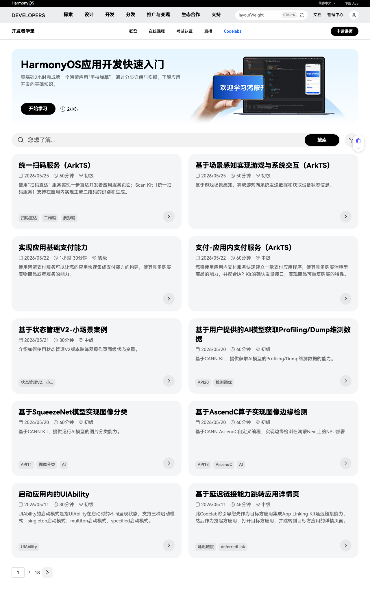

# Codelabs

HarmonyOS Codelabs 是华为官方提供的**互动式编程教程平台**，隶属于「开发者学堂」。通过分步详解与实操，帮助开发者快速掌握 HarmonyOS 应用开发的核心技能。

> 访问 [HarmonyOS Codelabs 官方页面](https://developer.huawei.com/consumer/cn/codelabsPortal/serviceTypes) 浏览全部课程。

## 平台特点

- **按阶段分级**：分为初级、中级、高级三个难度级别，循序渐进
- **多类别覆盖**：涵盖 UI 开发、系统能力、AI、支付、扫码、多媒体等广泛主题
- **实操导向**：每个 Codelab 提供完整的代码示例和分步指导
- **时效性强**：持续更新，紧跟 HarmonyOS 最新版本

## 典型课程

| 课程名称 | 时长 | 难度 | 关键词 |
|---------|------|------|--------|
| HarmonyOS 应用开发快速入门 | 2 小时 | 入门 | 手持弹幕、基础入门 |
| 统一扫码服务（ArkTS） | 60 分钟 | 初级 | Scan Kit、二维码、条形码 |
| 基于场景感知实现游戏与系统交互 | 50 分钟 | 初级 | 游戏场景感知 |
| 支付-应用内支付服务（ArkTS） | 60 分钟 | 中级 | IAP Kit、支付 |
| 基于状态管理 V2-小场景案例 | 30 分钟 | 中级 | 状态管理 V2、装饰器 |
| 基于 CANN Kit 获取 AI 模型维测数据 | 60 分钟 | 初级 | CANN、Profiling、Dump |
| 基于 SqueezeNet 模型实现图像分类 | 60 分钟 | 初级 | AI、图像分类 |
| 基于 AscendC 算子实现图像边缘检测 | 60 分钟 | 初级 | AscendC、AI、NPU |

