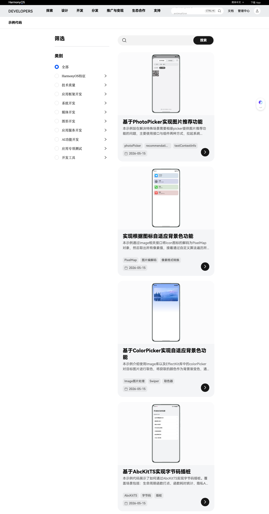

# Sample Codes

HarmonyOS 示例代码是华为官方提供的**代码示例库**，涵盖 HarmonyOS 应用开发的各个技术领域，帮助开发者通过实际代码快速理解和上手各类开发场景。

## 平台特点

- **分类齐全**：覆盖 10 大技术类别，可按需筛选
- **代码即用**：每个示例提供完整可运行的工程代码
- **持续更新**：紧跟 HarmonyOS 最新 API 和特性

## 技术分类

| 类别 | 说明 |
|------|------|
| 全部 | 不限类别，浏览所有示例 |
| HarmonyOS 特征 | HarmonyOS 系统级特性示例 |
| 技术质量 | 性能优化、稳定性等技术质量相关 |
| 应用框架开发 | ArkUI、ArkTS、Ability 等框架相关 |
| 系统开发 | 系统底层能力调用示例 |
| 媒体开发 | 音频、视频、相机等媒体处理 |
| 图形开发 | ArkGraphics 2D/3D、AR Engine 等 |
| 应用服务开发 | Account、Location、Map 等服务集成 |
| AI 功能开发 | CANN、Core Vision 等 AI 能力 |
| 应用专项测试 | 自动化测试、性能测试示例 |
| 开发工具 | DevEco Studio、hvigor 等工具使用 |

> 访问 [HarmonyOS 示例代码官方页面](https://developer.huawei.com/consumer/cn/samples/) 浏览全部示例。
